# Coevolution STERGM
###############################################################################

```r
source("/home/kirk/Dropbox/hiv_network/workspace/kk_utils/utils.R", echo=FALSE, encoding="UTF-8")
source("/home/kirk/Dropbox/hiv_network/workspace/cotergm/R/functions.R",echo=FALSE, encoding="UTF-8")
set.seed(123)
fig.path = "figures/"
# .libPaths(cotergm_path_linux)
library("statnet.common",lib=cotergm_path_linux)
```

```
## Error: object 'cotergm_path_linux' not found
```

```r
library("network",lib=cotergm_path_linux)
```

```
## Error: object 'cotergm_path_linux' not found
```

```r
library("ergm",lib=cotergm_path_linux)
```

```
## Error: object 'cotergm_path_linux' not found
```

```r
library("tergm",lib=cotergm_path_linux)
```

```
## Error: object 'cotergm_path_linux' not found
```
Initialize two network panels, each has 40 nodes, 0.2 edge density and 0.5 positive node density.
We assume one network evolves to another network.  


First network 

```r
n <- 40
y0 <- network(n,density=0.2,directed=FALSE)
y0 %v% "status" <- c(rep(c(2,1),each=n/2))
#"+" is 2, "-" is 1
y0%v%"status"
```

```
##  [1] 2 2 2 2 2 2 2 2 2 2 2 2 2 2 2 2 2 2 2 2 1 1 1 1 1 1 1 1 1 1 1 1 1 1 1
## [36] 1 1 1 1 1
```


Second network

```r
nw <-  network(n,density=0.2,directed=FALSE)
nw %v% "status" <- c(sample(c(2,1),n,replace=T))
nw%v%"status"
```

```
##  [1] 1 2 1 2 1 2 2 1 2 1 2 2 1 2 2 1 2 2 2 2 1 2 2 2 1 1 1 2 2 2 1 1 1 1 2
## [36] 2 1 2 1 2
```


We decompose the network evolution into four simultaneous modules, in each module, only nodes of one status can either form ties or dissolve ties, but not both. 

* F+ Formation network initiated by "+" actors 
Only the empty dyads that involve at least one "+" actor may form ties, and only the "+" actors may change its nodal status to "-"
* F- Formation network initiated by "-" actors 
Only the empty dyads that involve at least one "-" actor may form ties, and only the "-" actors may change its nodal status to "+"
* D+ Dissolution network initiated by "+" actors
Only the non-empty dyads that involve at least one "+" actor may dissolve ties, and only the "+" actors may change its nodal status to "-"
* D- Dissolution network initiated by "-" actors
Only the non-empty dyads that involve at least one "-" actor may dissolve ties, and only the "-" actors may change its nodal status to "-"


```r
# Formation Plus Network
FP <- FP.nw(y0,nw,"status")
# Formation Minus Network
FM <- FM.nw(y0,nw,"status")
# Dissolution Plus Network
DP <- DP.nw(y0,nw,"status")
# Dissolution Minus Network
DM <- DM.nw(y0,nw,"status")
```


```r
# pdf(paste0(fig.path,"0922.pdf"),height=10,width=10)
layout_mat <- matrix(c(7,2,8,1,3,6,1,4,6,0,5,0),4,3,byrow=T)
par(mar=c(2,2,3,2))
layout(layout_mat)
#
p1 <- plot(y0,edge.col=1,edge.lwd=5,vertex.cex=2,vertex.col="status",cex.lab=2,main="y0",cex.main=2,displaylabels=T,cex.lab=1)

p1.1 <- plot(y0,edge.col=1,edge.lwd=5,vertex.cex=2,vertex.col="status",cex.lab=2,coord=p1,main="F+",cex.main=2,displaylabels=T,cex.lab=1)
plot(FP,coord=p1,new=FALSE,vertex.cex=2,vertex.col="status",cex.lab=2,edge.col=3)
#
#
p2 <- plot(y0,edge.col=1,edge.lwd=5,vertex.cex=2,vertex.col="status",cex.lab=2,coord=p1,main="F-",cex.main=2,displaylabels=T,cex.lab=1)
plot(FM,coord=p1,new=FALSE,vertex.cex=2,vertex.col="status",cex.lab=2,edge.col=3)

p3 <- plot(y0,edge.col="yellow",edge.lwd=5,vertex.cex=2,vertex.col="status",cex.lab=2,coord=p1,main="D+",cex.main=2,displaylabels=T,cex.lab=1)
plot(DP,coord=p1,new=FALSE,vertex.cex=2,vertex.col="status",cex.lab=2,edge.col=1)

p4 <- plot(y0,edge.col="yellow",edge.lwd=5,vertex.cex=2,vertex.col="status",cex.lab=2,coord=p1,main="D-",cex.main=2,displaylabels=T,cex.lab=1)
plot(DM,coord=p1,new=FALSE,vertex.cex=2,vertex.col="status",cex.lab=2,edge.col=1)

p5 <- plot(nw,edge.col=1,edge.lwd=5,vertex.cex=2,vertex.col="status",cex.lab=2,coord=p1,main="y1",cex.main=2,displaylabels=T,cex.lab=1,vertex.sides=ifelse(y0 %v% "status" == nw %v% "status",50,3))
#
p7 <- plot.new()
legend("topleft",legend=c("+","-"),pch=19,col=c(2,1),cex=2,bty="n")

p8 <- plot.new()
legend("topleft",legend=c("tie formed","tie dissolved","nodal status changed"),lty=c(1,1,NA),pch=c(NA,NA,24), col=c(3,"yellow",1),cex=2,bty="n")
```

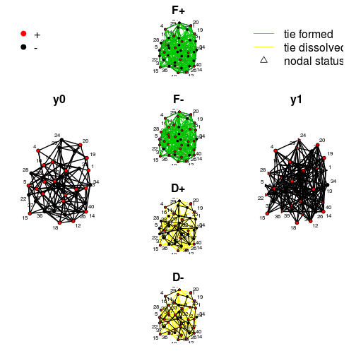 

```r
#
#dev.off()
```


```r
summary(y0~edges+plus+nodematch_cotergm("status",diff=TRUE))
```

```
##              edges               plus nodematch.status.1 
##                150                 20                 42 
## nodematch.status.2 
##                 30
```

```r
summary(nw~edges+plus+nodematch_cotergm("status",diff=TRUE))
```

```
##              edges               plus nodematch.status.1 
##                155                 23                 26 
## nodematch.status.2 
##                 46
```

```r
summary(FP~edges+plus+nodematch_cotergm("status",diff=TRUE))
```

```
##              edges               plus nodematch.status.1 
##                249                 13                 96 
## nodematch.status.2 
##                 27
```

```r
summary(FM~edges+plus+nodematch_cotergm("status",diff=TRUE))
```

```
##              edges               plus nodematch.status.1 
##                241                 30                 21 
## nodematch.status.2 
##                116
```

```r
summary(DP~edges+plus+nodematch_cotergm("status",diff=TRUE))
```

```
##              edges               plus nodematch.status.1 
##                 60                 13                 46 
## nodematch.status.2 
##                  1
```

```r
summary(DM~edges+plus+nodematch_cotergm("status",diff=TRUE))
```

```
##              edges               plus nodematch.status.1 
##                 53                 30                  4 
## nodematch.status.2 
##                 35
```


```r
fit1 <- ergm(FP~edges+plus+gwesp_cotergm(-0.5, fixed=TRUE)+nodematch_cotergm("status",diff=TRUE),control=control.ergm(MCMC.burnin=10000,MCMC.samplesize=10000,MCMC.interval=100,MCMLE.maxit=10,MCMLE.min.effectiveSize=20,MCMC.max.interval=100), constraints=~atleastnonminus(y0),verbose=0)
```

```
## Iteration 1 of at most 10: 
## Convergence test P-value: 0e+00
```

```
## Using the GLPK callable library version 4.52
```

```
## The log-likelihood improved by 6.717 
## Iteration 2 of at most 10: 
## Convergence test P-value: 1.3e-200 
## The log-likelihood improved by 11.24 
## Iteration 3 of at most 10: 
## Convergence test P-value: 2.5e-63 
## The log-likelihood improved by 6.549 
## Iteration 4 of at most 10: 
## Convergence test P-value: 0e+00
```

```
## Error: $ operator is invalid for atomic vectors
```

```r
fit1
```

```
## Error: object 'fit1' not found
```

```r
mcmc.diagnostics(fit1, vars.per.page=5)
```

```
## Error: object 'fit1' not found
```

```r
fit1.1 <- ergm(FP~edges+plus+gwesp_cotergm(-0.5, fixed=TRUE)+nodematch_cotergm("status",diff=TRUE,keep=1),control=control.ergm(MCMC.burnin=10000,MCMC.samplesize=10000,MCMC.interval=100,MCMLE.maxit=10,MCMLE.min.effectiveSize=20,MCMC.max.interval=100), constraints=~atleastnonminus(y0),verbose=0)
```

```
## Iteration 1 of at most 10: 
## Convergence test P-value: 0e+00 
## The log-likelihood improved by 8.336 
## Iteration 2 of at most 10: 
## Convergence test P-value: 2e-117 
## The log-likelihood improved by 12.83 
## Iteration 3 of at most 10: 
## Convergence test P-value: 7e-173 
## The log-likelihood improved by 5.548 
## Iteration 4 of at most 10: 
## Convergence test P-value: 6.7e-166 
## The log-likelihood improved by 8.198 
## Iteration 5 of at most 10: 
## Convergence test P-value: 3.8e-161 
## The log-likelihood improved by 2.419 
## Iteration 6 of at most 10: 
## Convergence test P-value: 2.9e-17 
## The log-likelihood improved by 0.06908 
## Iteration 7 of at most 10: 
## Convergence test P-value: 3.4e-02 
## The log-likelihood improved by 0.02755 
## Iteration 8 of at most 10: 
## Convergence test P-value: 6.2e-05 
## The log-likelihood improved by 0.0908 
## Iteration 9 of at most 10: 
## Convergence test P-value: 5.5e-01 
## Convergence detected. Stopping.
## The log-likelihood improved by 0.007046 
## 
## This model was fit using MCMC.  To examine model diagnostics and check for degeneracy, use the mcmc.diagnostics() function.
```

```r
fit1.1
```

```
## MCMC sample of size based on: 
##              edges                plus     gwesp.fixed-0.5  
##             -0.996              -1.305              -0.524  
## nodematch.status.1  
##             -0.209  
## 
## Monte Carlo MLE Coefficients:
##              edges                plus     gwesp.fixed-0.5  
##             -0.990              -1.232              -0.517  
## nodematch.status.1  
##             -0.200
```

```r
mcmc.diagnostics(fit1.1, vars.per.page=5)
```

```
## Sample statistics summary:
## 
## Iterations = 1998:91989
## Thinning interval = 9 
## Number of chains = 1 
## Sample size per chain = 10000 
## 
## 1. Empirical mean and standard deviation for each variable,
##    plus standard error of the mean:
## 
##                       Mean    SD Naive SE Time-series SE
## edges              -1.0010  9.18   0.0918         1.4909
## plus               -0.0063  1.86   0.0186         0.0459
## gwesp.fixed-0.5    -0.7143  6.67   0.0667         0.9788
## nodematch.status.1 -0.3724 16.78   0.1678         0.4025
## 
## 2. Quantiles for each variable:
## 
##                     2.5%   25%   50%   75% 97.5%
## edges              -17.0  -7.0 -2.00  4.00  21.0
## plus                -4.0  -1.0  0.00  1.00   4.0
## gwesp.fixed-0.5    -12.4  -5.4 -1.28  3.01  14.6
## nodematch.status.1 -31.0 -12.0 -1.00 10.00  35.0
## 
## 
## Are sample statistics significantly different from observed?
##              edges    plus gwesp.fixed-0.5 nodematch.status.1
## diff.      -1.0010 -0.0063         -0.7143            -0.3724
## test stat. -0.6714 -0.1373         -0.7298            -0.9252
## P-val.      0.5020  0.8908          0.4655             0.3548
##            Overall (Chi^2)
## diff.                   NA
## test stat.          3.1309
## P-val.              0.5513
## 
## Sample statistics cross-correlations:
##                       edges    plus gwesp.fixed-0.5 nodematch.status.1
## edges               1.00000  0.1874         0.91036           -0.04262
## plus                0.18743  1.0000         0.16854           -0.95687
## gwesp.fixed-0.5     0.91036  0.1685         1.00000           -0.03597
## nodematch.status.1 -0.04262 -0.9569        -0.03597            1.00000
## 
## Sample statistics auto-correlation:
## Chain 1 
##         edges   plus gwesp.fixed-0.5 nodematch.status.1
## Lag 0  1.0000 1.0000          1.0000             1.0000
## Lag 9  0.9918 0.7023          0.9854             0.7040
## Lag 18 0.9837 0.5024          0.9715             0.5010
## Lag 27 0.9758 0.3664          0.9585             0.3637
## Lag 36 0.9680 0.2703          0.9460             0.2635
## Lag 45 0.9607 0.2050          0.9345             0.1934
## 
## Sample statistics burn-in diagnostic (Geweke):
## Chain 1 
## 
## Fraction in 1st window = 0.1
## Fraction in 2nd window = 0.5 
## 
##              edges               plus    gwesp.fixed-0.5 
##           -1.86440           -0.06083           -2.69201 
## nodematch.status.1 
##           -0.51503 
## 
## Individual P-values (lower = worse):
##              edges               plus    gwesp.fixed-0.5 
##           0.062265           0.951495           0.007102 
## nodematch.status.1 
##           0.606536 
## Joint P-value (lower = worse):  0.01079 .
```

```
## Loading required package: latticeExtra
## Loading required package: RColorBrewer
## Loading required package: lattice
```

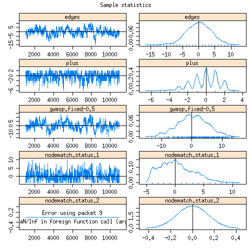 

```r
fit1.2 <- ergm(FP~edges+plus+gwesp_cotergm(-0.5, fixed=TRUE)+nodematch_cotergm("status",diff=TRUE,keep=2),control=control.ergm(MCMC.burnin=10000,MCMC.samplesize=10000,MCMC.interval=100,MCMLE.maxit=10,MCMLE.min.effectiveSize=20,MCMC.max.interval=100), constraints=~atleastnonminus(y0),verbose=0)
```

```
## Iteration 1 of at most 10: 
## Convergence test P-value: 0e+00 
## The log-likelihood improved by 7.781 
## Iteration 2 of at most 10: 
## Convergence test P-value: 2e-127 
## The log-likelihood improved by 14.45 
## Iteration 3 of at most 10: 
## Convergence test P-value: 2.6e-180 
## The log-likelihood improved by 6.503 
## Iteration 4 of at most 10: 
## Convergence test P-value: 1.3e-117 
## The log-likelihood improved by 9.423 
## Iteration 5 of at most 10: 
## Convergence test P-value: 4.1e-164 
## The log-likelihood improved by 3.948 
## Iteration 6 of at most 10: 
## Convergence test P-value: 8e-20 
## The log-likelihood improved by 0.06083 
## Iteration 7 of at most 10: 
## Convergence test P-value: 4.7e-03 
## The log-likelihood improved by 0.01121 
## Iteration 8 of at most 10: 
## Convergence test P-value: 5.7e-05 
## The log-likelihood improved by 0.04337 
## Iteration 9 of at most 10: 
## Convergence test P-value: 3.2e-07 
## The log-likelihood improved by 0.0151 
## Iteration 10 of at most 10: 
## Convergence test P-value: 4.9e-03 
## The log-likelihood improved by 0.03096 
## 
## This model was fit using MCMC.  To examine model diagnostics and check for degeneracy, use the mcmc.diagnostics() function.
```

```r
fit1.2
```

```
## MCMC sample of size based on: 
##              edges                plus     gwesp.fixed-0.5  
##             -0.979              -1.019              -0.507  
## nodematch.status.2  
##             -0.180  
## 
## Monte Carlo MLE Coefficients:
##              edges                plus     gwesp.fixed-0.5  
##             -0.995              -1.196              -0.516  
## nodematch.status.2  
##             -0.196
```

```r
mcmc.diagnostics(fit1.2, vars.per.page=5)
```

```
## Sample statistics summary:
## 
## Iterations = 1498:71492
## Thinning interval = 7 
## Number of chains = 1 
## Sample size per chain = 10000 
## 
## 1. Empirical mean and standard deviation for each variable,
##    plus standard error of the mean:
## 
##                      Mean    SD Naive SE Time-series SE
## edges               1.936  8.40   0.0840         1.1653
## plus                0.143  1.92   0.0192         0.0495
## gwesp.fixed-0.5     1.337  6.24   0.0624         0.7539
## nodematch.status.2 -0.434 17.78   0.1778         0.4695
## 
## 2. Quantiles for each variable:
## 
##                     2.5%    25%  50%  75% 97.5%
## edges              -14.0  -4.00  2.0  8.0  18.0
## plus                -4.0  -1.00  0.0  1.0   4.0
## gwesp.fixed-0.5    -10.6  -2.89  1.6  5.5  13.4
## nodematch.status.2 -32.0 -13.00 -1.0 11.0  38.0
## 
## 
## Are sample statistics significantly different from observed?
##              edges    plus gwesp.fixed-0.5 nodematch.status.2
## diff.      1.93570 0.14280         1.33686            -0.4337
## test stat. 1.66110 2.88456         1.77329            -0.9237
## P-val.     0.09669 0.00392         0.07618             0.3556
##            Overall (Chi^2)
## diff.                   NA
## test stat.       15.720736
## P-val.            0.004899
## 
## Sample statistics cross-correlations:
##                      edges    plus gwesp.fixed-0.5 nodematch.status.2
## edges              1.00000  0.1194       8.829e-01          6.060e-03
## plus               0.11937  1.0000       1.060e-01         -9.580e-01
## gwesp.fixed-0.5    0.88293  0.1060       1.000e+00          3.461e-05
## nodematch.status.2 0.00606 -0.9580       3.461e-05          1.000e+00
## 
## Sample statistics auto-correlation:
## Chain 1 
##         edges   plus gwesp.fixed-0.5 nodematch.status.2
## Lag 0  1.0000 1.0000          1.0000             1.0000
## Lag 7  0.9897 0.7192          0.9824             0.7304
## Lag 14 0.9793 0.5283          0.9659             0.5436
## Lag 21 0.9691 0.3976          0.9501             0.4134
## Lag 28 0.9593 0.3026          0.9353             0.3161
## Lag 35 0.9495 0.2287          0.9213             0.2371
## 
## Sample statistics burn-in diagnostic (Geweke):
## Chain 1 
## 
## Fraction in 1st window = 0.1
## Fraction in 2nd window = 0.5 
## 
##              edges               plus    gwesp.fixed-0.5 
##            -2.1523            -0.3822            -2.4754 
## nodematch.status.2 
##            -1.1955 
## 
## Individual P-values (lower = worse):
##              edges               plus    gwesp.fixed-0.5 
##            0.03137            0.70230            0.01331 
## nodematch.status.2 
##            0.23191 
## Joint P-value (lower = worse):  0.1069 .
```

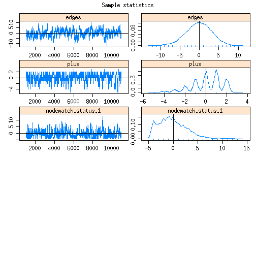 


```r
fit2 <- ergm(FM~edges+plus+gwesp_cotergm(-0.5, fixed=TRUE)+nodematch_cotergm("status",diff=TRUE),control=control.ergm(MCMC.burnin=10000,MCMC.samplesize=10000,MCMC.interval=100,MCMLE.maxit=10,MCMLE.min.effectiveSize=20,MCMC.max.interval=100), constraints=~atleastnonplus(y0),verbose=0)
```

```
## Iteration 1 of at most 10: 
## Convergence test P-value: 0e+00 
## The log-likelihood improved by 2.596 
## Iteration 2 of at most 10: 
## Convergence test P-value: 0e+00 
## The log-likelihood improved by < 0.0001 
## Iteration 3 of at most 10: 
## Convergence test P-value: 2.1e-279 
## The log-likelihood improved by < 0.0001 
## Iteration 4 of at most 10: 
## Convergence test P-value: 1.8e-204 
## The log-likelihood improved by < 0.0001 
## Iteration 5 of at most 10: 
## Convergence test P-value: 2.1e-244 
## The log-likelihood improved by < 0.0001 
## Iteration 6 of at most 10: 
## Convergence test P-value: 2.8e-159 
## The log-likelihood improved by < 0.0001 
## Iteration 7 of at most 10: 
## Convergence test P-value: 2.6e-273 
## The log-likelihood improved by < 0.0001 
## Iteration 8 of at most 10: 
## Convergence test P-value: 6e-183 
## The log-likelihood improved by < 0.0001 
## Iteration 9 of at most 10: 
## Convergence test P-value: 1e-297 
## The log-likelihood improved by < 0.0001 
## Iteration 10 of at most 10: 
## Convergence test P-value: 4.4e-194 
## The log-likelihood improved by < 0.0001 
## 
## This model was fit using MCMC.  To examine model diagnostics and check for degeneracy, use the mcmc.diagnostics() function.
```

```r
fit2
```

```
## MCMC sample of size based on: 
##              edges                plus     gwesp.fixed-0.5  
##            -2.0009              1.3070              0.0451  
## nodematch.status.1  nodematch.status.2  
##             1.5840              0.0352  
## 
## Monte Carlo MLE Coefficients:
##              edges                plus     gwesp.fixed-0.5  
##            -2.0009              1.1716              0.0451  
## nodematch.status.1  nodematch.status.2  
##             1.5840              0.0577
```

```r
mcmc.diagnostics(fit2, vars.per.page=5)
```

```
## Sample statistics summary:
## 
## Iterations = 6581:76574
## Thinning interval = 7 
## Number of chains = 1 
## Sample size per chain = 10000 
## 
## 1. Empirical mean and standard deviation for each variable,
##    plus standard error of the mean:
## 
##                      Mean   SD Naive SE Time-series SE
## edges                7.47 8.48   0.0848         1.2716
## plus               -10.00 0.01   0.0001         0.0001
## gwesp.fixed-0.5      6.07 5.95   0.0595         0.7546
## nodematch.status.1  80.11 5.88   0.0588         0.7952
## nodematch.status.2 -86.00 0.06   0.0006         0.0006
## 
## 2. Quantiles for each variable:
## 
##                      2.5%    25%    50%   75% 97.5%
## edges               -8.02   2.00   7.00  13.0  25.0
## plus               -10.00 -10.00 -10.00 -10.0 -10.0
## gwesp.fixed-0.5     -5.12   1.86   5.95  10.3  17.7
## nodematch.status.1  69.00  76.00  80.00  84.0  91.0
## nodematch.status.2 -86.00 -86.00 -86.00 -86.0 -86.0
## 
## 
## Are sample statistics significantly different from observed?
##                edges   plus gwesp.fixed-0.5 nodematch.status.1
## diff.      7.468e+00    -10       6.067e+00              80.11
## test stat. 5.873e+00 -99999       8.040e+00             100.74
## P-val.     4.280e-09      0       8.982e-16               0.00
##            nodematch.status.2 Overall (Chi^2)
## diff.                     -86              NA
## test stat.            -143332       2.021e+10
## P-val.                      0      4.427e-194
## 
## Sample statistics cross-correlations:
##                       edges      plus gwesp.fixed-0.5 nodematch.status.1
## edges              1.000000  0.004167        0.879063           0.718363
## plus               0.004167  1.000000        0.004963          -0.003593
## gwesp.fixed-0.5    0.879063  0.004963        1.000000           0.623109
## nodematch.status.1 0.718363 -0.003593        0.623109           1.000000
## nodematch.status.2 0.004167  1.000000        0.004963          -0.003593
##                    nodematch.status.2
## edges                        0.004167
## plus                         1.000000
## gwesp.fixed-0.5              0.004963
## nodematch.status.1          -0.003593
## nodematch.status.2           1.000000
## 
## Sample statistics auto-correlation:
## Chain 1 
##         edges       plus gwesp.fixed-0.5 nodematch.status.1
## Lag 0  1.0000  1.0000000          1.0000             1.0000
## Lag 7  0.9912 -0.0001000          0.9819             0.9891
## Lag 14 0.9824 -0.0001000          0.9647             0.9785
## Lag 21 0.9738 -0.0001000          0.9486             0.9682
## Lag 28 0.9654 -0.0001001          0.9338             0.9583
## Lag 35 0.9571 -0.0001001          0.9188             0.9484
##        nodematch.status.2
## Lag 0           1.0000000
## Lag 7          -0.0001000
## Lag 14         -0.0001000
## Lag 21         -0.0001000
## Lag 28         -0.0001001
## Lag 35         -0.0001001
## 
## Sample statistics burn-in diagnostic (Geweke):
## Chain 1 
## 
## Fraction in 1st window = 0.1
## Fraction in 2nd window = 0.5 
## 
##              edges               plus    gwesp.fixed-0.5 
##            -0.7573                NaN            -0.6361 
## nodematch.status.1 nodematch.status.2 
##            -0.7022                NaN 
## 
## Individual P-values (lower = worse):
##              edges               plus    gwesp.fixed-0.5 
##             0.4489                NaN             0.5247 
## nodematch.status.1 nodematch.status.2 
##             0.4826                NaN 
## Joint P-value (lower = worse):  0.8523 .
```

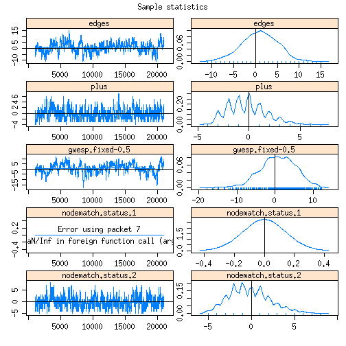 

```r
fit2.1 <- ergm(FM~edges+plus+gwesp_cotergm(-0.5, fixed=TRUE)+nodematch_cotergm("status",diff=TRUE,keep=1),control=control.ergm(MCMC.burnin=10000,MCMC.samplesize=10000,MCMC.interval=100,MCMLE.maxit=10,MCMLE.min.effectiveSize=20,MCMC.max.interval=100), constraints=~atleastnonplus(y0),verbose=0)
```

```
## Iteration 1 of at most 10: 
## Convergence test P-value: 0e+00 
## The log-likelihood improved by 6.53 
## Iteration 2 of at most 10: 
## Convergence test P-value: 5.7e-29 
## The log-likelihood improved by 0.6693 
## Iteration 3 of at most 10: 
## Convergence test P-value: 3.2e-03 
## The log-likelihood improved by 0.05625 
## Iteration 4 of at most 10: 
## Convergence test P-value: 2.4e-03 
## The log-likelihood improved by 0.0196 
## Iteration 5 of at most 10: 
## Convergence test P-value: 5.6e-02 
## The log-likelihood improved by 0.0957 
## Iteration 6 of at most 10: 
## Convergence test P-value: 5.2e-01 
## Convergence detected. Stopping.
## The log-likelihood improved by 0.02115 
## 
## This model was fit using MCMC.  To examine model diagnostics and check for degeneracy, use the mcmc.diagnostics() function.
```

```r
fit2.1
```

```
## MCMC sample of size based on: 
##              edges                plus     gwesp.fixed-0.5  
##             -1.314               1.068              -0.177  
## nodematch.status.1  
##              0.286  
## 
## Monte Carlo MLE Coefficients:
##              edges                plus     gwesp.fixed-0.5  
##             -1.333               1.040              -0.185  
## nodematch.status.1  
##              0.278
```

```r
mcmc.diagnostics(fit2.1, vars.per.page=5)
```

```
## Sample statistics summary:
## 
## Iterations = 1184:61178
## Thinning interval = 6 
## Number of chains = 1 
## Sample size per chain = 10000 
## 
## 1. Empirical mean and standard deviation for each variable,
##    plus standard error of the mean:
## 
##                      Mean    SD Naive SE Time-series SE
## edges               1.656  8.20   0.0820          1.138
## plus               -0.076  3.06   0.0306          0.115
## gwesp.fixed-0.5     1.159  6.17   0.0617          0.656
## nodematch.status.1  0.597 12.80   0.1280          0.496
## 
## 2. Quantiles for each variable:
## 
##                     2.5%   25%  50%  75% 97.5%
## edges              -15.0 -4.00  2.0 8.00  17.0
## plus                -6.0 -2.00  0.0 2.00   6.0
## gwesp.fixed-0.5    -11.4 -2.97  1.5 5.54  12.6
## nodematch.status.1 -19.0 -9.00 -1.0 9.00  30.0
## 
## 
## Are sample statistics significantly different from observed?
##             edges    plus gwesp.fixed-0.5 nodematch.status.1
## diff.      1.6562 -0.0760         1.15931             0.5974
## test stat. 1.4558 -0.6592         1.76781             1.2047
## P-val.     0.1454  0.5098         0.07709             0.2283
##            Overall (Chi^2)
## diff.                   NA
## test stat.          3.3071
## P-val.              0.5232
## 
## Sample statistics cross-correlations:
##                       edges     plus gwesp.fixed-0.5 nodematch.status.1
## edges               1.00000 -0.08472         0.87309             0.1506
## plus               -0.08472  1.00000        -0.07081            -0.9541
## gwesp.fixed-0.5     0.87309 -0.07081         1.00000             0.1370
## nodematch.status.1  0.15065 -0.95410         0.13697             1.0000
## 
## Sample statistics auto-correlation:
## Chain 1 
##         edges   plus gwesp.fixed-0.5 nodematch.status.1
## Lag 0  1.0000 1.0000          1.0000             1.0000
## Lag 6  0.9897 0.8638          0.9799             0.8687
## Lag 12 0.9795 0.7450          0.9605             0.7568
## Lag 18 0.9696 0.6407          0.9417             0.6583
## Lag 24 0.9595 0.5469          0.9239             0.5690
## Lag 30 0.9500 0.4699          0.9070             0.4937
## 
## Sample statistics burn-in diagnostic (Geweke):
## Chain 1 
## 
## Fraction in 1st window = 0.1
## Fraction in 2nd window = 0.5 
## 
##              edges               plus    gwesp.fixed-0.5 
##             1.5783            -0.2696             1.3927 
## nodematch.status.1 
##             0.6631 
## 
## Individual P-values (lower = worse):
##              edges               plus    gwesp.fixed-0.5 
##             0.1145             0.7875             0.1637 
## nodematch.status.1 
##             0.5073 
## Joint P-value (lower = worse):  0.774 .
```

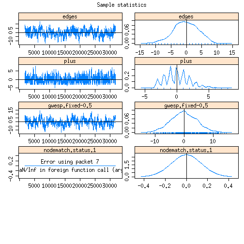 

```r
fit2.2 <- ergm(FM~edges+plus+gwesp_cotergm(-0.5, fixed=TRUE)+nodematch_cotergm("status",diff=TRUE,keep=2),control=control.ergm(MCMC.burnin=10000,MCMC.samplesize=10000,MCMC.interval=100,MCMLE.maxit=10,MCMLE.min.effectiveSize=20,MCMC.max.interval=100), constraints=~atleastnonplus(y0),verbose=0)
```

```
## Iteration 1 of at most 10: 
## Convergence test P-value: 0e+00 
## The log-likelihood improved by 6.41 
## Iteration 2 of at most 10: 
## Convergence test P-value: 6.8e-23 
## The log-likelihood improved by 0.7092 
## Iteration 3 of at most 10: 
## Convergence test P-value: 4.5e-03 
## The log-likelihood improved by 0.02249 
## Iteration 4 of at most 10: 
## Convergence test P-value: 1.1e-13 
## The log-likelihood improved by 0.05641 
## Iteration 5 of at most 10: 
## Convergence test P-value: 6.1e-08 
## The log-likelihood improved by 0.02169 
## Iteration 6 of at most 10: 
## Convergence test P-value: 4.4e-01 
## The log-likelihood improved by 0.009676 
## Iteration 7 of at most 10: 
## Convergence test P-value: 5.3e-01 
## Convergence detected. Stopping.
## The log-likelihood improved by 0.009702 
## 
## This model was fit using MCMC.  To examine model diagnostics and check for degeneracy, use the mcmc.diagnostics() function.
```

```r
fit2.2
```

```
## MCMC sample of size based on: 
##              edges                plus     gwesp.fixed-0.5  
##             -1.359               1.119              -0.180  
## nodematch.status.2  
##              0.302  
## 
## Monte Carlo MLE Coefficients:
##              edges                plus     gwesp.fixed-0.5  
##             -1.354               1.080              -0.166  
## nodematch.status.2  
##              0.293
```

```r
mcmc.diagnostics(fit2.2, vars.per.page=5)
```

```
## Sample statistics summary:
## 
## Iterations = 1051:81043
## Thinning interval = 8 
## Number of chains = 1 
## Sample size per chain = 10000 
## 
## 1. Empirical mean and standard deviation for each variable,
##    plus standard error of the mean:
## 
##                       Mean    SD Naive SE Time-series SE
## edges              -1.1543  9.06   0.0906          1.329
## plus                0.0753  3.18   0.0318          0.120
## gwesp.fixed-0.5    -0.8841  6.64   0.0664          0.743
## nodematch.status.2 -0.2604 12.87   0.1287          0.509
## 
## 2. Quantiles for each variable:
## 
##                     2.5%    25%    50%  75% 97.5%
## edges              -18.0  -8.00 -1.000 5.00  17.0
## plus                -6.0  -2.00  0.000 2.00   6.0
## gwesp.fixed-0.5    -13.9  -5.31 -0.941 3.74  11.9
## nodematch.status.2 -19.0 -10.00 -2.000 8.00  29.0
## 
## 
## Are sample statistics significantly different from observed?
##              edges   plus gwesp.fixed-0.5 nodematch.status.2
## diff.      -1.1543 0.0753         -0.8841            -0.2604
## test stat. -0.8683 0.6276         -1.1901            -0.5113
## P-val.      0.3852 0.5302          0.2340             0.6092
##            Overall (Chi^2)
## diff.                   NA
## test stat.          3.3113
## P-val.              0.5259
## 
## Sample statistics cross-correlations:
##                      edges     plus gwesp.fixed-0.5 nodematch.status.2
## edges               1.0000 -0.10757         0.89514             0.1641
## plus               -0.1076  1.00000        -0.09005            -0.9562
## gwesp.fixed-0.5     0.8951 -0.09005         1.00000             0.1390
## nodematch.status.2  0.1641 -0.95620         0.13896             1.0000
## 
## Sample statistics auto-correlation:
## Chain 1 
##         edges   plus gwesp.fixed-0.5 nodematch.status.2
## Lag 0  1.0000 1.0000          1.0000             1.0000
## Lag 8  0.9908 0.8556          0.9806             0.8633
## Lag 16 0.9818 0.7290          0.9625             0.7446
## Lag 24 0.9730 0.6220          0.9463             0.6457
## Lag 32 0.9639 0.5349          0.9306             0.5613
## Lag 40 0.9550 0.4606          0.9153             0.4881
## 
## Sample statistics burn-in diagnostic (Geweke):
## Chain 1 
## 
## Fraction in 1st window = 0.1
## Fraction in 2nd window = 0.5 
## 
##              edges               plus    gwesp.fixed-0.5 
##            -1.3027             0.4191            -1.2616 
## nodematch.status.2 
##            -0.5320 
## 
## Individual P-values (lower = worse):
##              edges               plus    gwesp.fixed-0.5 
##             0.1927             0.6751             0.2071 
## nodematch.status.2 
##             0.5947 
## Joint P-value (lower = worse):  0.7616 .
```

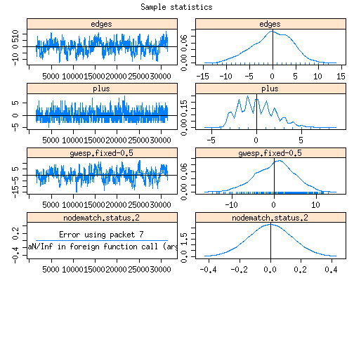 


```r
fit3 <- ergm(DP~edges+plus+gwesp_cotergm(-0.5, fixed=TRUE)+nodematch_cotergm("status",diff=TRUE),control=control.ergm(MCMC.burnin=10000,MCMC.samplesize=10000,MCMC.interval=100,MCMLE.maxit=10,MCMLE.min.effectiveSize=20,MCMC.max.interval=100), constraints=~atmostnonminus(y0),verbose=0)
```

```
## Iteration 1 of at most 10: 
## Convergence test P-value: 0e+00 
## The log-likelihood improved by 9.232 
## Iteration 2 of at most 10: 
## Convergence test P-value: 1.7e-50 
## The log-likelihood improved by 2.137 
## Iteration 3 of at most 10: 
## Convergence test P-value: 7e-13 
## The log-likelihood improved by 0.2988 
## Iteration 4 of at most 10: 
## Convergence test P-value: 1.6e-02 
## The log-likelihood improved by 0.03418 
## Iteration 5 of at most 10: 
## Convergence test P-value: 1.5e-02 
## The log-likelihood improved by 0.03276 
## Iteration 6 of at most 10: 
## Convergence test P-value: 2.2e-02 
## The log-likelihood improved by 0.03956 
## Iteration 7 of at most 10: 
## Convergence test P-value: 4.1e-02 
## The log-likelihood improved by 0.03102 
## Iteration 8 of at most 10: 
## Convergence test P-value: 7.8e-02 
## The log-likelihood improved by 0.02665 
## Iteration 9 of at most 10: 
## Convergence test P-value: 2.1e-02 
## The log-likelihood improved by 0.06361 
## Iteration 10 of at most 10: 
## Convergence test P-value: 3e-01 
## The log-likelihood improved by 0.006739 
## 
## This model was fit using MCMC.  To examine model diagnostics and check for degeneracy, use the mcmc.diagnostics() function.
```

```r
fit3
```

```
## MCMC sample of size based on: 
##              edges                plus     gwesp.fixed-0.5  
##             -1.273               0.425              -0.164  
## nodematch.status.1  nodematch.status.2  
##             -0.544              -1.031  
## 
## Monte Carlo MLE Coefficients:
##              edges                plus     gwesp.fixed-0.5  
##             -1.291               0.481              -0.171  
## nodematch.status.1  nodematch.status.2  
##             -0.486              -0.969
```

```r
mcmc.diagnostics(fit3, vars.per.page=5)
```

```
## Sample statistics summary:
## 
## Iterations = 1000:20998
## Thinning interval = 2 
## Number of chains = 1 
## Sample size per chain = 10000 
## 
## 1. Empirical mean and standard deviation for each variable,
##    plus standard error of the mean:
## 
##                       Mean   SD Naive SE Time-series SE
## edges              -0.0208 3.70   0.0370         0.4723
## plus               -0.1182 2.08   0.0208         0.1103
## gwesp.fixed-0.5     0.0234 1.66   0.0166         0.1371
## nodematch.status.1 -0.0543 2.15   0.0215         0.1088
## nodematch.status.2 -0.0644 1.03   0.0103         0.0508
## 
## 2. Quantiles for each variable:
## 
##                     2.5%   25%      50%  75% 97.5%
## edges              -6.00 -3.00 0.00e+00 2.00  9.00
## plus               -5.00 -1.00 0.00e+00 1.00  4.00
## gwesp.fixed-0.5    -1.35 -1.35 5.33e-15 1.07  4.35
## nodematch.status.1 -3.00 -2.00 0.00e+00 1.00  5.00
## nodematch.status.2 -1.00 -1.00 0.00e+00 0.00  2.00
## 
## 
## Are sample statistics significantly different from observed?
##               edges    plus gwesp.fixed-0.5 nodematch.status.1
## diff.      -0.02080 -0.1182          0.0234            -0.0543
## test stat. -0.04404 -1.0717          0.1707            -0.4990
## P-val.      0.96487  0.2838          0.8645             0.6178
##            nodematch.status.2 Overall (Chi^2)
## diff.                 -0.0644              NA
## test stat.            -1.2667          6.4246
## P-val.                 0.2053          0.3005
## 
## Sample statistics cross-correlations:
##                     edges      plus gwesp.fixed-0.5 nodematch.status.1
## edges              1.0000  0.177501        0.310524             0.3274
## plus               0.1775  1.000000        0.008359            -0.5466
## gwesp.fixed-0.5    0.3105  0.008359        1.000000             0.1539
## nodematch.status.1 0.3274 -0.546573        0.153912             1.0000
## nodematch.status.2 0.2606  0.325888       -0.029502            -0.1727
##                    nodematch.status.2
## edges                          0.2606
## plus                           0.3259
## gwesp.fixed-0.5               -0.0295
## nodematch.status.1            -0.1727
## nodematch.status.2             1.0000
## 
## Sample statistics auto-correlation:
## Chain 1 
##         edges   plus gwesp.fixed-0.5 nodematch.status.1 nodematch.status.2
## Lag 0  1.0000 1.0000          1.0000             1.0000             1.0000
## Lag 2  0.9873 0.9284          0.9744             0.9208             0.9033
## Lag 4  0.9746 0.8649          0.9496             0.8517             0.8207
## Lag 6  0.9619 0.8049          0.9252             0.7870             0.7499
## Lag 8  0.9498 0.7471          0.9023             0.7262             0.6837
## Lag 10 0.9383 0.6926          0.8796             0.6698             0.6266
## 
## Sample statistics burn-in diagnostic (Geweke):
## Chain 1 
## 
## Fraction in 1st window = 0.1
## Fraction in 2nd window = 0.5 
## 
##              edges               plus    gwesp.fixed-0.5 
##            -1.2395            -0.4635            -0.4152 
## nodematch.status.1 nodematch.status.2 
##             0.2389            -0.5575 
## 
## Individual P-values (lower = worse):
##              edges               plus    gwesp.fixed-0.5 
##             0.2152             0.6430             0.6780 
## nodematch.status.1 nodematch.status.2 
##             0.8111             0.5772 
## Joint P-value (lower = worse):  0.6765 .
```

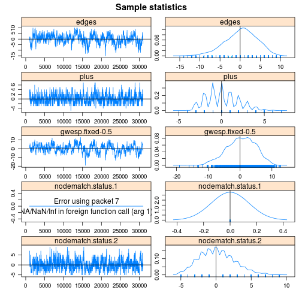 

```r
fit3.1 <- ergm(DP~edges+plus+gwesp_cotergm(-0.5, fixed=TRUE)+nodematch_cotergm("status",diff=TRUE,keep=1),control=control.ergm(MCMC.burnin=10000,MCMC.samplesize=10000,MCMC.interval=100,MCMLE.maxit=10,MCMLE.min.effectiveSize=20,MCMC.max.interval=100), constraints=~atmostnonminus(y0),verbose=0)
```

```
## Iteration 1 of at most 10: 
## Convergence test P-value: 0e+00 
## The log-likelihood improved by 8.575 
## Iteration 2 of at most 10: 
## Convergence test P-value: 1.6e-65 
## The log-likelihood improved by 4.305 
## Iteration 3 of at most 10: 
## Convergence test P-value: 1.6e-40 
## The log-likelihood improved by 3.678 
## Iteration 4 of at most 10: 
## Convergence test P-value: 1.1e-35 
## The log-likelihood improved by 1.438 
## Iteration 5 of at most 10: 
## Convergence test P-value: 2.8e-08 
## The log-likelihood improved by 0.2097 
## Iteration 6 of at most 10: 
## Convergence test P-value: 1.9e-03 
## The log-likelihood improved by 0.07906 
## Iteration 7 of at most 10: 
## Convergence test P-value: 1.4e-02 
## The log-likelihood improved by 0.0581 
## Iteration 8 of at most 10: 
## Convergence test P-value: 2.8e-02 
## The log-likelihood improved by 0.0464 
## Iteration 9 of at most 10: 
## Convergence test P-value: 4.6e-01 
## The log-likelihood improved by 0.01503 
## Iteration 10 of at most 10: 
## Convergence test P-value: 4.1e-02 
## The log-likelihood improved by 0.03552 
## 
## This model was fit using MCMC.  To examine model diagnostics and check for degeneracy, use the mcmc.diagnostics() function.
```

```r
fit3.1
```

```
## MCMC sample of size based on: 
##              edges                plus     gwesp.fixed-0.5  
##             -1.481               0.371              -0.175  
## nodematch.status.1  
##             -0.346  
## 
## Monte Carlo MLE Coefficients:
##              edges                plus     gwesp.fixed-0.5  
##             -1.506               0.295              -0.226  
## nodematch.status.1  
##             -0.421
```

```r
mcmc.diagnostics(fit3.1, vars.per.page=5)
```

```
## Sample statistics summary:
## 
## Iterations = 1249:21247
## Thinning interval = 2 
## Number of chains = 1 
## Sample size per chain = 10000 
## 
## 1. Empirical mean and standard deviation for each variable,
##    plus standard error of the mean:
## 
##                     Mean   SD Naive SE Time-series SE
## edges              0.883 4.04   0.0404          0.557
## plus               0.121 2.08   0.0208          0.104
## gwesp.fixed-0.5    0.310 1.84   0.0184          0.176
## nodematch.status.1 0.320 2.42   0.0242          0.128
## 
## 2. Quantiles for each variable:
## 
##                     2.5%   25%       50%  75% 97.5%
## edges              -6.00 -2.00  1.00e+00 4.00  9.00
## plus               -4.00 -1.00  0.00e+00 2.00  4.00
## gwesp.fixed-0.5    -1.35 -1.35 -8.88e-16 1.65  4.65
## nodematch.status.1 -3.00 -1.00  0.00e+00 2.00  6.00
## 
## 
## Are sample statistics significantly different from observed?
##             edges   plus gwesp.fixed-0.5 nodematch.status.1
## diff.      0.8827 0.1215         0.30961             0.3200
## test stat. 1.5848 1.1688         1.75447             2.4950
## P-val.     0.1130 0.2425         0.07935             0.0126
##            Overall (Chi^2)
## diff.                   NA
## test stat.        10.92426
## P-val.             0.04129
## 
## Sample statistics cross-correlations:
##                     edges      plus gwesp.fixed-0.5 nodematch.status.1
## edges              1.0000  0.108461        0.452348             0.3233
## plus               0.1085  1.000000       -0.004527            -0.6093
## gwesp.fixed-0.5    0.4523 -0.004527        1.000000             0.1586
## nodematch.status.1 0.3233 -0.609323        0.158645             1.0000
## 
## Sample statistics auto-correlation:
## Chain 1 
##         edges   plus gwesp.fixed-0.5 nodematch.status.1
## Lag 0  1.0000 1.0000          1.0000             1.0000
## Lag 2  0.9895 0.9227          0.9785             0.9312
## Lag 4  0.9792 0.8497          0.9576             0.8669
## Lag 6  0.9691 0.7814          0.9368             0.8062
## Lag 8  0.9590 0.7179          0.9165             0.7518
## Lag 10 0.9491 0.6595          0.8964             0.7018
## 
## Sample statistics burn-in diagnostic (Geweke):
## Chain 1 
## 
## Fraction in 1st window = 0.1
## Fraction in 2nd window = 0.5 
## 
##              edges               plus    gwesp.fixed-0.5 
##            0.69551            1.17404           -0.08390 
## nodematch.status.1 
##            0.07087 
## 
## Individual P-values (lower = worse):
##              edges               plus    gwesp.fixed-0.5 
##             0.4867             0.2404             0.9331 
## nodematch.status.1 
##             0.9435 
## Joint P-value (lower = worse):  0.8837 .
```

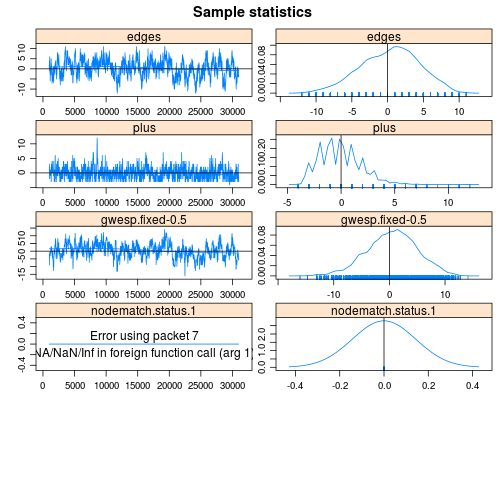 

```r
fit3.2 <- ergm(DP~edges+plus+gwesp_cotergm(-0.5, fixed=TRUE)+nodematch_cotergm("status",diff=TRUE,keep=2),control=control.ergm(MCMC.burnin=10000,MCMC.samplesize=10000,MCMC.interval=100,MCMLE.maxit=10,MCMLE.min.effectiveSize=20,MCMC.max.interval=100), constraints=~atmostnonminus(y0),verbose=0)
```

```
## Iteration 1 of at most 10: 
## Convergence test P-value: 0e+00 
## The log-likelihood improved by 8.984 
## Iteration 2 of at most 10: 
## Convergence test P-value: 3.5e-53 
## The log-likelihood improved by 1.753 
## Iteration 3 of at most 10: 
## Convergence test P-value: 4e-07 
## The log-likelihood improved by 0.05078 
## Iteration 4 of at most 10: 
## Convergence test P-value: 2e-01 
## The log-likelihood improved by 0.01886 
## Iteration 5 of at most 10: 
## Convergence test P-value: 2e-01 
## The log-likelihood improved by 0.02951 
## Iteration 6 of at most 10: 
## Convergence test P-value: 1.1e-01 
## The log-likelihood improved by 0.01773 
## Iteration 7 of at most 10: 
## Convergence test P-value: 3.9e-03 
## The log-likelihood improved by 0.06 
## Iteration 8 of at most 10: 
## Convergence test P-value: 1e-02 
## The log-likelihood improved by 0.05753 
## Iteration 9 of at most 10: 
## Convergence test P-value: 1.6e-04 
## The log-likelihood improved by 0.0486 
## Iteration 10 of at most 10: 
## Convergence test P-value: 1.9e-01 
## The log-likelihood improved by 0.01284 
## 
## This model was fit using MCMC.  To examine model diagnostics and check for degeneracy, use the mcmc.diagnostics() function.
```

```r
fit3.2
```

```
## MCMC sample of size based on: 
##              edges                plus     gwesp.fixed-0.5  
##             -1.466               0.265              -0.253  
## nodematch.status.2  
##             -0.457  
## 
## Monte Carlo MLE Coefficients:
##              edges                plus     gwesp.fixed-0.5  
##             -1.477               0.294              -0.187  
## nodematch.status.2  
##             -0.389
```

```r
mcmc.diagnostics(fit3.2, vars.per.page=5)
```

```
## Sample statistics summary:
## 
## Iterations = 1000:20998
## Thinning interval = 2 
## Number of chains = 1 
## Sample size per chain = 10000 
## 
## 1. Empirical mean and standard deviation for each variable,
##    plus standard error of the mean:
## 
##                       Mean   SD Naive SE Time-series SE
## edges              -0.1125 3.75   0.0375          0.490
## plus                0.0746 2.08   0.0208          0.102
## gwesp.fixed-0.5    -0.1561 1.48   0.0148          0.145
## nodematch.status.2 -0.2758 2.28   0.0228          0.124
## 
## 2. Quantiles for each variable:
## 
##                     2.5%   25%   50%  75% 97.5%
## edges              -7.00 -3.00  0.00 3.00     7
## plus               -4.00 -1.00  0.00 2.00     4
## gwesp.fixed-0.5    -1.35 -1.35 -1.35 1.07     3
## nodematch.status.2 -4.00 -2.00 -1.00 1.00     5
## 
## 
## Are sample statistics significantly different from observed?
##              edges   plus gwesp.fixed-0.5 nodematch.status.2
## diff.      -0.1125 0.0746         -0.1561           -0.27580
## test stat. -0.2294 0.7300         -1.0792           -2.22312
## P-val.      0.8185 0.4654          0.2805            0.02621
##            Overall (Chi^2)
## diff.                   NA
## test stat.          6.4318
## P-val.              0.1938
## 
## Sample statistics cross-correlations:
##                      edges      plus gwesp.fixed-0.5 nodematch.status.2
## edges              1.00000  0.059885        0.265523             0.2903
## plus               0.05988  1.000000       -0.009463            -0.5858
## gwesp.fixed-0.5    0.26552 -0.009463        1.000000             0.1291
## nodematch.status.2 0.29028 -0.585834        0.129060             1.0000
## 
## Sample statistics auto-correlation:
## Chain 1 
##         edges   plus gwesp.fixed-0.5 nodematch.status.2
## Lag 0  1.0000 1.0000          1.0000             1.0000
## Lag 2  0.9880 0.9206          0.9792             0.9346
## Lag 4  0.9765 0.8468          0.9586             0.8745
## Lag 6  0.9647 0.7766          0.9384             0.8186
## Lag 8  0.9531 0.7104          0.9179             0.7673
## Lag 10 0.9413 0.6491          0.8980             0.7173
## 
## Sample statistics burn-in diagnostic (Geweke):
## Chain 1 
## 
## Fraction in 1st window = 0.1
## Fraction in 2nd window = 0.5 
## 
##              edges               plus    gwesp.fixed-0.5 
##          -1.230021           0.001534           0.694095 
## nodematch.status.2 
##          -0.440004 
## 
## Individual P-values (lower = worse):
##              edges               plus    gwesp.fixed-0.5 
##             0.2187             0.9988             0.4876 
## nodematch.status.2 
##             0.6599 
## Joint P-value (lower = worse):  0.5082 .
```

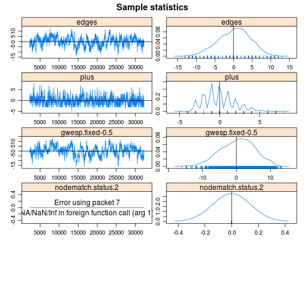 


```r
fit4 <- ergm(DM~edges+plus+gwesp_cotergm(-0.5, fixed=TRUE)+nodematch_cotergm("status",diff=TRUE),control=control.ergm(MCMC.burnin=10000,MCMC.samplesize=10000,MCMC.interval=100,MCMLE.maxit=10,MCMLE.min.effectiveSize=20,MCMC.max.interval=100), constraints=~atmostnonplus(y0),verbose=0)
```

```
## Iteration 1 of at most 10: 
## Convergence test P-value: 0e+00 
## The log-likelihood improved by 8.447 
## Iteration 2 of at most 10: 
## Convergence test P-value: 1.2e-75 
## The log-likelihood improved by 4.102 
## Iteration 3 of at most 10: 
## Convergence test P-value: 2.6e-19 
## The log-likelihood improved by 0.8399 
## Iteration 4 of at most 10: 
## Convergence test P-value: 2.4e-08 
## The log-likelihood improved by 0.1397 
## Iteration 5 of at most 10: 
## Convergence test P-value: 1.7e-03 
## The log-likelihood improved by 0.0334 
## Iteration 6 of at most 10: 
## Convergence test P-value: 9.3e-01 
## Convergence detected. Stopping.
## The log-likelihood improved by 0.004105 
## 
## This model was fit using MCMC.  To examine model diagnostics and check for degeneracy, use the mcmc.diagnostics() function.
```

```r
fit4
```

```
## MCMC sample of size based on: 
##              edges                plus     gwesp.fixed-0.5  
##             -1.170               1.280              -0.369  
## nodematch.status.1  nodematch.status.2  
##              0.629              -0.930  
## 
## Monte Carlo MLE Coefficients:
##              edges                plus     gwesp.fixed-0.5  
##             -1.182               1.283              -0.403  
## nodematch.status.1  nodematch.status.2  
##              0.657              -0.926
```

```r
mcmc.diagnostics(fit4, vars.per.page=5)
```

```
## Sample statistics summary:
## 
## Iterations = 1000:20998
## Thinning interval = 2 
## Number of chains = 1 
## Sample size per chain = 10000 
## 
## 1. Empirical mean and standard deviation for each variable,
##    plus standard error of the mean:
## 
##                       Mean   SD Naive SE Time-series SE
## edges               0.1999 4.73   0.0473          0.710
## plus               -0.0084 2.31   0.0231          0.155
## gwesp.fixed-0.5     0.1443 1.93   0.0193          0.225
## nodematch.status.1 -0.0406 2.36   0.0236          0.173
## nodematch.status.2  0.0175 2.51   0.0251          0.125
## 
## 2. Quantiles for each variable:
## 
##                      2.5%   25%   50%  75% 97.5%
## edges              -10.00 -3.00  0.00 4.00   9.0
## plus                -4.00 -2.00  0.00 2.00   4.0
## gwesp.fixed-0.5     -1.05 -1.05 -1.05 1.65   6.3
## nodematch.status.1  -4.00 -2.00  0.00 1.00   5.0
## nodematch.status.2  -4.00 -2.00  0.00 2.00   5.0
## 
## 
## Are sample statistics significantly different from observed?
##             edges     plus gwesp.fixed-0.5 nodematch.status.1
## diff.      0.1999 -0.00840          0.1443            -0.0406
## test stat. 0.2815 -0.05411          0.6411            -0.2350
## P-val.     0.7783  0.95685          0.5215             0.8142
##            nodematch.status.2 Overall (Chi^2)
## diff.                  0.0175              NA
## test stat.             0.1397          1.4086
## P-val.                 0.8889          0.9312
## 
## Sample statistics cross-correlations:
##                       edges    plus gwesp.fixed-0.5 nodematch.status.1
## edges               1.00000 -0.5181         0.33875             0.5575
## plus               -0.51814  1.0000        -0.15093            -0.7226
## gwesp.fixed-0.5     0.33875 -0.1509         1.00000             0.1507
## nodematch.status.1  0.55746 -0.7226         0.15069             1.0000
## nodematch.status.2  0.01244  0.5599        -0.06824            -0.3877
##                    nodematch.status.2
## edges                         0.01244
## plus                          0.55987
## gwesp.fixed-0.5              -0.06824
## nodematch.status.1           -0.38772
## nodematch.status.2            1.00000
## 
## Sample statistics auto-correlation:
## Chain 1 
##         edges   plus gwesp.fixed-0.5 nodematch.status.1 nodematch.status.2
## Lag 0  1.0000 1.0000          1.0000             1.0000             1.0000
## Lag 2  0.9912 0.9432          0.9834             0.9447             0.9228
## Lag 4  0.9822 0.8915          0.9674             0.8969             0.8507
## Lag 6  0.9734 0.8463          0.9525             0.8557             0.7849
## Lag 8  0.9648 0.8045          0.9382             0.8175             0.7249
## Lag 10 0.9563 0.7659          0.9247             0.7826             0.6686
## 
## Sample statistics burn-in diagnostic (Geweke):
## Chain 1 
## 
## Fraction in 1st window = 0.1
## Fraction in 2nd window = 0.5 
## 
##              edges               plus    gwesp.fixed-0.5 
##             0.1704             0.7212            -1.6200 
## nodematch.status.1 nodematch.status.2 
##            -1.4150             2.1677 
## 
## Individual P-values (lower = worse):
##              edges               plus    gwesp.fixed-0.5 
##            0.86469            0.47076            0.10524 
## nodematch.status.1 nodematch.status.2 
##            0.15708            0.03018 
## Joint P-value (lower = worse):  0.1672 .
```

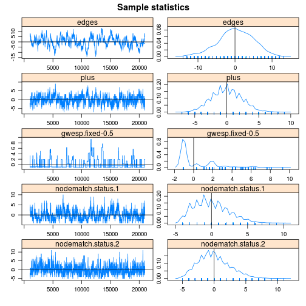 

```r
fit4.1 <- ergm(DM~edges+plus+gwesp_cotergm(-0.5, fixed=TRUE)+nodematch_cotergm("status",diff=TRUE,keep=1),control=control.ergm(MCMC.burnin=10000,MCMC.samplesize=10000,MCMC.interval=100,MCMLE.maxit=10,MCMLE.min.effectiveSize=20,MCMC.max.interval=100), constraints=~atmostnonplus(y0),verbose=0)
```

```
## Iteration 1 of at most 10: 
## Convergence test P-value: 0e+00 
## The log-likelihood improved by 8.22 
## Iteration 2 of at most 10: 
## Convergence test P-value: 5.8e-87 
## The log-likelihood improved by 2.669 
## Iteration 3 of at most 10: 
## Convergence test P-value: 5.4e-82 
## The log-likelihood improved by 3.812 
## Iteration 4 of at most 10: 
## Convergence test P-value: 1.7e-108 
## The log-likelihood improved by 5.679 
## Iteration 5 of at most 10: 
## Convergence test P-value: 1.4e-61 
## The log-likelihood improved by 4.261 
## Iteration 6 of at most 10: 
## Convergence test P-value: 6.3e-69 
## The log-likelihood improved by 1.219 
## Iteration 7 of at most 10: 
## Convergence test P-value: 1.9e-11 
## The log-likelihood improved by 0.2693 
## Iteration 8 of at most 10: 
## Convergence test P-value: 2.5e-04 
## The log-likelihood improved by 0.07731 
## Iteration 9 of at most 10: 
## Convergence test P-value: 5e-01 
## Convergence detected. Stopping.
## The log-likelihood improved by 0.02099 
## 
## This model was fit using MCMC.  To examine model diagnostics and check for degeneracy, use the mcmc.diagnostics() function.
```

```r
fit4.1
```

```
## MCMC sample of size based on: 
##              edges                plus     gwesp.fixed-0.5  
##             -1.499               0.527              -0.282  
## nodematch.status.1  
##              0.905  
## 
## Monte Carlo MLE Coefficients:
##              edges                plus     gwesp.fixed-0.5  
##             -1.455               0.504              -0.339  
## nodematch.status.1  
##              0.908
```

```r
mcmc.diagnostics(fit4.1, vars.per.page=5)
```

```
## Sample statistics summary:
## 
## Iterations = 1747:21745
## Thinning interval = 2 
## Number of chains = 1 
## Sample size per chain = 10000 
## 
## 1. Empirical mean and standard deviation for each variable,
##    plus standard error of the mean:
## 
##                       Mean   SD Naive SE Time-series SE
## edges              -0.7579 4.33   0.0433          0.619
## plus                0.2114 2.40   0.0240          0.134
## gwesp.fixed-0.5     0.0502 1.63   0.0163          0.148
## nodematch.status.1 -0.2568 2.31   0.0231          0.180
## 
## 2. Quantiles for each variable:
## 
##                     2.5%   25%   50%  75% 97.5%
## edges              -9.00 -4.00 -1.00 2.00  8.00
## plus               -4.00 -1.00  0.00 2.00  5.00
## gwesp.fixed-0.5    -1.05 -1.05 -1.05 1.65  4.95
## nodematch.status.1 -4.00 -2.00 -1.00 1.00  5.00
## 
## 
## Are sample statistics significantly different from observed?
##              edges   plus gwesp.fixed-0.5 nodematch.status.1
## diff.      -0.7579 0.2114         0.05023            -0.2568
## test stat. -1.2249 1.5768         0.34045            -1.4228
## P-val.      0.2206 0.1148         0.73352             0.1548
##            Overall (Chi^2)
## diff.                   NA
## test stat.          3.5353
## P-val.              0.5003
## 
## Sample statistics cross-correlations:
##                      edges     plus gwesp.fixed-0.5 nodematch.status.1
## edges               1.0000 -0.16853         0.30401             0.3980
## plus               -0.1685  1.00000        -0.04954            -0.6737
## gwesp.fixed-0.5     0.3040 -0.04954         1.00000             0.1055
## nodematch.status.1  0.3980 -0.67369         0.10550             1.0000
## 
## Sample statistics auto-correlation:
## Chain 1 
##         edges   plus gwesp.fixed-0.5 nodematch.status.1
## Lag 0  1.0000 1.0000          1.0000             1.0000
## Lag 2  0.9900 0.9379          0.9760             0.9525
## Lag 4  0.9803 0.8799          0.9523             0.9078
## Lag 6  0.9708 0.8264          0.9293             0.8666
## Lag 8  0.9614 0.7744          0.9076             0.8277
## Lag 10 0.9522 0.7244          0.8857             0.7906
## 
## Sample statistics burn-in diagnostic (Geweke):
## Chain 1 
## 
## Fraction in 1st window = 0.1
## Fraction in 2nd window = 0.5 
## 
##              edges               plus    gwesp.fixed-0.5 
##           -0.25281           -0.64966            0.00686 
## nodematch.status.1 
##            0.40094 
## 
## Individual P-values (lower = worse):
##              edges               plus    gwesp.fixed-0.5 
##             0.8004             0.5159             0.9945 
## nodematch.status.1 
##             0.6885 
## Joint P-value (lower = worse):  0.9553 .
```

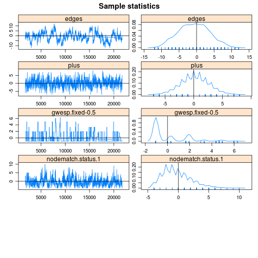 

```r
fit4.2 <- ergm(DM~edges+plus+gwesp_cotergm(-0.5, fixed=TRUE)+nodematch_cotergm("status",diff=TRUE,keep=2),control=control.ergm(MCMC.burnin=10000,MCMC.samplesize=10000,MCMC.interval=100,MCMLE.maxit=10,MCMLE.min.effectiveSize=20,MCMC.max.interval=100), constraints=~atmostnonplus(y0),verbose=0)
```

```
## Iteration 1 of at most 10: 
## Convergence test P-value: 0e+00 
## The log-likelihood improved by 9.591 
## Iteration 2 of at most 10: 
## Convergence test P-value: 3.6e-35 
## The log-likelihood improved by 5.454 
## Iteration 3 of at most 10: 
## Convergence test P-value: 1.6e-48 
## The log-likelihood improved by 1.409 
## Iteration 4 of at most 10: 
## Convergence test P-value: 2.2e-12 
## The log-likelihood improved by 0.2433 
## Iteration 5 of at most 10: 
## Convergence test P-value: 4.4e-02 
## The log-likelihood improved by 0.02865 
## Iteration 6 of at most 10: 
## Convergence test P-value: 4.2e-01 
## The log-likelihood improved by 0.01583 
## Iteration 7 of at most 10: 
## Convergence test P-value: 1.5e-01 
## The log-likelihood improved by 0.01674 
## Iteration 8 of at most 10: 
## Convergence test P-value: 2.9e-01 
## The log-likelihood improved by 0.02477 
## Iteration 9 of at most 10: 
## Convergence test P-value: 2.7e-06 
## The log-likelihood improved by 0.05324 
## Iteration 10 of at most 10: 
## Convergence test P-value: 1.8e-01 
## The log-likelihood improved by 0.01607 
## 
## This model was fit using MCMC.  To examine model diagnostics and check for degeneracy, use the mcmc.diagnostics() function.
```

```r
fit4.2
```

```
## MCMC sample of size based on: 
##              edges                plus     gwesp.fixed-0.5  
##             -1.419               0.419              -0.330  
## nodematch.status.2  
##              0.804  
## 
## Monte Carlo MLE Coefficients:
##              edges                plus     gwesp.fixed-0.5  
##             -1.441               0.475              -0.373  
## nodematch.status.2  
##              0.811
```

```r
mcmc.diagnostics(fit4.2, vars.per.page=5)
```

```
## Sample statistics summary:
## 
## Iterations = 1998:21996
## Thinning interval = 2 
## Number of chains = 1 
## Sample size per chain = 10000 
## 
## 1. Empirical mean and standard deviation for each variable,
##    plus standard error of the mean:
## 
##                      Mean   SD Naive SE Time-series SE
## edges               0.410 3.66   0.0366          0.410
## plus               -0.328 2.44   0.0244          0.138
## gwesp.fixed-0.5     0.149 1.67   0.0167          0.153
## nodematch.status.2  0.285 2.46   0.0246          0.170
## 
## 2. Quantiles for each variable:
## 
##                     2.5%   25%   50%  75% 97.5%
## edges              -7.00 -2.00  0.00 3.00  8.00
## plus               -5.00 -2.00  0.00 1.00  4.00
## gwesp.fixed-0.5    -1.05 -1.05 -1.05 1.95  4.95
## nodematch.status.2 -4.00 -2.00  0.00 2.00  6.00
## 
## 
## Are sample statistics significantly different from observed?
##             edges     plus gwesp.fixed-0.5 nodematch.status.2
## diff.      0.4097 -0.32790          0.1487            0.28470
## test stat. 1.0005 -2.37542          0.9721            1.67793
## P-val.     0.3171  0.01753          0.3310            0.09336
##            Overall (Chi^2)
## diff.                   NA
## test stat.          6.6252
## P-val.              0.1768
## 
## Sample statistics cross-correlations:
##                      edges     plus gwesp.fixed-0.5 nodematch.status.2
## edges               1.0000 -0.12467         0.25137            0.31575
## plus               -0.1247  1.00000         0.01827           -0.73120
## gwesp.fixed-0.5     0.2514  0.01827         1.00000            0.07965
## nodematch.status.2  0.3158 -0.73120         0.07965            1.00000
## 
## Sample statistics auto-correlation:
## Chain 1 
##         edges   plus gwesp.fixed-0.5 nodematch.status.2
## Lag 0  1.0000 1.0000          1.0000             1.0000
## Lag 2  0.9851 0.9393          0.9777             0.9540
## Lag 4  0.9700 0.8832          0.9559             0.9116
## Lag 6  0.9547 0.8288          0.9333             0.8730
## Lag 8  0.9396 0.7781          0.9116             0.8374
## Lag 10 0.9247 0.7308          0.8903             0.8045
## 
## Sample statistics burn-in diagnostic (Geweke):
## Chain 1 
## 
## Fraction in 1st window = 0.1
## Fraction in 2nd window = 0.5 
## 
##              edges               plus    gwesp.fixed-0.5 
##           -1.19378           -0.51264           -0.25647 
## nodematch.status.2 
##           -0.04042 
## 
## Individual P-values (lower = worse):
##              edges               plus    gwesp.fixed-0.5 
##             0.2326             0.6082             0.7976 
## nodematch.status.2 
##             0.9678 
## Joint P-value (lower = worse):  0.9089 .
```

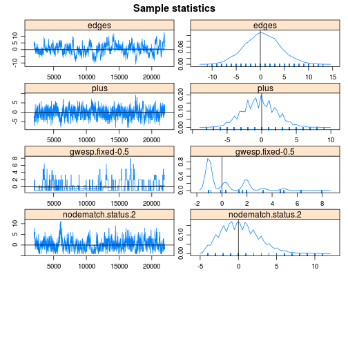 
