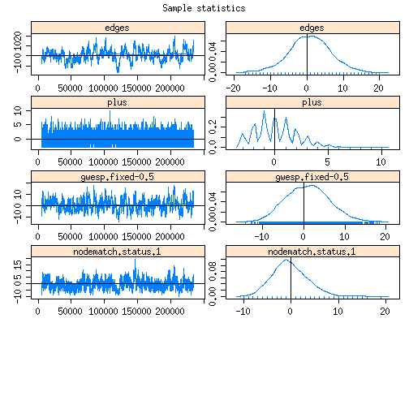
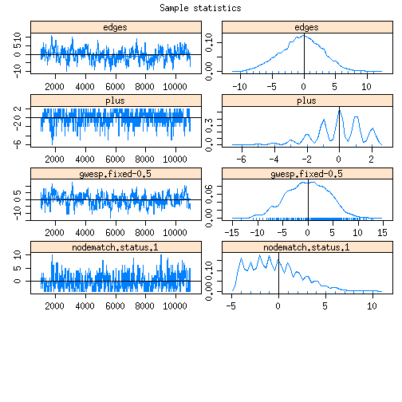
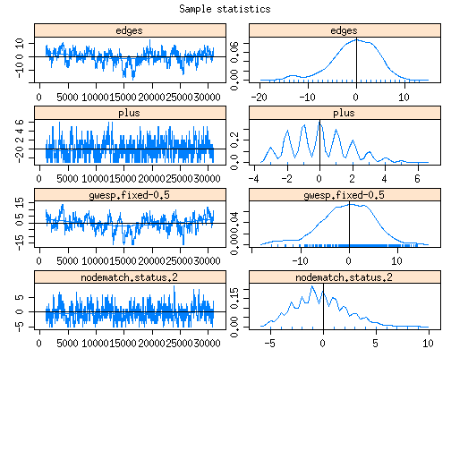

# Coevolution STERGM
###############################################################################

```r
opts_chunk$set(cache=TRUE)
op <- par()
par(mfrow=c(1,1),mar=c(3,3,1,1), mgp=c(2,1,0))
np <- par()

fls <-list.files("../../",recursive=T)
source(paste0("../../",fls[grep("kk_utils/utils.R",fls)]))
source(paste0("../../",fls[grep("cotergm/R/functions.R",fls)]))
fig.path = "figures/"
# .libPaths(cotergm)
library("statnet.common",lib=cotergm)
library("network",lib=cotergm)
library("ergm",lib=cotergm)
library("tergm",lib=cotergm)
set.seed(123)
```


```r
net1 <-as.network(read.table("../s50_data/s50-network1.dat"))
net2 <-as.network(read.table("../s50_data/s50-network2.dat"))
net3 <-as.network(read.table("../s50_data/s50-network3.dat"))
alcohol <- read.table("../s50_data/s50-alcohol.dat")
drugs <- read.table("../s50_data/s50-drugs.dat")
net <- net1

d2ud <- function(net){
	net <- as.matrix(net)
	for (i in 1:nrow(net)){
		for(j in 1:nrow(net)){
			net[i,j] = max(net[i,j],net[j,i])
		}}
	as.network(net,directed=FALSE)
}

net1 <- d2ud(net1)
net2 <- d2ud(net2)
net3 <- d2ud(net3)

al1 <- as.numeric(alcohol[,1]>3)+1
al2 <- as.numeric(alcohol[,2]>3)+1
net1 %v% "status" <- al1
net2 %v% "status" <- al2

y0 <- net1
nw <- net2
```


```r
# Formation Plus Network
FP <- FP.nw(y0,nw,"status")
# Formation Minus Network
FM <- FM.nw(y0,nw,"status")
# Dissolution Plus Network
DP <- DP.nw(y0,nw,"status")
# Dissolution Minus Network
DM <- DM.nw(y0,nw,"status")
```


```r
constraints=~atleastnonminus(y0)

MHproposal <- MHproposal(constraints,nw=y0,arguments=list())

summary(y0~edges+plus+nodematch_cotergm("status",diff=TRUE),MHproposal=MHproposal)
```

```
##              edges               plus nodematch.status.1 
##                 74                 17                 32 
## nodematch.status.2 
##                 16
```

```r
summary(nw~edges+plus+nodematch_cotergm("status",diff=TRUE),MHproposal=MHproposal)
```

```
##              edges               plus nodematch.status.1 
##                 81                 19                 29 
## nodematch.status.2 
##                 22
```

```r
summary(FP~edges+plus+nodematch_cotergm("status",diff=TRUE,y0edge=0),MHproposal=MHproposal)
```

```
##              edges               plus nodematch.status.1 
##                 94                 14                 43 
## nodematch.status.2 
##                 23
```

```r
summary(FP~edges+plus+nodematch_cotergm("status",diff=TRUE,y0edge=1),MHproposal=MHproposal)
```

```
##              edges               plus nodematch.status.1 
##                 94                 14                 40 
## nodematch.status.2 
##                 14
```

```r
summary(FP~edges+plus+nodematch_cotergm("status",diff=TRUE,y0edge=2),MHproposal=MHproposal)
```

```
##              edges               plus nodematch.status.1 
##                 94                 14                  3 
## nodematch.status.2 
##                  9
```

```r
summary(FM~edges+plus+nodematch_cotergm("status",diff=TRUE,y0edge=0),MHproposal=MHproposal)
```

```
##              edges               plus nodematch.status.1 
##                103                 22                 32 
## nodematch.status.2 
##                 30
```

```r
summary(FM~edges+plus+nodematch_cotergm("status",diff=TRUE,y0edge=1),MHproposal=MHproposal)
```

```
##              edges               plus nodematch.status.1 
##                103                 22                 22 
## nodematch.status.2 
##                 26
```

```r
summary(FM~edges+plus+nodematch_cotergm("status",diff=TRUE,y0edge=2),MHproposal=MHproposal)
```

```
##              edges               plus nodematch.status.1 
##                103                 22                 10 
## nodematch.status.2 
##                  4
```

```r
summary(DP~edges+plus+nodematch_cotergm("status",diff=TRUE,y0nodal=0),MHproposal=MHproposal)
```

```
##              edges               plus nodematch.status.1 
##                 54                 14                 36 
## nodematch.status.2 
##                  7
```

```r
summary(DP~edges+plus+nodematch_cotergm("status",diff=TRUE,y0nodal=1),MHproposal=MHproposal)
```

```
##              edges               plus nodematch.status.1 
##                 54                 14                 32 
## nodematch.status.2 
##                  7
```

```r
summary(DP~edges+plus+nodematch_cotergm("status",diff=TRUE,y0nodal=2),MHproposal=MHproposal)
```

```
##              edges               plus nodematch.status.1 
##                 54                 14                  4 
## nodematch.status.2 
##                  0
```

```r
summary(DM~edges+plus+nodematch_cotergm("status",diff=TRUE,y0nodal=0),MHproposal=MHproposal)
```

```
##              edges               plus nodematch.status.1 
##                 50                 22                 15 
## nodematch.status.2 
##                 21
```

```r
summary(DM~edges+plus+nodematch_cotergm("status",diff=TRUE,y0nodal=1),MHproposal=MHproposal)
```

```
##              edges               plus nodematch.status.1 
##                 50                 22                 15 
## nodematch.status.2 
##                 16
```

```r
summary(DM~edges+plus+nodematch_cotergm("status",diff=TRUE,y0nodal=2),MHproposal=MHproposal)
```

```
##              edges               plus nodematch.status.1 
##                 50                 22                  0 
## nodematch.status.2 
##                  5
```


```r
#fit1 <- ergm(FP~edges+plus+gwesp_cotergm(-0.5,fixed=TRUE)+nodematch_cotergm("status",diff=TRUE,y0edge=2),control=control.ergm(MCMC.burnin=10000,MCMC.samplesize=10000,MCMC.interval=100,MCMLE.maxit=20,MCMLE.min.effectiveSize=20,MCMC.max.interval=100), constraints=~atleastnonminus(y0),verbose=0, eval.loglik=F)
#fit1
#mcmc.diagnostics(fit1, vars.per.page=5)

#fit1.1 <- ergm(FP~edges+plus+gwesp_cotergm(-0.5,fixed=TRUE)+nodematch_cotergm("status",diff=TRUE,y0edge=2,keep=1),control=control.ergm(MCMC.burnin=10000,MCMC.samplesize=10000,MCMC.interval=100,MCMLE.maxit=20,MCMLE.min.effectiveSize=20,MCMC.max.interval=100), constraints=~atleastnonminus(y0),verbose=0, eval.loglik=F)
#fit1.1
#mcmc.diagnostics(fit1.1, vars.per.page=5)

fit1.2 <- ergm(FP~edges+plus+gwesp_cotergm(-0.5,fixed=TRUE)+nodematch_cotergm("status",diff=TRUE,y0edge=2,keep=2),control=control.ergm(MCMC.burnin=10000,MCMC.samplesize=10000,MCMC.interval=100,MCMLE.maxit=20,MCMLE.min.effectiveSize=20,MCMC.max.interval=100), constraints=~atleastnonminus(y0),verbose=0, eval.loglik=F)
```

```
## Iteration 1 of at most 20: 
## Convergence test P-value: 1.1e-307 
## The log-likelihood improved by 5.614 
## Iteration 2 of at most 20: 
## Convergence test P-value: 1e-52 
## The log-likelihood improved by 1.903 
## Iteration 3 of at most 20: 
## Convergence test P-value: 9.5e-36 
## The log-likelihood improved by 0.6248 
## Iteration 4 of at most 20: 
## Convergence test P-value: 5.3e-21 
## The log-likelihood improved by 0.2196 
## Iteration 5 of at most 20: 
## Convergence test P-value: 3.7e-01 
## The log-likelihood improved by 0.01629 
## Iteration 6 of at most 20: 
## Convergence test P-value: 2.5e-01 
## The log-likelihood improved by 0.02241 
## Iteration 7 of at most 20: 
## Convergence test P-value: 5.2e-02 
## The log-likelihood improved by 0.03801 
## Iteration 8 of at most 20: 
## Convergence test P-value: 1.8e-03 
## The log-likelihood improved by 0.04636 
## Iteration 9 of at most 20: 
## Convergence test P-value: 1.4e-02 
## The log-likelihood improved by 0.0355 
## Iteration 10 of at most 20: 
## Convergence test P-value: 1.2e-03 
## The log-likelihood improved by 0.05453 
## Iteration 11 of at most 20: 
## Convergence test P-value: 9.5e-03 
## The log-likelihood improved by 0.01952 
## Iteration 12 of at most 20: 
## Convergence test P-value: 1.1e-02 
## The log-likelihood improved by 0.05443 
## Iteration 13 of at most 20: 
## Convergence test P-value: 2.8e-04 
## The log-likelihood improved by 0.07023 
## Iteration 14 of at most 20: 
## Convergence test P-value: 6.1e-02 
## The log-likelihood improved by 0.03713 
## Iteration 15 of at most 20: 
## Convergence test P-value: 6.2e-01 
## Convergence detected. Stopping.
## The log-likelihood improved by 0.005948 
## 
## This model was fit using MCMC.  To examine model diagnostics and check for degeneracy, use the mcmc.diagnostics() function.
```

```r
fit1.2
```

```
## MCMC sample of size based on: 
##              edges                plus     gwesp.fixed-0.5  
##            -4.1009              0.5781              0.3756  
## nodematch.status.2  
##             1.7042  
## 
## Monte Carlo MLE Coefficients:
##              edges                plus     gwesp.fixed-0.5  
##            -4.0973              0.5750              0.4082  
## nodematch.status.2  
##             1.6770
```

```r
mcmc.diagnostics(fit1.2, vars.per.page=5)
```

```
## Sample statistics summary:
## 
## Iterations = 29997:259974
## Thinning interval = 23 
## Number of chains = 1 
## Sample size per chain = 10000 
## 
## 1. Empirical mean and standard deviation for each variable,
##    plus standard error of the mean:
## 
##                       Mean    SD Naive SE Time-series SE
## edges              -0.1699 5.266  0.05266        0.72433
## plus                0.0288 1.583  0.01583        0.08773
## gwesp.fixed-0.5    -0.3249 4.216  0.04216        0.36060
## nodematch.status.2  0.0220 4.005  0.04005        0.51034
## 
## 2. Quantiles for each variable:
## 
##                       2.5%    25%     50%   75%  97.5%
## edges              -10.000 -4.000  0.0000 3.000 11.000
## plus                -4.000 -1.000  0.0000 1.000  2.000
## gwesp.fixed-0.5     -7.905 -3.475 -0.6843 2.639  8.128
## nodematch.status.2  -7.000 -3.000  0.0000 3.000  8.000
## 
## 
## Are sample statistics significantly different from observed?
##                 edges      plus gwesp.fixed-0.5 nodematch.status.2
## diff.      -0.1699000 0.0288000      -0.3249220         0.02200000
## test stat. -0.2345619 0.3282836      -0.9010561         0.04310812
## P-val.      0.8145488 0.7426972       0.3675585         0.96561535
##            Overall (Chi^2)
## diff.                   NA
## test stat.       2.7995959
## P-val.           0.6181963
## 
## Sample statistics cross-correlations:
##                        edges      plus gwesp.fixed-0.5 nodematch.status.2
## edges              1.0000000 0.3805900       0.7262536          0.7776889
## plus               0.3805900 1.0000000       0.3086630          0.5774519
## gwesp.fixed-0.5    0.7262536 0.3086630       1.0000000          0.6663007
## nodematch.status.2 0.7776889 0.5774519       0.6663007          1.0000000
## 
## Sample statistics auto-correlation:
## Chain 1 
##             edges      plus gwesp.fixed-0.5 nodematch.status.2
## Lag 0   1.0000000 1.0000000       1.0000000          1.0000000
## Lag 23  0.9894819 0.5685456       0.9712397          0.9692765
## Lag 46  0.9792409 0.4056153       0.9443036          0.9482975
## Lag 69  0.9688586 0.3366258       0.9189441          0.9328172
## Lag 92  0.9585743 0.3042087       0.8935391          0.9200550
## Lag 115 0.9483176 0.2860058       0.8686625          0.9086584
## 
## Sample statistics burn-in diagnostic (Geweke):
## Chain 1 
## 
## Fraction in 1st window = 0.1
## Fraction in 2nd window = 0.5 
## 
##              edges               plus    gwesp.fixed-0.5 
##              3.241              2.687              2.003 
## nodematch.status.2 
##              2.442 
## 
## Individual P-values (lower = worse):
##              edges               plus    gwesp.fixed-0.5 
##        0.001191765        0.007213034        0.045145726 
## nodematch.status.2 
##        0.014612049 
## Joint P-value (lower = worse):  0.4278994 .
```

 


```r
#fit2 <- ergm(FM~edges+plus+gwesp_cotergm(-0.5,fixed=TRUE)+nodematch_cotergm("status",diff=TRUE,y0edge=2),control=control.ergm(MCMC.burnin=10000,MCMC.samplesize=10000,MCMC.interval=100,MCMLE.maxit=20,MCMLE.min.effectiveSize=20,MCMC.max.interval=100), constraints=~atleastnonplus(y0),verbose=0, eval.loglik=F)
#fit2
#mcmc.diagnostics(fit2, vars.per.page=5)

fit2.1 <- ergm(FM~edges+plus+gwesp_cotergm(-0.5,fixed=TRUE)+nodematch_cotergm("status",diff=TRUE,y0edge=2,keep=1),control=control.ergm(MCMC.burnin=10000,MCMC.samplesize=10000,MCMC.interval=100,MCMLE.maxit=20,MCMLE.min.effectiveSize=20,MCMC.max.interval=100), constraints=~atleastnonplus(y0),verbose=0, eval.loglik=F)
```

```
## Iteration 1 of at most 20: 
## Convergence test P-value: 9.7e-242 
## The log-likelihood improved by 7.353 
## Iteration 2 of at most 20: 
## Convergence test P-value: 3.4e-177 
## The log-likelihood improved by 5.175 
## Iteration 3 of at most 20: 
## Convergence test P-value: 3.2e-41 
## The log-likelihood improved by 0.3164 
## Iteration 4 of at most 20: 
## Convergence test P-value: 4.3e-03 
## The log-likelihood improved by 0.02847 
## Iteration 5 of at most 20: 
## Convergence test P-value: 3.4e-02 
## The log-likelihood improved by 0.04813 
## Iteration 6 of at most 20: 
## Convergence test P-value: 4.5e-01 
## The log-likelihood improved by 0.02562 
## Iteration 7 of at most 20: 
## Convergence test P-value: 9.7e-03 
## The log-likelihood improved by 0.0317 
## Iteration 8 of at most 20: 
## Convergence test P-value: 9.3e-06 
## The log-likelihood improved by 0.1213 
## Iteration 9 of at most 20: 
## Convergence test P-value: 5.7e-04 
## The log-likelihood improved by 0.07196 
## Iteration 10 of at most 20: 
## Convergence test P-value: 1.7e-01 
## The log-likelihood improved by 0.01808 
## Iteration 11 of at most 20: 
## Convergence test P-value: 5.2e-02 
## The log-likelihood improved by 0.02275 
## Iteration 12 of at most 20: 
## Convergence test P-value: 1e-02 
## The log-likelihood improved by 0.06779 
## Iteration 13 of at most 20: 
## Convergence test P-value: 6e-02 
## The log-likelihood improved by 0.01715 
## Iteration 14 of at most 20: 
## Convergence test P-value: 1.2e-03 
## The log-likelihood improved by 0.03227 
## Iteration 15 of at most 20: 
## Convergence test P-value: 1.6e-03 
## The log-likelihood improved by 0.02654 
## Iteration 16 of at most 20: 
## Convergence test P-value: 3e-06 
## The log-likelihood improved by 0.1112 
## Iteration 17 of at most 20: 
## Convergence test P-value: 2.1e-06 
## The log-likelihood improved by 0.05164 
## Iteration 18 of at most 20: 
## Convergence test P-value: 3.2e-01 
## The log-likelihood improved by 0.02049 
## Iteration 19 of at most 20: 
## Convergence test P-value: 2.1e-01 
## The log-likelihood improved by 0.04052 
## Iteration 20 of at most 20: 
## Convergence test P-value: 3e-03 
## The log-likelihood improved by 0.03812 
## 
## This model was fit using MCMC.  To examine model diagnostics and check for degeneracy, use the mcmc.diagnostics() function.
```

```r
fit2.1
```

```
## MCMC sample of size based on: 
##              edges                plus     gwesp.fixed-0.5  
##          -3.928730           -1.746028            0.848588  
## nodematch.status.1  
##          -0.005826  
## 
## Monte Carlo MLE Coefficients:
##              edges                plus     gwesp.fixed-0.5  
##           -3.96215            -1.71285             0.81698  
## nodematch.status.1  
##            0.07109
```

```r
mcmc.diagnostics(fit2.1, vars.per.page=5)
```

```
## Sample statistics summary:
## 
## Iterations = 4914.836:234891.8
## Thinning interval = 23 
## Number of chains = 1 
## Sample size per chain = 10000 
## 
## 1. Empirical mean and standard deviation for each variable,
##    plus standard error of the mean:
## 
##                       Mean    SD Naive SE Time-series SE
## edges               0.8324 5.728  0.05728        0.76066
## plus                0.0662 1.914  0.01914        0.03853
## gwesp.fixed-0.5     0.9669 5.175  0.05175        0.41040
## nodematch.status.1 -0.2608 3.612  0.03612        0.39383
## 
## 2. Quantiles for each variable:
## 
##                       2.5%    25%    50%   75% 97.5%
## edges              -11.000 -3.000  1.000 5.000 12.00
## plus                -3.000 -1.000  0.000 1.000  4.00
## gwesp.fixed-0.5     -8.525 -2.733  0.872 4.417 11.27
## nodematch.status.1  -7.000 -3.000 -1.000 2.000  7.00
## 
## 
## Are sample statistics significantly different from observed?
##                edges       plus gwesp.fixed-0.5 nodematch.status.1
## diff.      0.8324000 0.06620000       0.9669471         -0.2608000
## test stat. 1.0943188 1.71800986       2.3560928         -0.6622165
## P-val.     0.2738152 0.08579482       0.0184683          0.5078325
##            Overall (Chi^2)
## diff.                   NA
## test stat.    18.381748038
## P-val.         0.003001687
## 
## Sample statistics cross-correlations:
##                        edges         plus gwesp.fixed-0.5
## edges              1.0000000  0.016836103     0.741183908
## plus               0.0168361  1.000000000     0.007117825
## gwesp.fixed-0.5    0.7411839  0.007117825     1.000000000
## nodematch.status.1 0.5985412 -0.337312111     0.425323232
##                    nodematch.status.1
## edges                       0.5985412
## plus                       -0.3373121
## gwesp.fixed-0.5             0.4253232
## nodematch.status.1          1.0000000
## 
## Sample statistics auto-correlation:
## Chain 1 
##             edges       plus gwesp.fixed-0.5 nodematch.status.1
## Lag 0   1.0000000 1.00000000       1.0000000          1.0000000
## Lag 23  0.9887207 0.60420664       0.9686920          0.8600070
## Lag 46  0.9775830 0.37716247       0.9390387          0.7780965
## Lag 69  0.9666918 0.22277260       0.9112154          0.7226281
## Lag 92  0.9555719 0.13366987       0.8843485          0.6841015
## Lag 115 0.9448051 0.07841159       0.8592885          0.6582497
## 
## Sample statistics burn-in diagnostic (Geweke):
## Chain 1 
## 
## Fraction in 1st window = 0.1
## Fraction in 2nd window = 0.5 
## 
##              edges               plus    gwesp.fixed-0.5 
##            0.04682            1.27323            2.07301 
## nodematch.status.1 
##            0.07855 
## 
## Individual P-values (lower = worse):
##              edges               plus    gwesp.fixed-0.5 
##         0.96265374         0.20293539         0.03817107 
## nodematch.status.1 
##         0.93738962 
## Joint P-value (lower = worse):  0.1096309 .
```

 

```r
#fit2.2 <- ergm(FM~edges+plus+gwesp_cotergm(-0.5,fixed=TRUE)+nodematch_cotergm("status",diff=TRUE,y0edge=2,keep=2),control=control.ergm(MCMC.burnin=10000,MCMC.samplesize=10000,MCMC.interval=100,MCMLE.maxit=20,MCMLE.min.effectiveSize=20,MCMC.max.interval=100), constraints=~atleastnonplus(y0),verbose=0, eval.loglik=F)
#fit2.2
#mcmc.diagnostics(fit2.2, vars.per.page=5)
```


```r
#fit3 <- ergm(DP~edges+plus+gwesp_cotergm(-0.5,fixed=TRUE)+nodematch_cotergm("status",diff=TRUE,y0nodal=2),control=control.ergm(MCMC.burnin=10000,MCMC.samplesize=10000,MCMC.interval=100,MCMLE.maxit=20,MCMLE.min.effectiveSize=20,MCMC.max.interval=100), constraints=~atmostnonminus(y0),verbose=0, eval.loglik=F)
#fit3
#mcmc.diagnostics(fit3, vars.per.page=5)

fit3.1 <- ergm(DP~edges+plus+gwesp_cotergm(-0.5,fixed=TRUE)+nodematch_cotergm("status",diff=TRUE,y0nodal=2,keep=1),control=control.ergm(MCMC.burnin=10000,MCMC.samplesize=10000,MCMC.interval=100,MCMLE.maxit=20,MCMLE.min.effectiveSize=20,MCMC.max.interval=100), constraints=~atmostnonminus(y0),verbose=0, eval.loglik=F)
```

```
## Iteration 1 of at most 20: 
## Convergence test P-value: 0e+00 
## The log-likelihood improved by 6.08 
## Iteration 2 of at most 20: 
## Convergence test P-value: 3.9e-16 
## The log-likelihood improved by 0.1507 
## Iteration 3 of at most 20: 
## Convergence test P-value: 1.4e-01 
## The log-likelihood improved by 0.01854 
## Iteration 4 of at most 20: 
## Convergence test P-value: 2.8e-03 
## The log-likelihood improved by 0.06473 
## Iteration 5 of at most 20: 
## Convergence test P-value: 6.3e-02 
## The log-likelihood improved by 0.03555 
## Iteration 6 of at most 20: 
## Convergence test P-value: 3.2e-01 
## The log-likelihood improved by 0.01372 
## Iteration 7 of at most 20: 
## Convergence test P-value: 1.3e-01 
## The log-likelihood improved by 0.0241 
## Iteration 8 of at most 20: 
## Convergence test P-value: 3e-01 
## The log-likelihood improved by 0.01328 
## Iteration 9 of at most 20: 
## Convergence test P-value: 4.5e-01 
## The log-likelihood improved by 0.01393 
## Iteration 10 of at most 20: 
## Convergence test P-value: 3e-01 
## The log-likelihood improved by 0.01771 
## Iteration 11 of at most 20: 
## Convergence test P-value: 2.8e-01 
## The log-likelihood improved by 0.01458 
## Iteration 12 of at most 20: 
## Convergence test P-value: 2.2e-01 
## The log-likelihood improved by 0.02689 
## Iteration 13 of at most 20: 
## Convergence test P-value: 8.7e-02 
## The log-likelihood improved by 0.02176 
## Iteration 14 of at most 20: 
## Convergence test P-value: 8.7e-02 
## The log-likelihood improved by 0.03033 
## Iteration 15 of at most 20: 
## Convergence test P-value: 2.4e-01 
## The log-likelihood improved by 0.01612 
## Iteration 16 of at most 20: 
## Convergence test P-value: 4.5e-01 
## The log-likelihood improved by 0.01258 
## Iteration 17 of at most 20: 
## Convergence test P-value: 1.3e-03 
## The log-likelihood improved by 0.09986 
## Iteration 18 of at most 20: 
## Convergence test P-value: 2e-02 
## The log-likelihood improved by 0.05685 
## Iteration 19 of at most 20: 
## Convergence test P-value: 2.3e-01 
## The log-likelihood improved by 0.02176 
## Iteration 20 of at most 20: 
## Convergence test P-value: 6.2e-02 
## The log-likelihood improved by 0.02631 
## 
## This model was fit using MCMC.  To examine model diagnostics and check for degeneracy, use the mcmc.diagnostics() function.
```

```r
fit3.1
```

```
## MCMC sample of size based on: 
##              edges                plus     gwesp.fixed-0.5  
##            -0.3660              1.8668              0.4202  
## nodematch.status.1  
##             0.3127  
## 
## Monte Carlo MLE Coefficients:
##              edges                plus     gwesp.fixed-0.5  
##            -0.3187              1.9874              0.3922  
## nodematch.status.1  
##             0.3954
```

```r
mcmc.diagnostics(fit3.1, vars.per.page=5)
```

```
## Sample statistics summary:
## 
## Iterations = 1000:10999
## Thinning interval = 1 
## Number of chains = 1 
## Sample size per chain = 10000 
## 
## 1. Empirical mean and standard deviation for each variable,
##    plus standard error of the mean:
## 
##                       Mean    SD Naive SE Time-series SE
## edges              -0.3649 3.280  0.03280        0.34245
## plus               -0.0657 1.397  0.01397        0.09408
## gwesp.fixed-0.5    -0.1273 4.086  0.04086        0.37159
## nodematch.status.1 -0.3745 2.647  0.02647        0.17242
## 
## 2. Quantiles for each variable:
## 
##                     2.5% 25%        50%   75% 97.5%
## edges              -7.00  -2  0.000e+00 2.000 6.000
## plus               -3.00  -1  0.000e+00 1.000 2.000
## gwesp.fixed-0.5    -7.93  -3 -1.776e-15 2.896 7.247
## nodematch.status.1 -4.00  -2 -1.000e+00 1.000 5.000
## 
## 
## Are sample statistics significantly different from observed?
##                 edges       plus gwesp.fixed-0.5 nodematch.status.1
## diff.      -0.3649000 -0.0657000      -0.1273292        -0.37450000
## test stat. -1.0655460 -0.6983352      -0.3426626        -2.17208049
## P-val.      0.2866289  0.4849676       0.7318523         0.02984959
##            Overall (Chi^2)
## diff.                   NA
## test stat.      9.47792443
## P-val.          0.06216011
## 
## Sample statistics cross-correlations:
##                          edges         plus gwesp.fixed-0.5
## edges               1.00000000 -0.034399620     0.719758535
## plus               -0.03439962  1.000000000    -0.009272809
## gwesp.fixed-0.5     0.71975853 -0.009272809     1.000000000
## nodematch.status.1  0.20137420 -0.535122833     0.161961544
##                    nodematch.status.1
## edges                       0.2013742
## plus                       -0.5351228
## gwesp.fixed-0.5             0.1619615
## nodematch.status.1          1.0000000
## 
## Sample statistics auto-correlation:
## Chain 1 
##           edges      plus gwesp.fixed-0.5 nodematch.status.1
## Lag 0 1.0000000 1.0000000       1.0000000          1.0000000
## Lag 1 0.9818142 0.9568756       0.9761007          0.9550958
## Lag 2 0.9643348 0.9152896       0.9529215          0.9097063
## Lag 3 0.9476639 0.8754982       0.9309329          0.8677418
## Lag 4 0.9315879 0.8378092       0.9098439          0.8281605
## Lag 5 0.9158685 0.8019150       0.8887145          0.7908624
## 
## Sample statistics burn-in diagnostic (Geweke):
## Chain 1 
## 
## Fraction in 1st window = 0.1
## Fraction in 2nd window = 0.5 
## 
##              edges               plus    gwesp.fixed-0.5 
##             1.6785            -0.7804             1.2833 
## nodematch.status.1 
##            -1.4977 
## 
## Individual P-values (lower = worse):
##              edges               plus    gwesp.fixed-0.5 
##         0.09325658         0.43517557         0.19938017 
## nodematch.status.1 
##         0.13421852 
## Joint P-value (lower = worse):  0.01910265 .
```

 

```r
#fit3.2 <- ergm(DP~edges+plus+gwesp_cotergm(-0.5,fixed=TRUE)+nodematch_cotergm("status",diff=TRUE,y0nodal=2,keep=2),control=control.ergm(MCMC.burnin=10000,MCMC.samplesize=10000,MCMC.interval=100,MCMLE.maxit=20,MCMLE.min.effectiveSize=20,MCMC.max.interval=100), constraints=~atmostnonminus(y0),verbose=0, eval.loglik=F)
#fit3.2
#mcmc.diagnostics(fit3.2, vars.per.page=5)
```


```r
#fit4 <- ergm(DM~edges+plus+gwesp_cotergm(-0.5,fixed=TRUE)+nodematch_cotergm("status",diff=TRUE,y0nodal=2),control=control.ergm(MCMC.burnin=10000,MCMC.samplesize=10000,MCMC.interval=100,MCMLE.maxit=20,MCMLE.min.effectiveSize=20,MCMC.max.interval=100), constraints=~atmostnonplus(y0),verbose=0, eval.loglik=F)
#fit4
#mcmc.diagnostics(fit4, vars.per.page=5)

#fit4.1 <- ergm(DM~edges+plus+gwesp_cotergm(-0.5,fixed=TRUE)+nodematch_cotergm("status",diff=TRUE,y0nodal=2,keep=1),control=control.ergm(MCMC.burnin=10000,MCMC.samplesize=10000,MCMC.interval=100,MCMLE.maxit=20,MCMLE.min.effectiveSize=20,MCMC.max.interval=100), constraints=~atmostnonplus(y0),verbose=0, eval.loglik=F)
#fit4.1
#mcmc.diagnostics(fit4.1, vars.per.page=5)

fit4.2 <- ergm(DM~edges+plus+gwesp_cotergm(-0.5,fixed=TRUE)+nodematch_cotergm("status",diff=TRUE,y0nodal=2,keep=2),control=control.ergm(MCMC.burnin=10000,MCMC.samplesize=10000,MCMC.interval=100,MCMLE.maxit=20,MCMLE.min.effectiveSize=20,MCMC.max.interval=100), constraints=~atmostnonplus(y0),verbose=0, eval.loglik=F)
```

```
## Iteration 1 of at most 20: 
## Convergence test P-value: 0e+00 
## The log-likelihood improved by 6.346 
## Iteration 2 of at most 20: 
## Convergence test P-value: 4.9e-122 
## The log-likelihood improved by 5.061 
## Iteration 3 of at most 20: 
## Convergence test P-value: 6e-35 
## The log-likelihood improved by 0.7782 
## Iteration 4 of at most 20: 
## Convergence test P-value: 1.6e-06 
## The log-likelihood improved by 0.08342 
## Iteration 5 of at most 20: 
## Convergence test P-value: 7.5e-06 
## The log-likelihood improved by 0.09146 
## Iteration 6 of at most 20: 
## Convergence test P-value: 2.5e-03 
## The log-likelihood improved by 0.1168 
## Iteration 7 of at most 20: 
## Convergence test P-value: 6.3e-05 
## The log-likelihood improved by 0.05434 
## Iteration 8 of at most 20: 
## Convergence test P-value: 3.1e-01 
## The log-likelihood improved by 0.0152 
## Iteration 9 of at most 20: 
## Convergence test P-value: 1.5e-01 
## The log-likelihood improved by 0.02496 
## Iteration 10 of at most 20: 
## Convergence test P-value: 1.3e-02 
## The log-likelihood improved by 0.02118 
## Iteration 11 of at most 20: 
## Convergence test P-value: 9.9e-02 
## The log-likelihood improved by 0.02054 
## Iteration 12 of at most 20: 
## Convergence test P-value: 1.8e-01 
## The log-likelihood improved by 0.05622 
## Iteration 13 of at most 20: 
## Convergence test P-value: 3.3e-02 
## The log-likelihood improved by 0.04602 
## Iteration 14 of at most 20: 
## Convergence test P-value: 6.4e-01 
## Convergence detected. Stopping.
## The log-likelihood improved by 0.009778 
## 
## This model was fit using MCMC.  To examine model diagnostics and check for degeneracy, use the mcmc.diagnostics() function.
```

```r
fit4.2
```

```
## MCMC sample of size based on: 
##              edges                plus     gwesp.fixed-0.5  
##            -0.7754             -2.3800              1.1078  
## nodematch.status.2  
##             0.9781  
## 
## Monte Carlo MLE Coefficients:
##              edges                plus     gwesp.fixed-0.5  
##            -0.7773             -2.4152              1.1225  
## nodematch.status.2  
##             1.0354
```

```r
mcmc.diagnostics(fit4.2, vars.per.page=5)
```

```
## Sample statistics summary:
## 
## Iterations = 1000:30997
## Thinning interval = 3 
## Number of chains = 1 
## Sample size per chain = 10000 
## 
## 1. Empirical mean and standard deviation for each variable,
##    plus standard error of the mean:
## 
##                       Mean    SD Naive SE Time-series SE
## edges              -0.3971 4.744  0.04744         0.6450
## plus               -0.0570 1.792  0.01792         0.1246
## gwesp.fixed-0.5    -0.4895 5.279  0.05279         0.7649
## nodematch.status.2 -0.2648 2.387  0.02387         0.1590
## 
## 2. Quantiles for each variable:
## 
##                      2.5%    25%       50%   75% 97.5%
## edges              -13.00 -3.000 0.000e+00 3.000  8.00
## plus                -3.00 -1.000 0.000e+00 1.000  4.00
## gwesp.fixed-0.5    -13.05 -4.054 5.329e-15 3.297  8.88
## nodematch.status.2  -4.00 -2.000 0.000e+00 1.000  5.00
## 
## 
## Are sample statistics significantly different from observed?
##                 edges       plus gwesp.fixed-0.5 nodematch.status.2
## diff.      -0.3971000 -0.0570000      -0.4895455        -0.26480000
## test stat. -0.6156826 -0.4575533      -0.6400008        -1.66574011
## P-val.      0.5381040  0.6472734       0.5221721         0.09576519
##            Overall (Chi^2)
## diff.                   NA
## test stat.       2.7047977
## P-val.           0.6400446
## 
## Sample statistics cross-correlations:
##                        edges      plus gwesp.fixed-0.5 nodematch.status.2
## edges              1.0000000 0.1097525       0.8495416          0.2500772
## plus               0.1097525 1.0000000       0.1061670          0.6415091
## gwesp.fixed-0.5    0.8495416 0.1061670       1.0000000          0.2194377
## nodematch.status.2 0.2500772 0.6415091       0.2194377          1.0000000
## 
## Sample statistics auto-correlation:
## Chain 1 
##            edges      plus gwesp.fixed-0.5 nodematch.status.2
## Lag 0  1.0000000 1.0000000       1.0000000          1.0000000
## Lag 3  0.9892381 0.9561784       0.9900144          0.9558838
## Lag 6  0.9784139 0.9153156       0.9805352          0.9149086
## Lag 9  0.9674805 0.8755428       0.9708102          0.8767456
## Lag 12 0.9565781 0.8391338       0.9616321          0.8406180
## Lag 15 0.9461735 0.8055590       0.9526835          0.8065962
## 
## Sample statistics burn-in diagnostic (Geweke):
## Chain 1 
## 
## Fraction in 1st window = 0.1
## Fraction in 2nd window = 0.5 
## 
##              edges               plus    gwesp.fixed-0.5 
##             2.3111            -0.4875             1.5623 
## nodematch.status.2 
##             0.1825 
## 
## Individual P-values (lower = worse):
##              edges               plus    gwesp.fixed-0.5 
##         0.02082685         0.62589778         0.11821785 
## nodematch.status.2 
##         0.85522052 
## Joint P-value (lower = worse):  0.5052525 .
```

 


```r
effstring <- c("edges","plus","gwesp.fixed-0.5","nodematch.status.1","nodematch.status.2")
mat <- cbind(coef(fit1.2)[effstring],coef(fit2.1)[effstring],coef(fit3.1)[effstring],coef(fit4.2)[effstring])

va1 <- round(coef(fit1.2)[effstring],2)
va2 <- round(coef(fit2.1)[effstring],2)
va3 <- round(coef(fit3.1)[effstring],2)
va4 <- round(coef(fit4.2)[effstring],2)

sd1 <- round(summary(fit1.2)$coefs[,4],2)
names(sd1) <- rownames(summary(fit1.2)$coefs)
sd1 <- sd1[effstring]
sd2 <- round(summary(fit2.1)$coefs[,4],2)
names(sd2) <- rownames(summary(fit2.1)$coefs)
sd2 <- sd2[effstring]
sd3 <- round(summary(fit3.1)$coefs[,4],2)
names(sd3) <- rownames(summary(fit3.1)$coefs)
sd3 <- sd3[effstring]
sd4 <- round(summary(fit4.2)$coefs[,4],2)
names(sd4) <- rownames(summary(fit4.2)$coefs)
sd4 <- sd4[effstring]
mat <- cbind(paste0(va1," (",sd1,")"),
paste0(va2," (",sd2,")"),
paste0(va3," (",sd3,")"),
paste0(va4," (",sd4,")"))


rownames(mat) <- effstring
colnames(mat) <- c("FP,SS+","FM,SS-","DP,SI+","DP,SI-")
mat
```

```
##                    FP,SS+        FM,SS-        DP,SI+        
## edges              "-4.1 (0)"    "-3.96 (0)"   "-0.32 (0.48)"
## plus               "0.58 (0.46)" "-1.71 (0)"   "1.99 (0.03)" 
## gwesp.fixed-0.5    "0.41 (0.25)" "0.82 (0)"    "0.39 (0.27)" 
## nodematch.status.1 "NA (NA)"     "0.07 (0.85)" "0.4 (0.38)"  
## nodematch.status.2 "1.68 (0)"    "NA (NA)"     "NA (NA)"     
##                    DP,SI-        
## edges              "-0.78 (0.06)"
## plus               "-2.42 (0)"   
## gwesp.fixed-0.5    "1.12 (0)"    
## nodematch.status.1 "NA (NA)"     
## nodematch.status.2 "1.04 (0.07)"
```


