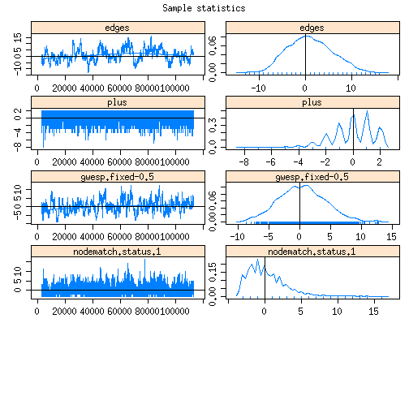
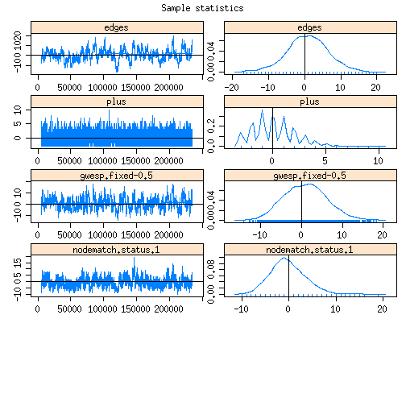
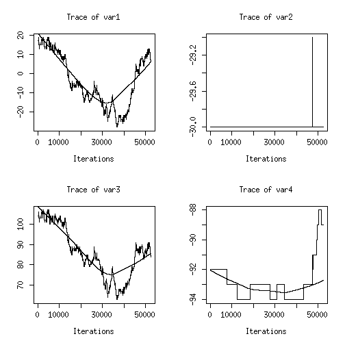
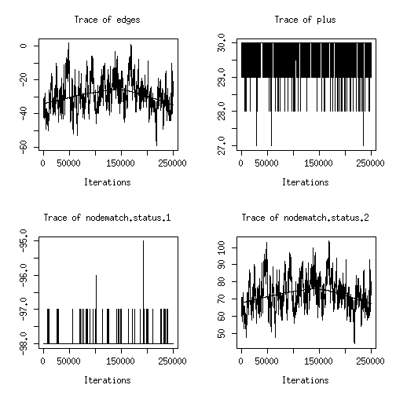
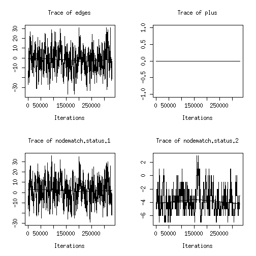
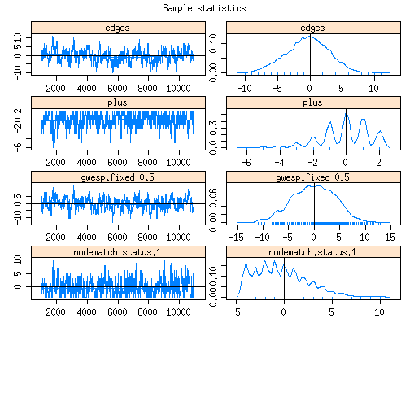
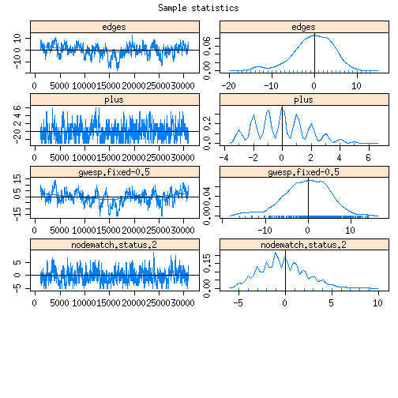

# Coevolution STERGM
###############################################################################

```r
fls <-list.files("../../",recursive=T)
source(paste0("../../",fls[grep("kk_utils/utils.R",fls)]))
source(paste0("../../",fls[grep("cotergm/R/functions.R",fls)]))
fig.path = "figures/"
# .libPaths(cotergm)
library("statnet.common",lib=cotergm)
library("network",lib=cotergm)
library("ergm",lib=cotergm)
library("tergm",lib=cotergm)
set.seed(0)
```


```r
net1 <-as.network(read.table("../s50_data/s50-network1.dat"))
net2 <-as.network(read.table("../s50_data/s50-network2.dat"))
net3 <-as.network(read.table("../s50_data/s50-network3.dat"))
alcohol <- read.table("../s50_data/s50-alcohol.dat")
drugs <- read.table("../s50_data/s50-drugs.dat")
net <- net1

d2ud <- function(net){
	net <- as.matrix(net)
	for (i in 1:nrow(net)){
		for(j in 1:nrow(net)){
			net[i,j] = max(net[i,j],net[j,i])
		}}
	as.network(net,directed=FALSE)
}

net1 <- d2ud(net1)
net2 <- d2ud(net2)
net3 <- d2ud(net3)

al1 <- as.numeric(alcohol[,1]>3)+1
al2 <- as.numeric(alcohol[,2]>3)+1
net1 %v% "status" <- al1
net2 %v% "status" <- al2

y0 <- net1
nw <- net2
```


```r
# Formation Plus Network
FP <- FP.nw(y0,nw,"status")
# Formation Minus Network
FM <- FM.nw(y0,nw,"status")
# Dissolution Plus Network
DP <- DP.nw(y0,nw,"status")
# Dissolution Minus Network
DM <- DM.nw(y0,nw,"status")
```


```r
constraints=~atleastnonminus(y0)
MHproposal <- MHproposal(constraints,nw=y0,arguments=list())
summary(y0~edges+plus+nodematch_cotergm("status",diff=TRUE),MHproposal=MHproposal)
```

```
##              edges               plus nodematch.status.1 
##                 74                 17                 32 
## nodematch.status.2 
##                 16
```

```r
summary(nw~edges+plus+nodematch_cotergm("status",diff=TRUE),MHproposal=MHproposal)
```

```
##              edges               plus nodematch.status.1 
##                 81                 19                 29 
## nodematch.status.2 
##                 22
```

```r
summary(FP~edges+plus+nodematch_cotergm("status",diff=TRUE),MHproposal=MHproposal)
```

```
##              edges               plus nodematch.status.1 
##                 94                 14                 43 
## nodematch.status.2 
##                 23
```

```r
summary(FM~edges+plus+nodematch_cotergm("status",diff=TRUE),MHproposal=MHproposal)
```

```
##              edges               plus nodematch.status.1 
##                103                 22                 32 
## nodematch.status.2 
##                 30
```

```r
summary(DP~edges+plus+nodematch_cotergm("status",diff=TRUE),MHproposal=MHproposal)
```

```
##              edges               plus nodematch.status.1 
##                 74                 14                 40 
## nodematch.status.2 
##                 14
```

```r
summary(DM~edges+plus+nodematch_cotergm("status",diff=TRUE),MHproposal=MHproposal)
```

```
##              edges               plus nodematch.status.1 
##                 74                 22                 22 
## nodematch.status.2 
##                 26
```

```r
summary(FP~edges+plus+nodematch_cotergm("status",diff=TRUE,y0edge=0),MHproposal=MHproposal)
```

```
##              edges               plus nodematch.status.1 
##                 94                 14                 43 
## nodematch.status.2 
##                 23
```

```r
summary(FP~edges+plus+nodematch_cotergm("status",diff=TRUE,y0edge=1),MHproposal=MHproposal)
```

```
##              edges               plus nodematch.status.1 
##                 94                 14                 40 
## nodematch.status.2 
##                 14
```


```r
fit1 <- ergm(FP~edges+plus+nodematch_cotergm("status",diff=TRUE,y0edge=2),control=control.ergm(MCMC.burnin=10000,MCMC.samplesize=10000,MCMC.interval=100,MCMLE.maxit=20,MCMLE.min.effectiveSize=20,MCMC.max.interval=100), constraints=~atleastnonminus(y0),verbose=0)
```

```
## Iteration 1 of at most 20: 
## Convergence test P-value: 0e+00 
## The log-likelihood improved by 6.943 
## Iteration 2 of at most 20: 
## Convergence test P-value: 5.1e-29 
## The log-likelihood improved by 1.419 
## Iteration 3 of at most 20: 
## Convergence test P-value: 3.3e-11 
## The log-likelihood improved by 0.06679 
## Iteration 4 of at most 20: 
## Convergence test P-value: 3e-01 
## The log-likelihood improved by 0.01251 
## Iteration 5 of at most 20: 
## Convergence test P-value: 7.9e-02 
## The log-likelihood improved by 0.007183 
## Iteration 6 of at most 20: 
## Convergence test P-value: 1.2e-01 
## The log-likelihood improved by 0.02901 
## Iteration 7 of at most 20: 
## Convergence test P-value: 6.7e-01 
## Convergence detected. Stopping.
## The log-likelihood improved by 0.01572 
## 
## This model was fit using MCMC.  To examine model diagnostics and check for degeneracy, use the mcmc.diagnostics() function.
```

```r
fit1
```

```
## MCMC sample of size based on: 
##              edges                plus  nodematch.status.1  
##            -4.0776              0.9258              0.5990  
## nodematch.status.2  
##             2.0115  
## 
## Monte Carlo MLE Coefficients:
##              edges                plus  nodematch.status.1  
##            -4.1307              0.9185              0.6092  
## nodematch.status.2  
##             2.0631
```

```r
mcmc.diagnostics(fit1, vars.per.page=5)
```

```
## Sample statistics summary:
## 
## Iterations = 4994.5:184976.5
## Thinning interval = 18 
## Number of chains = 1 
## Sample size per chain = 10000 
## 
## 1. Empirical mean and standard deviation for each variable,
##    plus standard error of the mean:
## 
##                       Mean    SD Naive SE Time-series SE
## edges               0.6022 4.673  0.04673        0.56808
## plus               -0.0374 1.603  0.01603        0.09598
## nodematch.status.1  0.1589 2.444  0.02444        0.18435
## nodematch.status.2 -0.0256 3.584  0.03584        0.43886
## 
## 2. Quantiles for each variable:
## 
##                    2.5% 25% 50% 75% 97.5%
## edges                -9  -2   1   3    10
## plus                 -4  -1   0   1     2
## nodematch.status.1   -3  -2   0   2     6
## nodematch.status.2   -6  -2   0   2     8
## 
## 
## Are sample statistics significantly different from observed?
##                edges       plus nodematch.status.1 nodematch.status.2
## diff.      0.6022000 -0.0374000          0.1589000         -0.0256000
## test stat. 1.0600684 -0.3896630          0.8619319         -0.0583330
## P-val.     0.2891135  0.6967858          0.3887250          0.9534834
##            Overall (Chi^2)
## diff.                   NA
## test stat.       2.4750917
## P-val.           0.6675694
## 
## Sample statistics cross-correlations:
##                         edges       plus nodematch.status.1
## edges              1.00000000  0.2230934         0.08846268
## plus               0.22309339  1.0000000        -0.69916884
## nodematch.status.1 0.08846268 -0.6991688         1.00000000
## nodematch.status.2 0.64779011  0.5827185        -0.41105878
##                    nodematch.status.2
## edges                       0.6477901
## plus                        0.5827185
## nodematch.status.1         -0.4110588
## nodematch.status.2          1.0000000
## 
## Sample statistics auto-correlation:
## Chain 1 
##            edges      plus nodematch.status.1 nodematch.status.2
## Lag 0  1.0000000 1.0000000          1.0000000          1.0000000
## Lag 18 0.9870241 0.6325733          0.7241148          0.9695897
## Lag 36 0.9737552 0.4679425          0.5856738          0.9469903
## Lag 54 0.9608388 0.3945369          0.5239221          0.9295775
## Lag 72 0.9483539 0.3599564          0.4911124          0.9156375
## Lag 90 0.9357408 0.3362669          0.4658168          0.9030837
## 
## Sample statistics burn-in diagnostic (Geweke):
## Chain 1 
## 
## Fraction in 1st window = 0.1
## Fraction in 2nd window = 0.5 
## 
##              edges               plus nodematch.status.1 
##             0.2946            -2.1888             1.6256 
## nodematch.status.2 
##            -1.0734 
## 
## Individual P-values (lower = worse):
##              edges               plus nodematch.status.1 
##         0.76829294         0.02861158         0.10403610 
## nodematch.status.2 
##         0.28309314 
## Joint P-value (lower = worse):  0.6485847 .
```

 

```r
fit1.1 <- ergm(FP~edges+plus+nodematch_cotergm("status",diff=TRUE,y0edge=2,keep=1),control=control.ergm(MCMC.burnin=10000,MCMC.samplesize=10000,MCMC.interval=100,MCMLE.maxit=20,MCMLE.min.effectiveSize=20,MCMC.max.interval=100), constraints=~atleastnonminus(y0),verbose=0)
```

```
## Iteration 1 of at most 20: 
## Convergence test P-value: 0e+00 
## The log-likelihood improved by 6.033 
## Iteration 2 of at most 20: 
## Convergence test P-value: 2.3e-84 
## The log-likelihood improved by 0.5881 
## Iteration 3 of at most 20: 
## Convergence test P-value: 1.2e-26 
## The log-likelihood improved by 0.1125 
## Iteration 4 of at most 20: 
## Convergence test P-value: 3.1e-01 
## The log-likelihood improved by 0.08998 
## Iteration 5 of at most 20: 
## Convergence test P-value: 3e-03 
## The log-likelihood improved by 0.03125 
## Iteration 6 of at most 20: 
## Convergence test P-value: 2e-01 
## The log-likelihood improved by 0.0383 
## Iteration 7 of at most 20: 
## Convergence test P-value: 1.9e-03 
## The log-likelihood improved by 0.02272 
## Iteration 8 of at most 20: 
## Convergence test P-value: 2.2e-01 
## The log-likelihood improved by 0.004465 
## Iteration 9 of at most 20: 
## Convergence test P-value: 9.2e-01 
## Convergence detected. Stopping.
## The log-likelihood improved by 0.0005828 
## 
## This model was fit using MCMC.  To examine model diagnostics and check for degeneracy, use the mcmc.diagnostics() function.
```

```r
fit1.1
```

```
## MCMC sample of size based on: 
##              edges                plus  nodematch.status.1  
##          -3.470111            1.602498           -0.004185  
## 
## Monte Carlo MLE Coefficients:
##              edges                plus  nodematch.status.1  
##          -3.475038            1.608814           -0.008629
```

```r
mcmc.diagnostics(fit1.1, vars.per.page=5)
```

```
## Sample statistics summary:
## 
## Iterations = 2620.625:132607.6
## Thinning interval = 13 
## Number of chains = 1 
## Sample size per chain = 10000 
## 
## 1. Empirical mean and standard deviation for each variable,
##    plus standard error of the mean:
## 
##                       Mean    SD Naive SE Time-series SE
## edges               0.1537 5.231  0.05231        1.05213
## plus               -0.0239 1.453  0.01453        0.03464
## nodematch.status.1  0.0579 2.306  0.02306        0.07020
## 
## 2. Quantiles for each variable:
## 
##                    2.5% 25% 50% 75% 97.5%
## edges               -10  -3   0   3    12
## plus                 -3  -1   0   1     2
## nodematch.status.1   -3  -2   0   1     6
## 
## 
## Are sample statistics significantly different from observed?
##                edges       plus nodematch.status.1 Overall (Chi^2)
## diff.      0.1537000 -0.0239000          0.0579000              NA
## test stat. 0.1460841 -0.6898562          0.8247687       0.5490877
## P-val.     0.8838550  0.4902846          0.4095029       0.9152811
## 
## Sample statistics cross-correlations:
##                          edges        plus nodematch.status.1
## edges               1.00000000 -0.01585659          0.3382562
## plus               -0.01585659  1.00000000         -0.6695013
## nodematch.status.1  0.33825615 -0.66950130          1.0000000
## 
## Sample statistics auto-correlation:
## Chain 1 
##            edges      plus nodematch.status.1
## Lag 0  1.0000000 1.0000000          1.0000000
## Lag 13 0.9950681 0.7007191          0.7438841
## Lag 26 0.9901655 0.4917479          0.5657090
## Lag 39 0.9852629 0.3448135          0.4324652
## Lag 52 0.9803274 0.2384123          0.3414610
## Lag 65 0.9754644 0.1626021          0.2793599
## 
## Sample statistics burn-in diagnostic (Geweke):
## Chain 1 
## 
## Fraction in 1st window = 0.1
## Fraction in 2nd window = 0.5 
## 
##              edges               plus nodematch.status.1 
##             -1.085             -2.175             -2.098 
## 
## Individual P-values (lower = worse):
##              edges               plus nodematch.status.1 
##         0.27781093         0.02960130         0.03593758 
## Joint P-value (lower = worse):  0.08956837 .
```

 

```r
fit1.2 <- ergm(FP~edges+plus+nodematch_cotergm("status",diff=TRUE,y0edge=2,keep=2),control=control.ergm(MCMC.burnin=10000,MCMC.samplesize=10000,MCMC.interval=100,MCMLE.maxit=20,MCMLE.min.effectiveSize=20,MCMC.max.interval=100), constraints=~atleastnonminus(y0),verbose=0)
```

```
## Iteration 1 of at most 20: 
## Convergence test P-value: 5.8e-245 
## The log-likelihood improved by 3.568 
## Iteration 2 of at most 20: 
## Convergence test P-value: 4.5e-42 
## The log-likelihood improved by 0.4711 
## Iteration 3 of at most 20: 
## Convergence test P-value: 2.1e-19 
## The log-likelihood improved by 0.0562 
## Iteration 4 of at most 20: 
## Convergence test P-value: 3.2e-02 
## The log-likelihood improved by 0.00735 
## Iteration 5 of at most 20: 
## Convergence test P-value: 7.3e-01 
## Convergence detected. Stopping.
## The log-likelihood improved by 0.007693 
## 
## This model was fit using MCMC.  To examine model diagnostics and check for degeneracy, use the mcmc.diagnostics() function.
```

```r
fit1.2
```

```
## MCMC sample of size based on: 
##              edges                plus  nodematch.status.2  
##            -3.9341              0.5003              1.8351  
## 
## Monte Carlo MLE Coefficients:
##              edges                plus  nodematch.status.2  
##            -3.9710              0.4848              1.8809
```

```r
mcmc.diagnostics(fit1.2, vars.per.page=5)
```

```
## Sample statistics summary:
## 
## Iterations = 9997:249973
## Thinning interval = 24 
## Number of chains = 1 
## Sample size per chain = 10000 
## 
## 1. Empirical mean and standard deviation for each variable,
##    plus standard error of the mean:
## 
##                       Mean    SD Naive SE Time-series SE
## edges               0.2646 4.723  0.04723         0.5671
## plus               -0.0144 1.605  0.01605         0.1007
## nodematch.status.2 -0.1274 3.817  0.03817         0.5001
## 
## 2. Quantiles for each variable:
## 
##                    2.5% 25% 50% 75% 97.5%
## edges                -8  -3   0   3    10
## plus                 -4  -1   0   1     2
## nodematch.status.2   -6  -3   0   2     9
## 
## 
## Are sample statistics significantly different from observed?
##                edges       plus nodematch.status.2 Overall (Chi^2)
## diff.      0.2646000 -0.0144000         -0.1274000              NA
## test stat. 0.4665626 -0.1430148         -0.2547306       1.3356785
## P-val.     0.6408128  0.8862785          0.7989312       0.7310091
## 
## Sample statistics cross-correlations:
##                        edges      plus nodematch.status.2
## edges              1.0000000 0.3688286          0.7302990
## plus               0.3688286 1.0000000          0.5617649
## nodematch.status.2 0.7302990 0.5617649          1.0000000
## 
## Sample statistics auto-correlation:
## Chain 1 
##             edges      plus nodematch.status.2
## Lag 0   1.0000000 1.0000000          1.0000000
## Lag 24  0.9862203 0.5747653          0.9670650
## Lag 48  0.9724721 0.3973596          0.9445038
## Lag 72  0.9590388 0.3233698          0.9278338
## Lag 96  0.9456335 0.2853262          0.9143689
## Lag 120 0.9324536 0.2630042          0.9031067
## 
## Sample statistics burn-in diagnostic (Geweke):
## Chain 1 
## 
## Fraction in 1st window = 0.1
## Fraction in 2nd window = 0.5 
## 
##              edges               plus nodematch.status.2 
##             -1.865             -3.041             -2.602 
## 
## Individual P-values (lower = worse):
##              edges               plus nodematch.status.2 
##        0.062199690        0.002361563        0.009272048 
## Joint P-value (lower = worse):  0.242017 .
```

 


```r
fit2 <- ergm(FM~edges+plus+nodematch_cotergm("status",diff=TRUE,y0edge=2),control=control.ergm(MCMC.burnin=10000,MCMC.samplesize=10000,MCMC.interval=100,MCMLE.maxit=10,MCMLE.min.effectiveSize=20,MCMC.max.interval=100, MCMC.runtime.traceplot=T), constraints=~atleastnonplus(y0),verbose=1)
```

```
## Evaluating network in model
## Initializing Metropolis-Hastings proposal(s): ergm:MH_randomtoggleList_nodal
## Initializing model.
## Fitting initial model.
## MPLE covariate matrix has 4 rows.
## A sparse network with too many unique dyads encountered. Using case-control MPLE.
## Fitting ERGM.
## Density guard set to 10000 from an initial count of 103  edges.
## Iteration 1 of at most 10 with parameter: 
##              edges               plus nodematch.status.1 
##          -3.164059           1.000000           1.000000 
## nodematch.status.2 
##           1.000000 
## Sampler accepted  12.310% of 10000 proposed steps.
```

 

```
## 
## 	Multivariate extension to Geweke's burn-in convergence diagnostic
## 
## data:  
## T^2 = 5.3848, param = 4.000, df = 10.121, p-value = 0.4897
## alternative hypothesis: two.sided
## null values:
## var1 var2 var3 var4 
##    0    0    0    0 
## sample estimates:
##         var1         var2         var3         var4 
## -3.998000000 -0.008666667  0.051333333 -4.243333333 
## 
## Burn-in converged. Proceeding to the sampling run.
## Sampler accepted  11.734% of 1000000 proposed steps.
```

 

```
## new nodalstatus =  2 2 2 2 2 2 2 2 2 2 2 2 2 2 2 2 2 2 2 2 2 2 2 2 2 2 2 2 2 1 2 2 2 2 2 2 2 2 2 2 2 2 2 2 2 2 2 2 2 2 
## Back from unconstrained MCMC. Average statistics:
##              edges               plus nodematch.status.1 
##            73.6443            26.6628            -9.9604 
## nodematch.status.2 
##            96.1771 
## Unconstrained MCMC burn-in took an average of 9999 steps. New burn-in: 2499.75 .
## Effective MCMC sample sizes:
##              edges               plus nodematch.status.1 
##           236.0133          4231.0105          6886.1773 
## nodematch.status.2 
##           240.4034 
## Mean effective sample size = 455.6695 . New interval = 22 .
## Average estimating equation values:
##              edges               plus nodematch.status.1 
##            73.6443            26.6628            -9.9604 
## nodematch.status.2 
##            96.1771 
## Convergence test P-value: 0e+00 
## Calling MCMLE Optimization...
## Using Newton-Raphson Step with step length  0.119320750236511  ...
## Using lognormal metric (see control.ergm function).
## Optimizing loglikelihood
## The log-likelihood improved by 10.91 
## Iteration 2 of at most 10 with parameter: 
##              edges               plus nodematch.status.1 
##          -4.241292          -3.610126           2.865790 
## nodematch.status.2 
##           2.099244 
## Sampler accepted  11.925% of 2499 proposed steps.
```

 

```
## Insufficient burn-in sample size ( 4.172401 < 10 ) to test convergence. Rerunning.
## Sampler accepted  10.004% of 2499 proposed steps.
```

 

```
## Insufficient burn-in sample size ( 5.534351 < 10 ) to test convergence. Rerunning.
## Sampler accepted   9.724% of 2499 proposed steps.
```

 

```
## Insufficient burn-in sample size ( 6.958716 < 10 ) to test convergence. Rerunning.
## Sampler accepted  10.244% of 2499 proposed steps.
```

 

```
## Insufficient burn-in sample size ( 2.017334 < 10 ) to test convergence. Rerunning.
## Sampler accepted   9.244% of 2499 proposed steps.
```

 

```
## Insufficient burn-in sample size ( 6.51755 < 10 ) to test convergence. Rerunning.
## Sampler accepted   9.124% of 2499 proposed steps.
```

 

```
## Insufficient burn-in sample size ( 2.371114 < 10 ) to test convergence. Rerunning.
## Sampler accepted  10.204% of 2499 proposed steps.
```

 

```
## Insufficient burn-in sample size ( 2.500761 < 10 ) to test convergence. Rerunning.
## Sampler accepted   9.564% of 2499 proposed steps.
```

 

```
## Insufficient burn-in sample size ( 1.782968 < 10 ) to test convergence. Rerunning.
## Sampler accepted   9.924% of 2499 proposed steps.
## Increasing thinning to 2 .
```

 

```
## Insufficient burn-in sample size ( 6.119754 < 10 ) to test convergence. Rerunning.
## Sampler accepted  10.744% of 4998 proposed steps.
```

 

```
## Insufficient burn-in sample size ( 9.821427 < 10 ) to test convergence. Rerunning.
## Sampler accepted  10.104% of 4998 proposed steps.
```

 

```
## Insufficient burn-in sample size ( 3.941368 < 10 ) to test convergence. Rerunning.
## Sampler accepted   9.904% of 4998 proposed steps.
```

 

```
## Insufficient burn-in sample size ( 2.984433 < 10 ) to test convergence. Rerunning.
## Sampler accepted   9.264% of 4998 proposed steps.
## Increasing thinning to 4 .
```

 

```
## Insufficient burn-in sample size ( 9.452805 < 10 ) to test convergence. Rerunning.
## Sampler accepted   8.954% of 9996 proposed steps.
```

 

```
## Insufficient burn-in sample size ( 7.857553 < 10 ) to test convergence. Rerunning.
## Sampler accepted   9.764% of 9996 proposed steps.
```

 

```
## Insufficient burn-in sample size ( 6.328582 < 10 ) to test convergence. Rerunning.
## Sampler accepted   9.694% of 9996 proposed steps.
```

 

```
## Insufficient burn-in sample size ( 9.60594 < 10 ) to test convergence. Rerunning.
## Sampler accepted   9.754% of 9996 proposed steps.
## Increasing thinning to 8 .
```

 

```
## 
## 	Multivariate extension to Geweke's burn-in convergence diagnostic
## 
## data:  
## T^2 = 4.112, param = 3.000, df = 15.438, p-value = 0.3497
## alternative hypothesis: two.sided
## null values:
## var1 var2 var3 var4 
##    0    0    0    0 
## sample estimates:
##      var1      var2      var3      var4 
## -2.616429  0.000000 -5.074386  1.303364 
## 
## Burn-in converged. Proceeding to the sampling run.
## Sampler accepted   9.561% of 220000 proposed steps.
```

 

```
## new nodalstatus =  1 2 1 1 1 2 2 2 1 2 2 2 1 1 2 2 1 2 1 1 1 1 2 1 1 2 1 1 1 1 2 2 1 1 1 2 1 1 1 1 2 2 1 2 1 1 1 1 1 2 
## Back from unconstrained MCMC. Average statistics:
##              edges               plus nodematch.status.1 
##            70.0002            -2.9973            77.5388 
## nodematch.status.2 
##            -0.7056 
## Unconstrained MCMC burn-in took an average of 82458.75 steps. New burn-in: 20614.69 .
## Effective MCMC sample sizes:
##              edges               plus nodematch.status.1 
##           76.00013         2252.83424           78.62623 
## nodematch.status.2 
##           55.09862 
## Mean effective sample size = 89.94942 . New interval = 25 .
## Average estimating equation values:
##              edges               plus nodematch.status.1 
##            70.0002            -2.9973            77.5388 
## nodematch.status.2 
##            -0.7056 
## Convergence test P-value: 3.5e-161 
## Calling MCMLE Optimization...
## Using Newton-Raphson Step with step length  0.239564284682274  ...
## Using lognormal metric (see control.ergm function).
## Optimizing loglikelihood
## The log-likelihood improved by 7.164 
## Iteration 3 of at most 10 with parameter: 
##              edges               plus nodematch.status.1 
##          -3.760271           2.355748           2.023401 
## nodematch.status.2 
##           1.291238 
## Sampler accepted   9.103% of 30000 proposed steps.
```

 

```
## Insufficient burn-in sample size ( 5.59684 < 10 ) to test convergence. Rerunning.
## Sampler accepted   7.987% of 30000 proposed steps.
```

 

```
## 
## 	Multivariate extension to Geweke's burn-in convergence diagnostic
## 
## data:  
## T^2 = 1.3064, param = 4.000, df = 11.388, p-value = 0.9079
## alternative hypothesis: two.sided
## null values:
## var1 var2 var3 var4 
##    0    0    0    0 
## sample estimates:
##          var1          var2          var3          var4 
## -0.6776666667 -0.0413333333  0.0003333333 -0.9360000000 
## 
## Burn-in converged. Proceeding to the sampling run.
## Sampler accepted   8.286% of 250000 proposed steps.
```

 

```
## new nodalstatus =  2 2 2 2 2 2 2 2 1 2 2 2 2 2 2 2 2 2 2 2 2 2 2 2 2 2 2 2 2 2 2 2 2 2 2 2 2 2 2 2 2 2 2 2 2 2 2 2 2 2 
## Back from unconstrained MCMC. Average statistics:
##              edges               plus nodematch.status.1 
##            49.4864            26.8838            -9.9835 
## nodematch.status.2 
##            73.3445 
## Unconstrained MCMC burn-in took an average of 59994 steps. New burn-in: 14998.5 .
## Effective MCMC sample sizes:
##              edges               plus nodematch.status.1 
##           57.25115         2532.17225         1876.28739 
## nodematch.status.2 
##           58.97814 
## Mean effective sample size = 113.1535 . New interval = 23 .
## Average estimating equation values:
##              edges               plus nodematch.status.1 
##            49.4864            26.8838            -9.9835 
## nodematch.status.2 
##            73.3445 
## Convergence test P-value: 2.8e-156 
## Calling MCMLE Optimization...
## Using Newton-Raphson Step with step length  0.0994723588228226  ...
## Using lognormal metric (see control.ergm function).
## Optimizing loglikelihood
## The log-likelihood improved by 12.13 
## Iteration 4 of at most 10 with parameter: 
##              edges               plus nodematch.status.1 
##          -3.602566          -3.059016           3.036417 
## nodematch.status.2 
##           1.291246 
## Sampler accepted  17.315% of 20000 proposed steps.
```

 

```
## Insufficient burn-in sample size ( 1.910848 < 10 ) to test convergence. Rerunning.
## Sampler accepted  17.415% of 20000 proposed steps.
```

 

```
## Insufficient burn-in sample size ( 7.839194 < 10 ) to test convergence. Rerunning.
## Sampler accepted  16.925% of 20000 proposed steps.
```

 

```
## 
## 	Multivariate extension to Geweke's burn-in convergence diagnostic
## 
## data:  
## T^2 = 4.2786, param = 3.000, df = 13.503, p-value = 0.3482
## alternative hypothesis: two.sided
## null values:
## var1 var2 var3 var4 
##    0    0    0    0 
## sample estimates:
##     var1     var2     var3     var4 
## 2.705556 0.000000 1.274000 1.678444 
## 
## Burn-in converged. Proceeding to the sampling run.
## Sampler accepted  17.234% of 230000 proposed steps.
```

 

```
## new nodalstatus =  1 1 1 1 1 2 2 2 2 2 2 2 1 1 2 2 1 2 1 1 1 1 2 1 1 2 2 1 1 1 2 2 1 1 1 2 1 1 1 1 2 2 1 2 1 1 1 1 1 1 
## Back from unconstrained MCMC. Average statistics:
##              edges               plus nodematch.status.1 
##           148.4071            -3.0000           149.2281 
## nodematch.status.2 
##            -0.5636 
## Unconstrained MCMC burn-in took an average of 59994 steps. New burn-in: 14998.5 .
## Effective MCMC sample sizes:
##              edges               plus nodematch.status.1 
##           83.83418            0.00000           87.83479 
## nodematch.status.2 
##           54.86279 
## Mean effective sample size = 72.21849 . New interval = 32 .
## Average estimating equation values:
##              edges               plus nodematch.status.1 
##           148.4071            -3.0000           149.2281 
## nodematch.status.2 
##            -0.5636 
## Convergence test P-value: 0e+00 
## Calling MCMLE Optimization...
## Using Newton-Raphson Step with step length  0  ...
## Using lognormal metric (see control.ergm function).
## Optimizing loglikelihood
## The log-likelihood improved by < 0.0001 
## Iteration 5 of at most 10 with parameter: 
##              edges               plus nodematch.status.1 
##          -3.602566          -3.059016           3.036417 
## nodematch.status.2 
##           1.291246 
## Sampler accepted  16.920% of 20000 proposed steps.
```

 

```
## Insufficient burn-in sample size ( 2.888793 < 10 ) to test convergence. Rerunning.
## Sampler accepted  17.050% of 20000 proposed steps.
```

 

```
## Insufficient burn-in sample size ( 5.891255 < 10 ) to test convergence. Rerunning.
## Sampler accepted  17.360% of 20000 proposed steps.
```

 

```
## 
## 	Multivariate extension to Geweke's burn-in convergence diagnostic
## 
## data:  
## T^2 = 7.7517, param = 3.000, df = 10.252, p-value = 0.1791
## alternative hypothesis: two.sided
## null values:
## var1 var2 var3 var4 
##    0    0    0    0 
## sample estimates:
##       var1       var2       var3       var4 
## -7.6026667  0.0000000 -4.2206667 -0.2482222 
## 
## Burn-in converged. Proceeding to the sampling run.
## Sampler accepted  17.102% of 320000 proposed steps.
```

 

```
## new nodalstatus =  1 1 1 1 1 2 2 2 2 2 2 2 1 1 2 2 1 2 1 1 1 1 2 1 1 2 2 1 1 1 2 2 1 1 1 2 1 1 1 1 2 2 1 2 1 1 1 1 1 1 
## Back from unconstrained MCMC. Average statistics:
##              edges               plus nodematch.status.1 
##           148.4442            -3.0000           148.8445 
## nodematch.status.2 
##            -0.7501 
## Unconstrained MCMC burn-in took an average of 59994 steps. New burn-in: 14998.5 .
## Effective MCMC sample sizes:
##              edges               plus nodematch.status.1 
##           91.51152            0.00000          104.41301 
## nodematch.status.2 
##           99.73940 
## Mean effective sample size = 98.26058 . New interval = 33 .
## Average estimating equation values:
##              edges               plus nodematch.status.1 
##           148.4442            -3.0000           148.8445 
## nodematch.status.2 
##            -0.7501 
## Convergence test P-value: 0e+00 
## Calling MCMLE Optimization...
## Using Newton-Raphson Step with step length  0  ...
## Using lognormal metric (see control.ergm function).
## Optimizing loglikelihood
## The log-likelihood improved by < 0.0001 
## Iteration 6 of at most 10 with parameter: 
##              edges               plus nodematch.status.1 
##          -3.602566          -3.059016           3.036417 
## nodematch.status.2 
##           1.291246 
## Sampler accepted  17.605% of 20000 proposed steps.
```

 

```
## Insufficient burn-in sample size ( 8.488521 < 10 ) to test convergence. Rerunning.
## Sampler accepted  17.120% of 20000 proposed steps.
```

 

```
## Insufficient burn-in sample size ( 7.841266 < 10 ) to test convergence. Rerunning.
## Sampler accepted  17.190% of 20000 proposed steps.
```

 

```
## 
## 	Multivariate extension to Geweke's burn-in convergence diagnostic
## 
## data:  
## T^2 = 15.4809, param = 3.000, df = 10.918, p-value = 0.04087
## alternative hypothesis: two.sided
## null values:
## var1 var2 var3 var4 
##    0    0    0    0 
## sample estimates:
##      var1      var2      var3      var4 
## 11.393556  0.000000  7.346222  1.582889 
## 
## Burn-in converged. Proceeding to the sampling run.
## Sampler accepted  17.172% of 330000 proposed steps.
```

 

```
## new nodalstatus =  1 1 1 1 1 2 2 2 2 2 2 2 1 1 2 2 1 2 1 1 1 1 2 1 1 2 2 1 1 1 2 2 1 1 1 2 1 1 1 1 2 2 1 2 1 1 1 1 1 1 
## Back from unconstrained MCMC. Average statistics:
##              edges               plus nodematch.status.1 
##           147.1499            -3.0000           148.0208 
## nodematch.status.2 
##            -0.7184 
## Unconstrained MCMC burn-in took an average of 59994 steps. New burn-in: 14998.5 .
## Effective MCMC sample sizes:
##              edges               plus nodematch.status.1 
##          134.42869            0.00000          130.57461 
## nodematch.status.2 
##           85.41656 
## Mean effective sample size = 111.9208 . New interval = 30 .
## Average estimating equation values:
##              edges               plus nodematch.status.1 
##           147.1499            -3.0000           148.0208 
## nodematch.status.2 
##            -0.7184 
## Convergence test P-value: 0e+00 
## Calling MCMLE Optimization...
## Using Newton-Raphson Step with step length  0  ...
## Using lognormal metric (see control.ergm function).
## Optimizing loglikelihood
## The log-likelihood improved by < 0.0001 
## Iteration 7 of at most 10 with parameter: 
##              edges               plus nodematch.status.1 
##          -3.602566          -3.059016           3.036417 
## nodematch.status.2 
##           1.291246 
## Sampler accepted  17.540% of 20000 proposed steps.
```

 

```
## Insufficient burn-in sample size ( 4.757588 < 10 ) to test convergence. Rerunning.
## Sampler accepted  16.910% of 20000 proposed steps.
```

 

```
## Burn-in failed to converge or mixed very poorly, with p-value = 0.009803689 . Ranking of statistics from worst-mixing to best-mixing: plus, nodematch.status.2, nodematch.status.1, and edges . Rerunning.
## Sampler accepted  17.080% of 20000 proposed steps.
```

 

```
## Insufficient burn-in sample size ( 6.938439 < 10 ) to test convergence. Rerunning.
## Sampler accepted  17.820% of 20000 proposed steps.
```

 

```
## Burn-in failed to converge or mixed very poorly, with p-value = 0.0003838296 . Ranking of statistics from worst-mixing to best-mixing: plus, edges, nodematch.status.1, and nodematch.status.2 . Rerunning.
## Sampler accepted  17.370% of 20000 proposed steps.
```

 

```
## Insufficient burn-in sample size ( 9.970043 < 10 ) to test convergence. Rerunning.
## Sampler accepted  17.220% of 20000 proposed steps.
```

 

```
## 
## 	Multivariate extension to Geweke's burn-in convergence diagnostic
## 
## data:  
## T^2 = 1.6682, param = 3.000, df = 11.174, p-value = 0.7191
## alternative hypothesis: two.sided
## null values:
## var1 var2 var3 var4 
##    0    0    0    0 
## sample estimates:
##       var1       var2       var3       var4 
##  0.3827778  0.0000000 -0.4731111 -0.3658889 
## 
## Burn-in converged. Proceeding to the sampling run.
## Sampler accepted  17.057% of 300000 proposed steps.
```

 

```
## new nodalstatus =  1 1 1 1 1 2 2 2 2 2 2 2 1 1 2 2 1 2 1 1 1 1 2 1 1 2 2 1 1 1 2 2 1 1 1 2 1 1 1 1 2 2 1 2 1 1 1 1 1 1 
## Back from unconstrained MCMC. Average statistics:
##              edges               plus nodematch.status.1 
##           148.8203            -3.0000           149.0224 
## nodematch.status.2 
##            -0.3320 
## Unconstrained MCMC burn-in took an average of 119988 steps. New burn-in: 29997 .
## Effective MCMC sample sizes:
##              edges               plus nodematch.status.1 
##          131.44297            0.00000          123.81574 
## nodematch.status.2 
##           69.55958 
## Mean effective sample size = 99.79859 . New interval = 31 .
## Average estimating equation values:
##              edges               plus nodematch.status.1 
##           148.8203            -3.0000           149.0224 
## nodematch.status.2 
##            -0.3320 
## Convergence test P-value: 0e+00 
## Calling MCMLE Optimization...
## Using Newton-Raphson Step with step length  0  ...
## Using lognormal metric (see control.ergm function).
## Optimizing loglikelihood
## The log-likelihood improved by < 0.0001 
## Iteration 8 of at most 10 with parameter: 
##              edges               plus nodematch.status.1 
##          -3.602566          -3.059016           3.036417 
## nodematch.status.2 
##           1.291246 
## Sampler accepted  17.533% of 30000 proposed steps.
```

 

```
## Insufficient burn-in sample size ( 5.798303 < 10 ) to test convergence. Rerunning.
## Sampler accepted  17.293% of 30000 proposed steps.
```

 

```
## 
## 	Multivariate extension to Geweke's burn-in convergence diagnostic
## 
## data:  
## T^2 = 21.4314, param = 3.000, df = 12.661, p-value = 0.01174
## alternative hypothesis: two.sided
## null values:
## var1 var2 var3 var4 
##    0    0    0    0 
## sample estimates:
##      var1      var2      var3      var4 
## 10.146333  0.000000  9.969333  1.114333 
## 
## Burn-in converged. Proceeding to the sampling run.
## Sampler accepted  16.996% of 310000 proposed steps.
```

 

```
## new nodalstatus =  1 1 1 1 1 2 2 2 2 2 2 2 1 1 2 2 1 2 1 1 1 1 2 1 1 2 2 1 1 1 2 2 1 1 1 2 1 1 1 1 2 2 1 2 1 1 1 1 1 1 
## Back from unconstrained MCMC. Average statistics:
##              edges               plus nodematch.status.1 
##           146.8198            -3.0000           147.6276 
## nodematch.status.2 
##            -0.8442 
## Unconstrained MCMC burn-in took an average of 59994 steps. New burn-in: 14998.5 .
## Effective MCMC sample sizes:
##              edges               plus nodematch.status.1 
##          105.04884            0.00000          111.24209 
## nodematch.status.2 
##           89.55776 
## Mean effective sample size = 101.096 . New interval = 31 .
## Average estimating equation values:
##              edges               plus nodematch.status.1 
##           146.8198            -3.0000           147.6276 
## nodematch.status.2 
##            -0.8442 
## Convergence test P-value: 0e+00 
## Calling MCMLE Optimization...
## Using Newton-Raphson Step with step length  0  ...
## Using lognormal metric (see control.ergm function).
## Optimizing loglikelihood
## The log-likelihood improved by < 0.0001 
## Iteration 9 of at most 10 with parameter: 
##              edges               plus nodematch.status.1 
##          -3.602566          -3.059016           3.036417 
## nodematch.status.2 
##           1.291246 
## Sampler accepted  16.710% of 20000 proposed steps.
```

 

```
## Insufficient burn-in sample size ( 7.90226 < 10 ) to test convergence. Rerunning.
## Sampler accepted  17.270% of 20000 proposed steps.
```

 

```
## Insufficient burn-in sample size ( 4.787675 < 10 ) to test convergence. Rerunning.
## Sampler accepted  16.715% of 20000 proposed steps.
```

 

```
## 
## 	Multivariate extension to Geweke's burn-in convergence diagnostic
## 
## data:  
## T^2 = 7.5065, param = 3.000, df = 10.064, p-value = 0.1914
## alternative hypothesis: two.sided
## null values:
## var1 var2 var3 var4 
##    0    0    0    0 
## sample estimates:
##      var1      var2      var3      var4 
## -5.566889  0.000000 -6.466667  1.696667 
## 
## Burn-in converged. Proceeding to the sampling run.
## Sampler accepted  17.256% of 310000 proposed steps.
```

 

```
## new nodalstatus =  1 1 1 1 1 2 2 2 2 2 2 2 1 1 2 2 1 2 1 1 1 1 2 1 1 2 2 1 1 1 2 2 1 1 1 2 1 1 1 1 2 2 1 2 1 1 1 1 1 1 
## Back from unconstrained MCMC. Average statistics:
##              edges               plus nodematch.status.1 
##           148.5629            -3.0000           149.9770 
## nodematch.status.2 
##            -0.9936 
## Unconstrained MCMC burn-in took an average of 59994 steps. New burn-in: 14998.5 .
## Effective MCMC sample sizes:
##              edges               plus nodematch.status.1 
##          132.05138            0.00000          133.59506 
## nodematch.status.2 
##           93.08332 
## Mean effective sample size = 116.2738 . New interval = 27 .
## Average estimating equation values:
##              edges               plus nodematch.status.1 
##           148.5629            -3.0000           149.9770 
## nodematch.status.2 
##            -0.9936 
## Convergence test P-value: 0e+00 
## Calling MCMLE Optimization...
## Using Newton-Raphson Step with step length  0  ...
## Using lognormal metric (see control.ergm function).
## Optimizing loglikelihood
## The log-likelihood improved by < 0.0001 
## Iteration 10 of at most 10 with parameter: 
##              edges               plus nodematch.status.1 
##          -3.602566          -3.059016           3.036417 
## nodematch.status.2 
##           1.291246 
## Sampler accepted  17.265% of 20000 proposed steps.
```

 

```
## Insufficient burn-in sample size ( 0.5161694 < 10 ) to test convergence. Rerunning.
## Sampler accepted  17.065% of 20000 proposed steps.
```

 

```
## Insufficient burn-in sample size ( 5.057038 < 10 ) to test convergence. Rerunning.
## Sampler accepted  16.905% of 20000 proposed steps.
```

 

```
## Insufficient burn-in sample size ( 6.241528 < 10 ) to test convergence. Rerunning.
## Sampler accepted  17.320% of 20000 proposed steps.
```

 

```
## 
## 	Multivariate extension to Geweke's burn-in convergence diagnostic
## 
## data:  
## T^2 = 2.5792, param = 3.000, df = 14.883, p-value = 0.5448
## alternative hypothesis: two.sided
## null values:
## var1 var2 var3 var4 
##    0    0    0    0 
## sample estimates:
##       var1       var2       var3       var4 
## 7.43700000 0.00000000 3.79383333 0.09866667 
## 
## Burn-in converged. Proceeding to the sampling run.
## Sampler accepted  17.109% of 270000 proposed steps.
```

 

```
## new nodalstatus =  1 1 1 1 1 2 2 2 2 2 2 2 1 1 2 2 1 2 1 1 1 1 2 1 1 2 2 1 1 1 2 2 1 1 1 2 1 1 1 1 2 2 1 2 1 1 1 1 1 1 
## Back from unconstrained MCMC. Average statistics:
##              edges               plus nodematch.status.1 
##           148.2981            -3.0000           148.4470 
## nodematch.status.2 
##            -0.4603 
## Unconstrained MCMC burn-in took an average of 79992 steps. New burn-in: 19998 .
## Effective MCMC sample sizes:
##              edges               plus nodematch.status.1 
##           99.18130            0.00000          110.03184 
## nodematch.status.2 
##           70.98632 
## Mean effective sample size = 90.20374 . New interval = 30 .
## Average estimating equation values:
##              edges               plus nodematch.status.1 
##           148.2981            -3.0000           148.4470 
## nodematch.status.2 
##            -0.4603 
## Convergence test P-value: 0e+00 
## Calling MCMLE Optimization...
## Using Newton-Raphson Step with step length  0  ...
## Using lognormal metric (see control.ergm function).
## Optimizing loglikelihood
## Starting MCMC s.e. computation.
## The log-likelihood improved by < 0.0001 
## Evaluating log-likelihood at the estimate.
## 
## This model was fit using MCMC.  To examine model diagnostics and check for degeneracy, use the mcmc.diagnostics() function.
```

```r
fit2
```

```
## MCMC sample of size based on: 
##              edges                plus  nodematch.status.1  
##             -3.603              -3.059               3.036  
## nodematch.status.2  
##              1.291  
## 
## Monte Carlo MLE Coefficients:
##              edges                plus  nodematch.status.1  
##             -3.603              -3.059               3.036  
## nodematch.status.2  
##              1.291
```

```r
mcmc.diagnostics(fit2, vars.per.page=5)
```

```
## Sample statistics summary:
## 
## Iterations = 19998:319968
## Thinning interval = 30 
## Number of chains = 1 
## Sample size per chain = 10000 
## 
## 1. Empirical mean and standard deviation for each variable,
##    plus standard error of the mean:
## 
##                        Mean     SD Naive SE Time-series SE
## edges              148.2981 10.494  0.10494         1.0537
## plus                -3.0000  0.000  0.00000         0.0000
## nodematch.status.1 148.4470  9.440  0.09440         0.8999
## nodematch.status.2  -0.4603  1.755  0.01755         0.2083
## 
## 2. Quantiles for each variable:
## 
##                    2.5% 25% 50% 75% 97.5%
## edges               127 141 148 156   169
## plus                 -3  -3  -3  -3    -3
## nodematch.status.1  131 142 148 155   168
## nodematch.status.2   -4  -2  -1   1     4
## 
## 
## Are sample statistics significantly different from observed?
##               edges plus nodematch.status.1 nodematch.status.2
## diff.      148.2981   -3           148.4470        -0.46030000
## test stat. 140.7425  NaN           164.9553        -2.20975264
## P-val.       0.0000  NaN             0.0000         0.02712233
##            Overall (Chi^2)
## diff.                   NA
## test stat.             Inf
## P-val.                   0
## 
## Sample statistics cross-correlations:
##                        edges plus nodematch.status.1 nodematch.status.2
## edges              1.0000000   NA         0.90578531         0.31991777
## plus                      NA    1                 NA                 NA
## nodematch.status.1 0.9057853   NA         1.00000000         0.09154267
## nodematch.status.2 0.3199178   NA         0.09154267         1.00000000
## 
## Sample statistics auto-correlation:
## Chain 1 
##             edges plus nodematch.status.1 nodematch.status.2
## Lag 0   1.0000000  NaN          1.0000000          1.0000000
## Lag 30  0.9793592  NaN          0.9772325          0.9859014
## Lag 60  0.9587038  NaN          0.9546754          0.9720126
## Lag 90  0.9399370  NaN          0.9339606          0.9581237
## Lag 120 0.9216974  NaN          0.9139306          0.9446570
## Lag 150 0.9036740  NaN          0.8943900          0.9314500
## 
## Sample statistics burn-in diagnostic (Geweke):
## Chain 1 
## 
## Fraction in 1st window = 0.1
## Fraction in 2nd window = 0.5 
## 
##              edges               plus nodematch.status.1 
##             0.5269                NaN             1.9362 
## nodematch.status.2 
##            -0.8043 
## 
## Individual P-values (lower = worse):
##              edges               plus nodematch.status.1 
##          0.5982888                NaN          0.0528484 
## nodematch.status.2 
##          0.4212399 
## Joint P-value (lower = worse):  0.112681 .
```

 

```r
fit2.1 <- ergm(FM~edges+plus+nodematch_cotergm("status",diff=TRUE,y0edge=2,keep=1),control=control.ergm(MCMC.burnin=10000,MCMC.samplesize=10000,MCMC.interval=100,MCMLE.maxit=20,MCMLE.min.effectiveSize=20,MCMC.max.interval=100), constraints=~atleastnonplus(y0),verbose=0)
```

```
## Iteration 1 of at most 20: 
## Convergence test P-value: 0e+00 
## The log-likelihood improved by 6.604 
## Iteration 2 of at most 20: 
## Convergence test P-value: 1.3e-108 
## The log-likelihood improved by 2.452 
## Iteration 3 of at most 20: 
## Convergence test P-value: 7.1e-21 
## The log-likelihood improved by 0.1588 
## Iteration 4 of at most 20: 
## Convergence test P-value: 1.4e-04 
## The log-likelihood improved by 0.07834 
## Iteration 5 of at most 20: 
## Convergence test P-value: 1.2e-01 
## The log-likelihood improved by 0.03098 
## Iteration 6 of at most 20: 
## Convergence test P-value: 3.3e-01 
## The log-likelihood improved by 0.01742 
## Iteration 7 of at most 20: 
## Convergence test P-value: 1.1e-01 
## The log-likelihood improved by 0.02808 
## Iteration 8 of at most 20: 
## Convergence test P-value: 1.9e-01 
## The log-likelihood improved by 0.02519 
## Iteration 9 of at most 20: 
## Convergence test P-value: 2.4e-02 
## The log-likelihood improved by 0.06336 
## Iteration 10 of at most 20: 
## Convergence test P-value: 6.6e-03 
## The log-likelihood improved by 0.05964 
## Iteration 11 of at most 20: 
## Convergence test P-value: 8.6e-01 
## Convergence detected. Stopping.
## The log-likelihood improved by 0.002509 
## 
## This model was fit using MCMC.  To examine model diagnostics and check for degeneracy, use the mcmc.diagnostics() function.
```

```r
fit2.1
```

```
## MCMC sample of size based on: 
##              edges                plus  nodematch.status.1  
##            -3.5259             -1.7950             -0.0342  
## 
## Monte Carlo MLE Coefficients:
##              edges                plus  nodematch.status.1  
##          -3.539787           -1.777044           -0.009712
```

```r
mcmc.diagnostics(fit2.1, vars.per.page=5)
```

```
## Sample statistics summary:
## 
## Iterations = 2497.5:232474.5
## Thinning interval = 23 
## Number of chains = 1 
## Sample size per chain = 10000 
## 
## 1. Empirical mean and standard deviation for each variable,
##    plus standard error of the mean:
## 
##                       Mean    SD Naive SE Time-series SE
## edges               0.1168 5.229  0.05229         0.7500
## plus               -0.0023 1.925  0.01925         0.0451
## nodematch.status.1 -0.1370 3.676  0.03676         0.4427
## 
## 2. Quantiles for each variable:
## 
##                    2.5% 25% 50% 75% 97.5%
## edges               -10  -4   0   4     9
## plus                 -3  -1   0   1     4
## nodematch.status.1   -7  -3   0   2     8
## 
## 
## Are sample statistics significantly different from observed?
##                edges        plus nodematch.status.1 Overall (Chi^2)
## diff.      0.1168000 -0.00230000         -0.1370000              NA
## test stat. 0.1557282 -0.05100254         -0.3094472       0.7863063
## P-val.     0.8762473  0.95932350          0.7569814       0.8581825
## 
## Sample statistics cross-correlations:
##                         edges        plus nodematch.status.1
## edges              1.00000000  0.01185051          0.5542044
## plus               0.01185051  1.00000000         -0.3614041
## nodematch.status.1 0.55420444 -0.36140407          1.0000000
## 
## Sample statistics auto-correlation:
## Chain 1 
##             edges      plus nodematch.status.1
## Lag 0   1.0000000 1.0000000          1.0000000
## Lag 23  0.9903253 0.6917217          0.8886632
## Lag 46  0.9805116 0.4770713          0.8076674
## Lag 69  0.9708405 0.3351854          0.7541646
## Lag 92  0.9612581 0.2366992          0.7133218
## Lag 115 0.9520158 0.1567551          0.6818389
## 
## Sample statistics burn-in diagnostic (Geweke):
## Chain 1 
## 
## Fraction in 1st window = 0.1
## Fraction in 2nd window = 0.5 
## 
##              edges               plus nodematch.status.1 
##           -1.20524           -0.08381            0.24933 
## 
## Individual P-values (lower = worse):
##              edges               plus nodematch.status.1 
##          0.2281119          0.9332051          0.8031031 
## Joint P-value (lower = worse):  0.2279539 .
```

 

```r
fit2.2 <- ergm(FM~edges+plus+nodematch_cotergm("status",diff=TRUE,y0edge=2,keep=2),control=control.ergm(MCMC.burnin=10000,MCMC.samplesize=10000,MCMC.interval=100,MCMLE.maxit=20,MCMLE.min.effectiveSize=20,MCMC.max.interval=100), constraints=~atleastnonplus(y0),verbose=0)
```

```
## Iteration 1 of at most 20: 
## Convergence test P-value: 0e+00 
## The log-likelihood improved by 12.22 
## Iteration 2 of at most 20: 
## Convergence test P-value: 3e-40 
## The log-likelihood improved by 5.317 
## Iteration 3 of at most 20: 
## Convergence test P-value: 8.3e-52 
## The log-likelihood improved by 0.6919 
## Iteration 4 of at most 20: 
## Convergence test P-value: 5.1e-20 
## The log-likelihood improved by 0.07981 
## Iteration 5 of at most 20: 
## Convergence test P-value: 6e-02 
## The log-likelihood improved by 0.01025 
## Iteration 6 of at most 20: 
## Convergence test P-value: 1.4e-01 
## The log-likelihood improved by 0.02679 
## Iteration 7 of at most 20: 
## Convergence test P-value: 4e-02 
## The log-likelihood improved by 0.07153 
## Iteration 8 of at most 20: 
## Convergence test P-value: 1.2e-04 
## The log-likelihood improved by 0.02205 
## Iteration 9 of at most 20: 
## Convergence test P-value: 1e-11 
## The log-likelihood improved by 0.03069 
## Iteration 10 of at most 20: 
## Convergence test P-value: 3.4e-04 
## The log-likelihood improved by 0.02948 
## Iteration 11 of at most 20: 
## Convergence test P-value: 6.2e-02 
## The log-likelihood improved by 0.01873 
## Iteration 12 of at most 20: 
## Convergence test P-value: 5.9e-07 
## The log-likelihood improved by 0.06326 
## Iteration 13 of at most 20: 
## Convergence test P-value: 4.9e-03 
## The log-likelihood improved by 0.05001 
## Iteration 14 of at most 20: 
## Convergence test P-value: 3.7e-01 
## The log-likelihood improved by 0.009083 
## Iteration 15 of at most 20: 
## Convergence test P-value: 3.8e-01 
## The log-likelihood improved by 0.001485 
## Iteration 16 of at most 20: 
## Convergence test P-value: 1.4e-02 
## The log-likelihood improved by 0.0116 
## Iteration 17 of at most 20: 
## Convergence test P-value: 4.9e-03 
## The log-likelihood improved by 0.005997 
## Iteration 18 of at most 20: 
## Convergence test P-value: 2.6e-01 
## The log-likelihood improved by 0.009233 
## Iteration 19 of at most 20: 
## Convergence test P-value: 1.1e-03 
## The log-likelihood improved by 0.008313 
## Iteration 20 of at most 20: 
## Convergence test P-value: 1.9e-01 
## The log-likelihood improved by 0.00295 
## 
## This model was fit using MCMC.  To examine model diagnostics and check for degeneracy, use the mcmc.diagnostics() function.
```

```r
fit2.2
```

```
## MCMC sample of size based on: 
##              edges                plus  nodematch.status.2  
##            -3.5932             -2.0754              0.4705  
## 
## Monte Carlo MLE Coefficients:
##              edges                plus  nodematch.status.2  
##            -3.6048             -2.1078              0.5055
```

```r
mcmc.diagnostics(fit2.2, vars.per.page=5)
```

```
## Sample statistics summary:
## 
## Iterations = 1719.751:171702.8
## Thinning interval = 17 
## Number of chains = 1 
## Sample size per chain = 10000 
## 
## 1. Empirical mean and standard deviation for each variable,
##    plus standard error of the mean:
## 
##                       Mean    SD Naive SE Time-series SE
## edges               0.2408 5.592  0.05592        0.88605
## plus                0.0221 1.981  0.01981        0.05037
## nodematch.status.2 -0.0684 2.608  0.02608        0.14704
## 
## 2. Quantiles for each variable:
## 
##                    2.5% 25% 50% 75% 97.5%
## edges               -10  -4   0   4    13
## plus                 -3  -1   0   1     4
## nodematch.status.2   -4  -2  -1   1     6
## 
## 
## Are sample statistics significantly different from observed?
##                edges      plus nodematch.status.2 Overall (Chi^2)
## diff.      0.2408000 0.0221000         -0.0684000              NA
## test stat. 0.2717675 0.4387305         -0.4651681       5.1521838
## P-val.     0.7858008 0.6608569          0.6418111       0.1912204
## 
## Sample statistics cross-correlations:
##                        edges      plus nodematch.status.2
## edges              1.0000000 0.1405556          0.3350200
## plus               0.1405556 1.0000000          0.6789795
## nodematch.status.2 0.3350200 0.6789795          1.0000000
## 
## Sample statistics auto-correlation:
## Chain 1 
##            edges      plus nodematch.status.2
## Lag 0  1.0000000 1.0000000          1.0000000
## Lag 17 0.9920638 0.7320257          0.7473627
## Lag 34 0.9842563 0.5404837          0.5728766
## Lag 51 0.9766335 0.4036417          0.4644551
## Lag 68 0.9691547 0.3080728          0.3974544
## Lag 85 0.9617302 0.2324795          0.3395545
## 
## Sample statistics burn-in diagnostic (Geweke):
## Chain 1 
## 
## Fraction in 1st window = 0.1
## Fraction in 2nd window = 0.5 
## 
##              edges               plus nodematch.status.2 
##             1.3964             0.5461             0.3579 
## 
## Individual P-values (lower = worse):
##              edges               plus nodematch.status.2 
##          0.1625820          0.5849788          0.7204267 
## Joint P-value (lower = worse):  0.207038 .
```

 


```r
fit3 <- ergm(DP~edges+plus+nodematch_cotergm("status",diff=TRUE,y0nodal=2),control=control.ergm(MCMC.burnin=10000,MCMC.samplesize=10000,MCMC.interval=100,MCMLE.maxit=20,MCMLE.min.effectiveSize=20,MCMC.max.interval=100), constraints=~atmostnonminus(y0),verbose=0)
```

```
## Iteration 1 of at most 20: 
## Convergence test P-value: 0e+00 
## The log-likelihood improved by 6.24 
## Iteration 2 of at most 20: 
## Convergence test P-value: 4.1e-104 
## The log-likelihood improved by 2.152 
## Iteration 3 of at most 20: 
## Convergence test P-value: 1.3e-25 
## The log-likelihood improved by 0.7798 
## Iteration 4 of at most 20: 
## Convergence test P-value: 5.6e-08 
## The log-likelihood improved by 0.2496 
## Iteration 5 of at most 20: 
## Convergence test P-value: 4.7e-08 
## The log-likelihood improved by 0.1832 
## Iteration 6 of at most 20: 
## Convergence test P-value: 5.2e-03 
## The log-likelihood improved by 0.04177 
## Iteration 7 of at most 20: 
## Convergence test P-value: 2.8e-03 
## The log-likelihood improved by 0.05188 
## Iteration 8 of at most 20: 
## Convergence test P-value: 1.5e-01 
## The log-likelihood improved by 0.01526 
## Iteration 9 of at most 20: 
## Convergence test P-value: 5.6e-01 
## Convergence detected. Stopping.
## The log-likelihood improved by 0.007553 
## 
## This model was fit using MCMC.  To examine model diagnostics and check for degeneracy, use the mcmc.diagnostics() function.
```

```r
fit3
```

```
## MCMC sample of size based on: 
##              edges                plus  nodematch.status.1  
##              9.083               2.408               0.419  
## nodematch.status.2  
##              3.846  
## 
## Monte Carlo MLE Coefficients:
##              edges                plus  nodematch.status.1  
##             9.9672              2.3447              0.4145  
## nodematch.status.2  
##             4.3093
```

```r
mcmc.diagnostics(fit3, vars.per.page=5)
```

```
## Sample statistics summary:
## 
## Iterations = 1000:10999
## Thinning interval = 1 
## Number of chains = 1 
## Sample size per chain = 10000 
## 
## 1. Empirical mean and standard deviation for each variable,
##    plus standard error of the mean:
## 
##                       Mean     SD Naive SE Time-series SE
## edges              -0.0105 0.1019 0.001019        0.01145
## plus                0.1194 1.3840 0.013840        0.09333
## nodematch.status.1 -0.2085 4.1310 0.041310        0.24716
## nodematch.status.2  0.0000 0.0000 0.000000        0.00000
## 
## 2. Quantiles for each variable:
## 
##                    2.5% 25% 50% 75% 97.5%
## edges                 0   0   0   0     0
## plus                 -3  -1   0   1     2
## nodematch.status.1   -7  -3   0   2     9
## nodematch.status.2    0   0   0   0     0
## 
## 
## Are sample statistics significantly different from observed?
##                 edges      plus nodematch.status.1 nodematch.status.2
## diff.      -0.0105000 0.1194000         -0.2085000                  0
## test stat. -0.9172284 1.2793614         -0.8435885                NaN
## P-val.      0.3590229 0.2007698          0.3988994                NaN
##            Overall (Chi^2)
## diff.                   NA
## test stat.       2.0917194
## P-val.           0.5577501
## 
## Sample statistics cross-correlations:
##                          edges        plus nodematch.status.1
## edges               1.00000000 -0.09744508         0.02638807
## plus               -0.09744508  1.00000000        -0.73843254
## nodematch.status.1  0.02638807 -0.73843254         1.00000000
## nodematch.status.2          NA          NA                 NA
##                    nodematch.status.2
## edges                              NA
## plus                               NA
## nodematch.status.1                 NA
## nodematch.status.2                  1
## 
## Sample statistics auto-correlation:
## Chain 1 
##           edges      plus nodematch.status.1 nodematch.status.2
## Lag 0 1.0000000 1.0000000          1.0000000                NaN
## Lag 1 0.9807492 0.9557439          0.9456418                NaN
## Lag 2 0.9614984 0.9146726          0.8954211                NaN
## Lag 3 0.9422476 0.8742801          0.8468589                NaN
## Lag 4 0.9229968 0.8355061          0.8000665                NaN
## Lag 5 0.9037460 0.7997080          0.7560697                NaN
## 
## Sample statistics burn-in diagnostic (Geweke):
## Chain 1 
## 
## Fraction in 1st window = 0.1
## Fraction in 2nd window = 0.5 
## 
##              edges               plus nodematch.status.1 
##             0.9076            -0.5499             1.2894 
## nodematch.status.2 
##                NaN 
## 
## Individual P-values (lower = worse):
##              edges               plus nodematch.status.1 
##          0.3640814          0.5823659          0.1972703 
## nodematch.status.2 
##                NaN 
## Joint P-value (lower = worse):  0.3888962 .
```

 

```r
fit3.1 <- ergm(DP~edges+plus+nodematch_cotergm("status",diff=TRUE,y0nodal=2,keep=1),control=control.ergm(MCMC.burnin=10000,MCMC.samplesize=10000,MCMC.interval=100,MCMLE.maxit=20,MCMLE.min.effectiveSize=20,MCMC.max.interval=100), constraints=~atmostnonminus(y0),verbose=0)
```

```
## Iteration 1 of at most 20: 
## Convergence test P-value: 0e+00 
## The log-likelihood improved by 5.734 
## Iteration 2 of at most 20: 
## Convergence test P-value: 6.5e-115 
## The log-likelihood improved by 2.805 
## Iteration 3 of at most 20: 
## Convergence test P-value: 9.7e-21 
## The log-likelihood improved by 0.7201 
## Iteration 4 of at most 20: 
## Convergence test P-value: 1.9e-13 
## The log-likelihood improved by 0.519 
## Iteration 5 of at most 20: 
## Convergence test P-value: 4.9e-05 
## The log-likelihood improved by 0.118 
## Iteration 6 of at most 20: 
## Convergence test P-value: 3.6e-03 
## The log-likelihood improved by 0.04244 
## Iteration 7 of at most 20: 
## Convergence test P-value: 1.6e-01 
## The log-likelihood improved by 0.01768 
## Iteration 8 of at most 20: 
## Convergence test P-value: 7.2e-03 
## The log-likelihood improved by 0.02936 
## Iteration 9 of at most 20: 
## Convergence test P-value: 1.2e-02 
## The log-likelihood improved by 0.01951 
## Iteration 10 of at most 20: 
## Convergence test P-value: 6.3e-02 
## The log-likelihood improved by 0.0165 
## Iteration 11 of at most 20: 
## Convergence test P-value: 4.4e-01 
## The log-likelihood improved by 0.003089 
## Iteration 12 of at most 20: 
## Convergence test P-value: 4.5e-02 
## The log-likelihood improved by 0.01628 
## Iteration 13 of at most 20: 
## Convergence test P-value: 4.5e-01 
## The log-likelihood improved by 0.003307 
## Iteration 14 of at most 20: 
## Convergence test P-value: 1.5e-01 
## The log-likelihood improved by 0.00878 
## Iteration 15 of at most 20: 
## Convergence test P-value: 9.2e-01 
## Convergence detected. Stopping.
## The log-likelihood improved by 0.0004785 
## 
## This model was fit using MCMC.  To examine model diagnostics and check for degeneracy, use the mcmc.diagnostics() function.
```

```r
fit3.1
```

```
## MCMC sample of size based on: 
##              edges                plus  nodematch.status.1  
##            15.1311              2.4465              0.4418  
## 
## Monte Carlo MLE Coefficients:
##              edges                plus  nodematch.status.1  
##            16.1305              2.4135              0.4352
```

```r
mcmc.diagnostics(fit3.1, vars.per.page=5)
```

```
## Sample statistics summary:
## 
## Iterations = 1000:10999
## Thinning interval = 1 
## Number of chains = 1 
## Sample size per chain = 10000 
## 
## 1. Empirical mean and standard deviation for each variable,
##    plus standard error of the mean:
## 
##                       Mean   SD Naive SE Time-series SE
## edges               0.0000 0.00   0.0000         0.0000
## plus                0.0341 1.39   0.0139         0.0944
## nodematch.status.1 -0.0255 4.31   0.0431         0.2694
## 
## 2. Quantiles for each variable:
## 
##                    2.5% 25% 50% 75% 97.5%
## edges                 0   0   0   0     0
## plus                 -3  -1   0   1     2
## nodematch.status.1   -8  -3   0   3     9
## 
## 
## Are sample statistics significantly different from observed?
##            edges      plus nodematch.status.1 Overall (Chi^2)
## diff.          0 0.0341000         -0.0255000              NA
## test stat.   NaN 0.3612452         -0.0946568       0.1615629
## P-val.       NaN 0.7179161          0.9245874       0.9227180
## 
## Sample statistics cross-correlations:
##                    edges      plus nodematch.status.1
## edges                  1        NA                 NA
## plus                  NA  1.000000          -0.749836
## nodematch.status.1    NA -0.749836           1.000000
## 
## Sample statistics auto-correlation:
## Chain 1 
##       edges      plus nodematch.status.1
## Lag 0   NaN 1.0000000          1.0000000
## Lag 1   NaN 0.9575275          0.9500890
## Lag 2   NaN 0.9173313          0.9034142
## Lag 3   NaN 0.8803444          0.8597389
## Lag 4   NaN 0.8443405          0.8182983
## Lag 5   NaN 0.8104560          0.7797111
## 
## Sample statistics burn-in diagnostic (Geweke):
## Chain 1 
## 
## Fraction in 1st window = 0.1
## Fraction in 2nd window = 0.5 
## 
##              edges               plus nodematch.status.1 
##                NaN              2.059             -2.082 
## 
## Individual P-values (lower = worse):
##              edges               plus nodematch.status.1 
##                NaN         0.03947134         0.03732158 
## Joint P-value (lower = worse):  0.1184164 .
```

 

```r
fit3.2 <- ergm(DP~edges+plus+nodematch_cotergm("status",diff=TRUE,y0nodal=2,keep=2),control=control.ergm(MCMC.burnin=10000,MCMC.samplesize=10000,MCMC.interval=100,MCMLE.maxit=20,MCMLE.min.effectiveSize=20,MCMC.max.interval=100), constraints=~atmostnonminus(y0),verbose=0)
```

```
## Iteration 1 of at most 20: 
## Convergence test P-value: 0e+00 
## The log-likelihood improved by 4.61 
## Iteration 2 of at most 20: 
## Convergence test P-value: 1.6e-80 
## The log-likelihood improved by 2.855 
## Iteration 3 of at most 20: 
## Convergence test P-value: 1.3e-11 
## The log-likelihood improved by 0.6561 
## Iteration 4 of at most 20: 
## Convergence test P-value: 2.8e-26 
## The log-likelihood improved by 0.4535 
## Iteration 5 of at most 20: 
## Convergence test P-value: 9.1e-05 
## The log-likelihood improved by 0.1211 
## Iteration 6 of at most 20: 
## Convergence test P-value: 3.9e-02 
## The log-likelihood improved by 0.04352 
## Iteration 7 of at most 20: 
## Convergence test P-value: 9.5e-03 
## The log-likelihood improved by 0.04626 
## Iteration 8 of at most 20: 
## Convergence test P-value: 1.2e-01 
## The log-likelihood improved by 0.0186 
## Iteration 9 of at most 20: 
## Convergence test P-value: 5.8e-01 
## Convergence detected. Stopping.
## The log-likelihood improved by 0.005858 
## 
## This model was fit using MCMC.  To examine model diagnostics and check for degeneracy, use the mcmc.diagnostics() function.
```

```r
fit3.2
```

```
## MCMC sample of size based on: 
##              edges                plus  nodematch.status.2  
##              8.809               1.601               2.226  
## 
## Monte Carlo MLE Coefficients:
##              edges                plus  nodematch.status.2  
##              9.775               1.576               2.482
```

```r
mcmc.diagnostics(fit3.2, vars.per.page=5)
```

```
## Sample statistics summary:
## 
## Iterations = 1000:30997
## Thinning interval = 3 
## Number of chains = 1 
## Sample size per chain = 10000 
## 
## 1. Empirical mean and standard deviation for each variable,
##    plus standard error of the mean:
## 
##                       Mean     SD Naive SE Time-series SE
## edges              -0.0113 0.1057 0.001057        0.01577
## plus                0.0548 1.4554 0.014554        0.07318
## nodematch.status.2  0.0000 0.0000 0.000000        0.00000
## 
## 2. Quantiles for each variable:
## 
##                    2.5% 25% 50% 75% 97.5%
## edges                 0   0   0   0     0
## plus                 -3  -1   0   1     2
## nodematch.status.2    0   0   0   0     0
## 
## 
## Are sample statistics significantly different from observed?
##                 edges      plus nodematch.status.2 Overall (Chi^2)
## diff.      -0.0113000 0.0548000                  0              NA
## test stat. -0.7167684 0.7488800                NaN       1.1063012
## P-val.      0.4735170 0.4539295                NaN       0.5764381
## 
## Sample statistics cross-correlations:
##                          edges        plus nodematch.status.2
## edges              1.000000000 0.008576096                 NA
## plus               0.008576096 1.000000000                 NA
## nodematch.status.2          NA          NA                  1
## 
## Sample statistics auto-correlation:
## Chain 1 
##            edges      plus nodematch.status.2
## Lag 0  1.0000000 1.0000000                NaN
## Lag 3  0.9910482 0.9238876                NaN
## Lag 6  0.9820963 0.8538187                NaN
## Lag 9  0.9731445 0.7868213                NaN
## Lag 12 0.9641926 0.7261506                NaN
## Lag 15 0.9552408 0.6688348                NaN
## 
## Sample statistics burn-in diagnostic (Geweke):
## Chain 1 
## 
## Fraction in 1st window = 0.1
## Fraction in 2nd window = 0.5 
## 
##              edges               plus nodematch.status.2 
##             0.7251            -1.3899                NaN 
## 
## Individual P-values (lower = worse):
##              edges               plus nodematch.status.2 
##          0.4683655          0.1645503                NaN 
## Joint P-value (lower = worse):  0.3363452 .
```

 


```r
fit4 <- ergm(DM~edges+plus+nodematch_cotergm("status",diff=TRUE,y0nodal=2),control=control.ergm(MCMC.burnin=10000,MCMC.samplesize=10000,MCMC.interval=100,MCMLE.maxit=20,MCMLE.min.effectiveSize=20,MCMC.max.interval=100), constraints=~atmostnonplus(y0),verbose=0)
```

```
## Iteration 1 of at most 20: 
## Convergence test P-value: 0e+00 
## The log-likelihood improved by 5.898 
## Iteration 2 of at most 20: 
## Convergence test P-value: 1e-127 
## The log-likelihood improved by 5.02 
## Iteration 3 of at most 20: 
## Convergence test P-value: 1.6e-102 
## The log-likelihood improved by 3.658 
## Iteration 4 of at most 20: 
## Convergence test P-value: 8.7e-61 
## The log-likelihood improved by 2.069 
## Iteration 5 of at most 20: 
## Convergence test P-value: 1.4e-27 
## The log-likelihood improved by 0.6213 
## Iteration 6 of at most 20: 
## Convergence test P-value: 1.6e-09 
## The log-likelihood improved by 0.1969 
## Iteration 7 of at most 20: 
## Convergence test P-value: 9.6e-04 
## The log-likelihood improved by 0.08357 
## Iteration 8 of at most 20: 
## Convergence test P-value: 2.1e-01 
## The log-likelihood improved by 0.01933 
## Iteration 9 of at most 20: 
## Convergence test P-value: 6.6e-01 
## Convergence detected. Stopping.
## The log-likelihood improved by 0.006815 
## 
## This model was fit using MCMC.  To examine model diagnostics and check for degeneracy, use the mcmc.diagnostics() function.
```

```r
fit4
```

```
## MCMC sample of size based on: 
##              edges                plus  nodematch.status.1  
##             8.0264             -3.7630              0.5684  
## nodematch.status.2  
##             1.6556  
## 
## Monte Carlo MLE Coefficients:
##              edges                plus  nodematch.status.1  
##             8.9803             -3.7232              0.8652  
## nodematch.status.2  
##             1.6356
```

```r
mcmc.diagnostics(fit4, vars.per.page=5)
```

```
## Sample statistics summary:
## 
## Iterations = 1000:20998
## Thinning interval = 2 
## Number of chains = 1 
## Sample size per chain = 10000 
## 
## 1. Empirical mean and standard deviation for each variable,
##    plus standard error of the mean:
## 
##                       Mean     SD Naive SE Time-series SE
## edges              -0.0137 0.1162 0.001162        0.01039
## plus               -0.0500 1.8080 0.018080        0.12749
## nodematch.status.1  0.0000 0.0000 0.000000        0.00000
## nodematch.status.2 -0.0373 2.9549 0.029549        0.18743
## 
## 2. Quantiles for each variable:
## 
##                    2.5% 25% 50% 75% 97.5%
## edges                 0   0   0   0     0
## plus                 -3  -1   0   1     4
## nodematch.status.1    0   0   0   0     0
## nodematch.status.2   -5  -2   0   2     6
## 
## 
## Are sample statistics significantly different from observed?
##                 edges       plus nodematch.status.1 nodematch.status.2
## diff.      -0.0137000 -0.0500000                  0         -0.0373000
## test stat. -1.3184518 -0.3921908                NaN         -0.1990047
## P-val.      0.1873524  0.6949173                NaN          0.8422591
##            Overall (Chi^2)
## diff.                   NA
## test stat.       1.6355258
## P-val.           0.6553533
## 
## Sample statistics cross-correlations:
##                         edges       plus nodematch.status.1
## edges              1.00000000 0.06668898                 NA
## plus               0.06668898 1.00000000                 NA
## nodematch.status.1         NA         NA                  1
## nodematch.status.2 0.05819776 0.89772443                 NA
##                    nodematch.status.2
## edges                      0.05819776
## plus                       0.89772443
## nodematch.status.1                 NA
## nodematch.status.2         1.00000000
## 
## Sample statistics auto-correlation:
## Chain 1 
##            edges      plus nodematch.status.1 nodematch.status.2
## Lag 0  1.0000000 1.0000000                NaN          1.0000000
## Lag 2  0.9703960 0.9605659                NaN          0.9514932
## Lag 4  0.9407919 0.9219273                NaN          0.9043380
## Lag 6  0.9111879 0.8854916                NaN          0.8607679
## Lag 8  0.8815839 0.8511363                NaN          0.8198094
## Lag 10 0.8593805 0.8187697                NaN          0.7804315
## 
## Sample statistics burn-in diagnostic (Geweke):
## Chain 1 
## 
## Fraction in 1st window = 0.1
## Fraction in 2nd window = 0.5 
## 
##              edges               plus nodematch.status.1 
##             0.8794            -3.3179                NaN 
## nodematch.status.2 
##            -3.1514 
## 
## Individual P-values (lower = worse):
##              edges               plus nodematch.status.1 
##       0.3791793912       0.0009069768                NaN 
## nodematch.status.2 
##       0.0016249370 
## Joint P-value (lower = worse):  0.1426134 .
```

 

```r
fit4.1 <- ergm(DM~edges+plus+nodematch_cotergm("status",diff=TRUE,y0nodal=2,keep=1),control=control.ergm(MCMC.burnin=10000,MCMC.samplesize=10000,MCMC.interval=100,MCMLE.maxit=20,MCMLE.min.effectiveSize=20,MCMC.max.interval=100), constraints=~atmostnonplus(y0),verbose=0)
```

```
## Iteration 1 of at most 20: 
## Convergence test P-value: 0e+00 
## The log-likelihood improved by 6.75 
## Iteration 2 of at most 20: 
## Convergence test P-value: 9.3e-113 
## The log-likelihood improved by 4.16 
## Iteration 3 of at most 20: 
## Convergence test P-value: 6e-78 
## The log-likelihood improved by 3.366 
## Iteration 4 of at most 20: 
## Convergence test P-value: 8.3e-47 
## The log-likelihood improved by 1.12 
## Iteration 5 of at most 20: 
## Convergence test P-value: 4.1e-12 
## The log-likelihood improved by 0.2524 
## Iteration 6 of at most 20: 
## Convergence test P-value: 1.3e-03 
## The log-likelihood improved by 0.06402 
## Iteration 7 of at most 20: 
## Convergence test P-value: 3.7e-02 
## The log-likelihood improved by 0.023 
## Iteration 8 of at most 20: 
## Convergence test P-value: 6.5e-02 
## The log-likelihood improved by 0.02498 
## Iteration 9 of at most 20: 
## Convergence test P-value: 7.6e-01 
## Convergence detected. Stopping.
## The log-likelihood improved by 0.0002281 
## 
## This model was fit using MCMC.  To examine model diagnostics and check for degeneracy, use the mcmc.diagnostics() function.
```

```r
fit4.1
```

```
## MCMC sample of size based on: 
##              edges                plus  nodematch.status.1  
##              8.312              -1.753               4.239  
## 
## Monte Carlo MLE Coefficients:
##              edges                plus  nodematch.status.1  
##              8.312              -1.742               5.239
```

```r
mcmc.diagnostics(fit4.1, vars.per.page=5)
```

```
## Sample statistics summary:
## 
## Iterations = 1000:10999
## Thinning interval = 1 
## Number of chains = 1 
## Sample size per chain = 10000 
## 
## 1. Empirical mean and standard deviation for each variable,
##    plus standard error of the mean:
## 
##                       Mean    SD Naive SE Time-series SE
## edges               0.0000 0.000  0.00000         0.0000
## plus               -0.0418 1.957  0.01957         0.1347
## nodematch.status.1  0.0000 0.000  0.00000         0.0000
## 
## 2. Quantiles for each variable:
## 
##                    2.5% 25% 50% 75% 97.5%
## edges                 0   0   0   0 0.000
## plus                 -3  -1   0   1 4.025
## nodematch.status.1    0   0   0   0 0.000
## 
## 
## Are sample statistics significantly different from observed?
##            edges       plus nodematch.status.1 Overall (Chi^2)
## diff.          0 -0.0418000                  0              NA
## test stat.   NaN -0.3102190                NaN      0.09623583
## P-val.       NaN  0.7563944                NaN      0.75670209
## 
## Sample statistics cross-correlations:
##                    edges plus nodematch.status.1
## edges                  1   NA                 NA
## plus                  NA    1                 NA
## nodematch.status.1    NA   NA                  1
## 
## Sample statistics auto-correlation:
## Chain 1 
##       edges      plus nodematch.status.1
## Lag 0   NaN 1.0000000                NaN
## Lag 1   NaN 0.9608565                NaN
## Lag 2   NaN 0.9211136                NaN
## Lag 3   NaN 0.8833811                NaN
## Lag 4   NaN 0.8461696                NaN
## Lag 5   NaN 0.8094280                NaN
## 
## Sample statistics burn-in diagnostic (Geweke):
## Chain 1 
## 
## Fraction in 1st window = 0.1
## Fraction in 2nd window = 0.5 
## 
##              edges               plus nodematch.status.1 
##                NaN             -1.325                NaN 
## 
## Individual P-values (lower = worse):
##              edges               plus nodematch.status.1 
##                NaN          0.1852581                NaN 
## Joint P-value (lower = worse):  0.2969773 .
```

 

```r
fit4.2 <- ergm(DM~edges+plus+nodematch_cotergm("status",diff=TRUE,y0nodal=2,keep=2),control=control.ergm(MCMC.burnin=10000,MCMC.samplesize=10000,MCMC.interval=100,MCMLE.maxit=20,MCMLE.min.effectiveSize=20,MCMC.max.interval=100), constraints=~atmostnonplus(y0),verbose=0)
```

```
## Iteration 1 of at most 20: 
## Convergence test P-value: 0e+00 
## The log-likelihood improved by 6.581 
## Iteration 2 of at most 20: 
## Convergence test P-value: 2.9e-131 
## The log-likelihood improved by 4.445 
## Iteration 3 of at most 20: 
## Convergence test P-value: 6.6e-115 
## The log-likelihood improved by 3.434 
## Iteration 4 of at most 20: 
## Convergence test P-value: 8.1e-73 
## The log-likelihood improved by 2.71 
## Iteration 5 of at most 20: 
## Convergence test P-value: 2.4e-36 
## The log-likelihood improved by 0.8209 
## Iteration 6 of at most 20: 
## Convergence test P-value: 1.2e-06 
## The log-likelihood improved by 0.1339 
## Iteration 7 of at most 20: 
## Convergence test P-value: 1e-01 
## The log-likelihood improved by 0.0355 
## Iteration 8 of at most 20: 
## Convergence test P-value: 1.1e-02 
## The log-likelihood improved by 0.0315 
## Iteration 9 of at most 20: 
## Convergence test P-value: 8.2e-01 
## Convergence detected. Stopping.
## The log-likelihood improved by 0.00143 
## 
## This model was fit using MCMC.  To examine model diagnostics and check for degeneracy, use the mcmc.diagnostics() function.
```

```r
fit4.2
```

```
## MCMC sample of size based on: 
##              edges                plus  nodematch.status.2  
##              8.027              -3.824               1.699  
## 
## Monte Carlo MLE Coefficients:
##              edges                plus  nodematch.status.2  
##              8.980              -3.812               1.703
```

```r
mcmc.diagnostics(fit4.2, vars.per.page=5)
```

```
## Sample statistics summary:
## 
## Iterations = 1000:10999
## Thinning interval = 1 
## Number of chains = 1 
## Sample size per chain = 10000 
## 
## 1. Empirical mean and standard deviation for each variable,
##    plus standard error of the mean:
## 
##                       Mean      SD  Naive SE Time-series SE
## edges              -0.0022 0.04685 0.0004685       0.001972
## plus               -0.0523 1.73979 0.0173979       0.118790
## nodematch.status.2 -0.0899 2.96683 0.0296683       0.192810
## 
## 2. Quantiles for each variable:
## 
##                    2.5% 25% 50% 75% 97.5%
## edges                 0   0   0   0     0
## plus                 -3  -1   0   1     4
## nodematch.status.2   -6  -2   0   2     6
## 
## 
## Are sample statistics significantly different from observed?
##                 edges       plus nodematch.status.2 Overall (Chi^2)
## diff.      -0.0022000 -0.0523000         -0.0899000              NA
## test stat. -1.1155862 -0.4402712         -0.4662618       0.9291960
## P-val.      0.2645993  0.6597407          0.6410281       0.8204807
## 
## Sample statistics cross-correlations:
##                           edges         plus nodematch.status.2
## edges               1.000000000 -0.008772723         0.02447698
## plus               -0.008772723  1.000000000         0.89166163
## nodematch.status.2  0.024476985  0.891661626         1.00000000
## 
## Sample statistics auto-correlation:
## Chain 1 
##           edges      plus nodematch.status.2
## Lag 0 1.0000000 1.0000000          1.0000000
## Lag 1 0.9544450 0.9579965          0.9537368
## Lag 2 0.9088900 0.9174815          0.9102593
## Lag 3 0.8633350 0.8790481          0.8686225
## Lag 4 0.8177801 0.8435553          0.8302693
## Lag 5 0.7722251 0.8092537          0.7933043
## 
## Sample statistics burn-in diagnostic (Geweke):
## Chain 1 
## 
## Fraction in 1st window = 0.1
## Fraction in 2nd window = 0.5 
## 
##              edges               plus nodematch.status.2 
##             0.8282             1.0518             1.4312 
## 
## Individual P-values (lower = worse):
##              edges               plus nodematch.status.2 
##          0.4075832          0.2928919          0.1523715 
## Joint P-value (lower = worse):  0.6676572 .
```

 


```r
pvec <- c(round(summary(fit1)$coef[c("edges","plus","nodematch.status.1","nodematch.status.2"),4],2),round(summary(fit1.1)$coef[c("edges","plus","nodematch.status.1"),4],2),round(summary(fit1.2)$coef[c("edges","plus","nodematch.status.2"),4],2))

coefvec <- c(round(summary(fit1)$coef[c("edges","plus","nodematch.status.1","nodematch.status.2"),1],2),round(summary(fit1.1)$coef[c("edges","plus","nodematch.status.1"),1],2),round(summary(fit1.2)$coef[c("edges","plus","nodematch.status.2"),1],2))

# F+
M.fit1 <- matrix(paste0(coefvec,"(",pvec,")"),ncol=3,byrow=F)
```

```
## Warning in matrix(paste0(coefvec, "(", pvec, ")"), ncol = 3, byrow = F):
## data length [10] is not a sub-multiple or multiple of the number of rows
## [4]
```

```r
rownames(M.fit1) <- c("edges","plus","--(SC)","++(SS)")
colnames(M.fit1) <- c("full","SC","SS")

pvec <- c(round(summary(fit2)$coef[c("edges","plus","nodematch.status.1","nodematch.status.2"),4],2),round(summary(fit2.1)$coef[c("edges","plus","nodematch.status.1"),4],2),round(summary(fit2.2)$coef[c("edges","plus","nodematch.status.2"),4],2))

coefvec <- c(round(summary(fit2)$coef[c("edges","plus","nodematch.status.1","nodematch.status.2"),1],2),round(summary(fit2.1)$coef[c("edges","plus","nodematch.status.1"),1],2),round(summary(fit2.2)$coef[c("edges","plus","nodematch.status.2"),1],2))

# F-
M.fit2 <- matrix(paste0(coefvec,"(",pvec,")"),ncol=3,byrow=F)
```

```
## Warning in matrix(paste0(coefvec, "(", pvec, ")"), ncol = 3, byrow = F):
## data length [10] is not a sub-multiple or multiple of the number of rows
## [4]
```

```r
rownames(M.fit2) <- c("edges","plus","--(SS)","++(SC)")
colnames(M.fit2) <- c("full","SC","SS")

pvec <- c(round(summary(fit3)$coef[c("edges","plus","nodematch.status.1","nodematch.status.2"),4],2),round(summary(fit3.1)$coef[c("edges","plus","nodematch.status.1"),4],2),round(summary(fit3.2)$coef[c("edges","plus","nodematch.status.2"),4],2))

coefvec <- c(round(summary(fit3)$coef[c("edges","plus","nodematch.status.1","nodematch.status.2"),1],2),round(summary(fit3.1)$coef[c("edges","plus","nodematch.status.1"),1],2),round(summary(fit3.2)$coef[c("edges","plus","nodematch.status.2"),1],2))

# D+
M.fit3 <- matrix(paste0(coefvec,"(",pvec,")"),ncol=3,byrow=F)
```

```
## Warning in matrix(paste0(coefvec, "(", pvec, ")"), ncol = 3, byrow = F):
## data length [10] is not a sub-multiple or multiple of the number of rows
## [4]
```

```r
rownames(M.fit3) <- c("edges","plus","--(SI)","++(SC)")
colnames(M.fit3) <- c("full","SC","SI")

pvec <- c(round(summary(fit4)$coef[c("edges","plus","nodematch.status.1","nodematch.status.2"),4],2),round(summary(fit4.1)$coef[c("edges","plus","nodematch.status.1"),4],2),round(summary(fit4.2)$coef[c("edges","plus","nodematch.status.2"),4],2))

coefvec <- c(round(summary(fit4)$coef[c("edges","plus","nodematch.status.1","nodematch.status.2"),1],2),round(summary(fit4.1)$coef[c("edges","plus","nodematch.status.1"),1],2),round(summary(fit4.2)$coef[c("edges","plus","nodematch.status.2"),1],2))

# D-
M.fit4 <- matrix(paste0(coefvec,"(",pvec,")"),ncol=3,byrow=F)
```

```
## Warning in matrix(paste0(coefvec, "(", pvec, ")"), ncol = 3, byrow = F):
## data length [10] is not a sub-multiple or multiple of the number of rows
## [4]
```

```r
rownames(M.fit4) <- c("edges","plus","--(SC)","++(SI)")
colnames(M.fit4) <- c("full","SC","SI")
M.fit4[c(1,2,3,5,4),]
```

```
## Error in M.fit4[c(1, 2, 3, 5, 4), ]: subscript out of bounds
```

```r
MM <- cbind(M.fit1[,1],M.fit2[,1],M.fit3[,1],M.fit4[,1])
rownames(MM)[c(4,5)] <- c("--","++")
```

```
## Error in `rownames<-`(`*tmp*`, value = c("edges", "plus", "--(SC)", "--", : length of 'dimnames' [1] not equal to array extent
```

```r
colnames(MM) <-c("F+(++SS,--SC)","F-(--SS,++SC)","D+(--SI)","D-(++SI)")
```


```r
FP_fit <- M.fit1[c(1,2,3,5,4),]
```

```
## Error in M.fit1[c(1, 2, 3, 5, 4), ]: subscript out of bounds
```

```r
FP_fit
```

```
##      full         SC            SS          
## [1,] "-4.25(0)"   "-3.68(0)"    "0.53(0.49)"
## [2,] "0.99(0.31)" "1.61(0.08)"  "0.41(0.24)"
## [3,] "0.4(0.26)"  "0.55(0.08)"  "1.75(0)"   
## [4,] "1.89(0)"    "-4.11(0)"    "0.99(0.31)"
## [5,] "0.62(0.36)" "-0.01(0.98)" "-4.25(0)"
```


```r
FM_fit <- M.fit2
FM_fit
```

```
##        full         SC            SS          
## edges  "-3.6(0)"    "-3.54(0)"    "-2.11(0)"  
## plus   "-3.06(0)"   "-1.78(0)"    "0.51(0.36)"
## --(SS) "3.04(0)"    "-0.01(0.98)" "-3.6(0)"   
## ++(SC) "1.29(0.06)" "-3.6(0)"     "-3.06(0)"
```


```r
DP_fit <- M.fit3
DP_fit
```

```
##        full         SC           SI          
## edges  "9.97(0.53)" "16.13(0)"   "1.58(0.03)"
## plus   "2.34(0.03)" "2.41(0.03)" "2.48(0)"   
## --(SI) "0.41(0.25)" "0.44(0.22)" "9.97(0.53)"
## ++(SC) "4.31(0)"    "9.78(0.52)" "2.34(0.03)"
```


```r
DM_fit <- M.fit4[c(1,2,3,5,4),]
```

```
## Error in M.fit4[c(1, 2, 3, 5, 4), ]: subscript out of bounds
```

```r
DM_fit
```

```
##      full          SC            SI           
## [1,] "-4.08(0)"    "-3.96(0)"    "-2.09(0)"   
## [2,] "-2.05(0.01)" "-1.82(0)"    "0.82(0)"    
## [3,] "0.83(0)"     "0.84(0)"     "0.45(0.38)" 
## [4,] "0.51(0.36)"  "-4.01(0)"    "-2.05(0.01)"
## [5,] "0.13(0.77)"  "-0.04(0.91)" "-4.08(0)"
```


```r
Combined_table <- MM
Combined_table
```

```
##        F+(++SS,--SC) F-(--SS,++SC) D+(--SI)     D-(++SI)    
## edges  "-4.13(0)"    "-3.6(0)"     "9.97(0.53)" "8.98(0.52)"
## plus   "0.92(0.35)"  "-3.06(0)"    "2.34(0.03)" "-3.72(0)"  
## --(SC) "0.61(0.36)"  "3.04(0)"     "0.41(0.25)" "0.87(0)"   
## ++(SS) "2.06(0)"     "1.29(0.06)"  "4.31(0)"    "1.64(0.04)"
```


